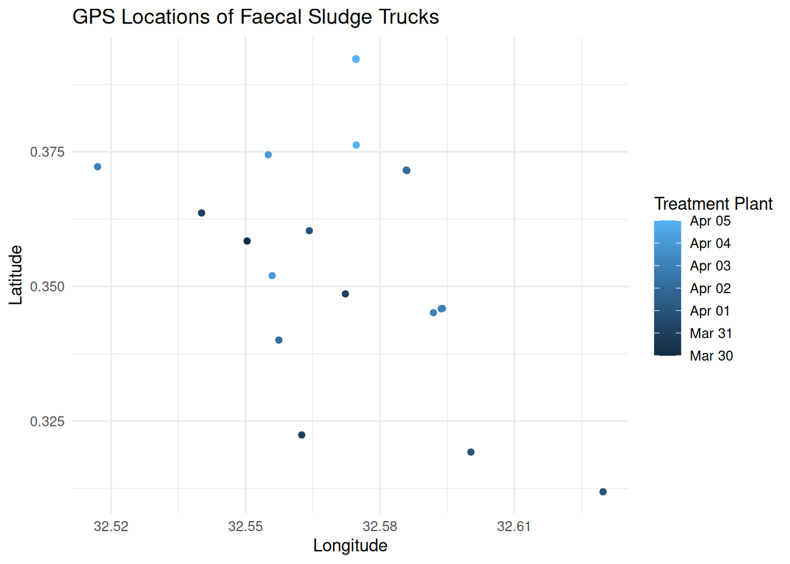

<!-- README.md is generated from README.Rmd. Please edit that file -->

# fslogisticskampala

<!-- badges: start -->

[](https://creativecommons.org/licenses/by/4.0/)
[](https://github.com/openwashdata/fslogisticskampala/actions/workflows/R-CMD-check.yaml)
<!-- badges: end -->

The goal of fslogisticskampala is to provide data sources on faecal
sludge transporting logistics in Kampala, Uganda collected from 30th
March 2015 until 25th June 2015.

## Installation

You can install the development version of fslogisticskampala from
[GitHub](https://github.com/) with:

``` r
# install.packages("devtools")
devtools::install_github("openwashdata/fslogisticskampala")
```

``` r
## Run the following code in console if you don't have the packages
## install.packages(c("dplyr", "knitr", "readr", "stringr", "gt", "kableExtra". "leaflet"))
library(dplyr)
library(knitr)
library(readr)
library(stringr)
library(gt)
library(kableExtra)
library(leaflet)
```

Alternatively, you can download the individual datasets as a CSV or XLSX
file from the table below.

| dataset | CSV | XLSX |
|:---|:---|:---|
| trips | [Download CSV](https://github.com/openwashdata/fslogisticskampala/raw/main/inst/extdata/trips.csv) | [Download XLSX](https://github.com/openwashdata/fslogisticskampala/raw/main/inst/extdata/trips.xlsx) |
| trucks | [Download CSV](https://github.com/openwashdata/fslogisticskampala/raw/main/inst/extdata/trucks.csv) | [Download XLSX](https://github.com/openwashdata/fslogisticskampala/raw/main/inst/extdata/trucks.xlsx) |

## Data

The package provides access to two datasets `trips` and `trucks`.

``` r
library(fslogisticskampala)
```

### trips

The dataset `trips` contains data about the GPS locations of faecal
sludge trucks collecting sludge from pit latrines and septic tanks in
Kampala, Uganda. Each trip is recorded with a unique identifier, the
numberplate of the truck, the date and time of the record. Data was
collected from 30th March 2015 until 25th June 2015. It has 5653
observations and 7 variables

``` r
trips |> 
  head(3) |> 
  gt::gt() |>
  gt::as_raw_html()
```

<div id="wchbxraphe" style="padding-left:0px;padding-right:0px;padding-top:10px;padding-bottom:10px;overflow-x:auto;overflow-y:auto;width:auto;height:auto;">
  &#10;  <table class="gt_table" data-quarto-disable-processing="false" data-quarto-bootstrap="false" style="-webkit-font-smoothing: antialiased; -moz-osx-font-smoothing: grayscale; font-family: system-ui, 'Segoe UI', Roboto, Helvetica, Arial, sans-serif, 'Apple Color Emoji', 'Segoe UI Emoji', 'Segoe UI Symbol', 'Noto Color Emoji'; display: table; border-collapse: collapse; line-height: normal; margin-left: auto; margin-right: auto; color: #333333; font-size: 16px; font-weight: normal; font-style: normal; background-color: #FFFFFF; width: auto; border-top-style: solid; border-top-width: 2px; border-top-color: #A8A8A8; border-right-style: none; border-right-width: 2px; border-right-color: #D3D3D3; border-bottom-style: solid; border-bottom-width: 2px; border-bottom-color: #A8A8A8; border-left-style: none; border-left-width: 2px; border-left-color: #D3D3D3;" bgcolor="#FFFFFF">
  <thead style="border-style: none;">
    <tr class="gt_col_headings" style="border-style: none; border-top-style: solid; border-top-width: 2px; border-top-color: #D3D3D3; border-bottom-style: solid; border-bottom-width: 2px; border-bottom-color: #D3D3D3; border-left-style: none; border-left-width: 1px; border-left-color: #D3D3D3; border-right-style: none; border-right-width: 1px; border-right-color: #D3D3D3;">
      <th class="gt_col_heading gt_columns_bottom_border gt_right" rowspan="1" colspan="1" scope="col" id="fid" style="border-style: none; color: #333333; background-color: #FFFFFF; font-size: 100%; font-weight: normal; text-transform: inherit; border-left-style: none; border-left-width: 1px; border-left-color: #D3D3D3; border-right-style: none; border-right-width: 1px; border-right-color: #D3D3D3; vertical-align: bottom; padding-top: 5px; padding-bottom: 6px; padding-left: 5px; padding-right: 5px; overflow-x: hidden; text-align: right; font-variant-numeric: tabular-nums;" bgcolor="#FFFFFF" valign="bottom" align="right">fid</th>
      <th class="gt_col_heading gt_columns_bottom_border gt_left" rowspan="1" colspan="1" scope="col" id="numberplate" style="border-style: none; color: #333333; background-color: #FFFFFF; font-size: 100%; font-weight: normal; text-transform: inherit; border-left-style: none; border-left-width: 1px; border-left-color: #D3D3D3; border-right-style: none; border-right-width: 1px; border-right-color: #D3D3D3; vertical-align: bottom; padding-top: 5px; padding-bottom: 6px; padding-left: 5px; padding-right: 5px; overflow-x: hidden; text-align: left;" bgcolor="#FFFFFF" valign="bottom" align="left">numberplate</th>
      <th class="gt_col_heading gt_columns_bottom_border gt_right" rowspan="1" colspan="1" scope="col" id="date" style="border-style: none; color: #333333; background-color: #FFFFFF; font-size: 100%; font-weight: normal; text-transform: inherit; border-left-style: none; border-left-width: 1px; border-left-color: #D3D3D3; border-right-style: none; border-right-width: 1px; border-right-color: #D3D3D3; vertical-align: bottom; padding-top: 5px; padding-bottom: 6px; padding-left: 5px; padding-right: 5px; overflow-x: hidden; text-align: right; font-variant-numeric: tabular-nums;" bgcolor="#FFFFFF" valign="bottom" align="right">date</th>
      <th class="gt_col_heading gt_columns_bottom_border gt_center" rowspan="1" colspan="1" scope="col" id="time" style="border-style: none; color: #333333; background-color: #FFFFFF; font-size: 100%; font-weight: normal; text-transform: inherit; border-left-style: none; border-left-width: 1px; border-left-color: #D3D3D3; border-right-style: none; border-right-width: 1px; border-right-color: #D3D3D3; vertical-align: bottom; padding-top: 5px; padding-bottom: 6px; padding-left: 5px; padding-right: 5px; overflow-x: hidden; text-align: center;" bgcolor="#FFFFFF" valign="bottom" align="center">time</th>
      <th class="gt_col_heading gt_columns_bottom_border gt_right" rowspan="1" colspan="1" scope="col" id="lat" style="border-style: none; color: #333333; background-color: #FFFFFF; font-size: 100%; font-weight: normal; text-transform: inherit; border-left-style: none; border-left-width: 1px; border-left-color: #D3D3D3; border-right-style: none; border-right-width: 1px; border-right-color: #D3D3D3; vertical-align: bottom; padding-top: 5px; padding-bottom: 6px; padding-left: 5px; padding-right: 5px; overflow-x: hidden; text-align: right; font-variant-numeric: tabular-nums;" bgcolor="#FFFFFF" valign="bottom" align="right">lat</th>
      <th class="gt_col_heading gt_columns_bottom_border gt_right" rowspan="1" colspan="1" scope="col" id="lon" style="border-style: none; color: #333333; background-color: #FFFFFF; font-size: 100%; font-weight: normal; text-transform: inherit; border-left-style: none; border-left-width: 1px; border-left-color: #D3D3D3; border-right-style: none; border-right-width: 1px; border-right-color: #D3D3D3; vertical-align: bottom; padding-top: 5px; padding-bottom: 6px; padding-left: 5px; padding-right: 5px; overflow-x: hidden; text-align: right; font-variant-numeric: tabular-nums;" bgcolor="#FFFFFF" valign="bottom" align="right">lon</th>
      <th class="gt_col_heading gt_columns_bottom_border gt_left" rowspan="1" colspan="1" scope="col" id="plant" style="border-style: none; color: #333333; background-color: #FFFFFF; font-size: 100%; font-weight: normal; text-transform: inherit; border-left-style: none; border-left-width: 1px; border-left-color: #D3D3D3; border-right-style: none; border-right-width: 1px; border-right-color: #D3D3D3; vertical-align: bottom; padding-top: 5px; padding-bottom: 6px; padding-left: 5px; padding-right: 5px; overflow-x: hidden; text-align: left;" bgcolor="#FFFFFF" valign="bottom" align="left">plant</th>
    </tr>
  </thead>
  <tbody class="gt_table_body" style="border-style: none; border-top-style: solid; border-top-width: 2px; border-top-color: #D3D3D3; border-bottom-style: solid; border-bottom-width: 2px; border-bottom-color: #D3D3D3;">
    <tr style="border-style: none;"><td headers="fid" class="gt_row gt_right" style="border-style: none; padding-top: 8px; padding-bottom: 8px; padding-left: 5px; padding-right: 5px; margin: 10px; border-top-style: solid; border-top-width: 1px; border-top-color: #D3D3D3; border-left-style: none; border-left-width: 1px; border-left-color: #D3D3D3; border-right-style: none; border-right-width: 1px; border-right-color: #D3D3D3; vertical-align: middle; overflow-x: hidden; text-align: right; font-variant-numeric: tabular-nums;" valign="middle" align="right">117</td>
<td headers="numberplate" class="gt_row gt_left" style="border-style: none; padding-top: 8px; padding-bottom: 8px; padding-left: 5px; padding-right: 5px; margin: 10px; border-top-style: solid; border-top-width: 1px; border-top-color: #D3D3D3; border-left-style: none; border-left-width: 1px; border-left-color: #D3D3D3; border-right-style: none; border-right-width: 1px; border-right-color: #D3D3D3; vertical-align: middle; overflow-x: hidden; text-align: left;" valign="middle" align="left">AUS 119X</td>
<td headers="date" class="gt_row gt_right" style="border-style: none; padding-top: 8px; padding-bottom: 8px; padding-left: 5px; padding-right: 5px; margin: 10px; border-top-style: solid; border-top-width: 1px; border-top-color: #D3D3D3; border-left-style: none; border-left-width: 1px; border-left-color: #D3D3D3; border-right-style: none; border-right-width: 1px; border-right-color: #D3D3D3; vertical-align: middle; overflow-x: hidden; text-align: right; font-variant-numeric: tabular-nums;" valign="middle" align="right">2015-03-30</td>
<td headers="time" class="gt_row gt_center" style="border-style: none; padding-top: 8px; padding-bottom: 8px; padding-left: 5px; padding-right: 5px; margin: 10px; border-top-style: solid; border-top-width: 1px; border-top-color: #D3D3D3; border-left-style: none; border-left-width: 1px; border-left-color: #D3D3D3; border-right-style: none; border-right-width: 1px; border-right-color: #D3D3D3; vertical-align: middle; overflow-x: hidden; text-align: center;" valign="middle" align="center">10:53:03</td>
<td headers="lat" class="gt_row gt_right" style="border-style: none; padding-top: 8px; padding-bottom: 8px; padding-left: 5px; padding-right: 5px; margin: 10px; border-top-style: solid; border-top-width: 1px; border-top-color: #D3D3D3; border-left-style: none; border-left-width: 1px; border-left-color: #D3D3D3; border-right-style: none; border-right-width: 1px; border-right-color: #D3D3D3; vertical-align: middle; overflow-x: hidden; text-align: right; font-variant-numeric: tabular-nums;" valign="middle" align="right">0.358437</td>
<td headers="lon" class="gt_row gt_right" style="border-style: none; padding-top: 8px; padding-bottom: 8px; padding-left: 5px; padding-right: 5px; margin: 10px; border-top-style: solid; border-top-width: 1px; border-top-color: #D3D3D3; border-left-style: none; border-left-width: 1px; border-left-color: #D3D3D3; border-right-style: none; border-right-width: 1px; border-right-color: #D3D3D3; vertical-align: middle; overflow-x: hidden; text-align: right; font-variant-numeric: tabular-nums;" valign="middle" align="right">32.55036</td>
<td headers="plant" class="gt_row gt_left" style="border-style: none; padding-top: 8px; padding-bottom: 8px; padding-left: 5px; padding-right: 5px; margin: 10px; border-top-style: solid; border-top-width: 1px; border-top-color: #D3D3D3; border-left-style: none; border-left-width: 1px; border-left-color: #D3D3D3; border-right-style: none; border-right-width: 1px; border-right-color: #D3D3D3; vertical-align: middle; overflow-x: hidden; text-align: left;" valign="middle" align="left">Bugolobi</td></tr>
    <tr style="border-style: none;"><td headers="fid" class="gt_row gt_right" style="border-style: none; padding-top: 8px; padding-bottom: 8px; padding-left: 5px; padding-right: 5px; margin: 10px; border-top-style: solid; border-top-width: 1px; border-top-color: #D3D3D3; border-left-style: none; border-left-width: 1px; border-left-color: #D3D3D3; border-right-style: none; border-right-width: 1px; border-right-color: #D3D3D3; vertical-align: middle; overflow-x: hidden; text-align: right; font-variant-numeric: tabular-nums;" valign="middle" align="right">118</td>
<td headers="numberplate" class="gt_row gt_left" style="border-style: none; padding-top: 8px; padding-bottom: 8px; padding-left: 5px; padding-right: 5px; margin: 10px; border-top-style: solid; border-top-width: 1px; border-top-color: #D3D3D3; border-left-style: none; border-left-width: 1px; border-left-color: #D3D3D3; border-right-style: none; border-right-width: 1px; border-right-color: #D3D3D3; vertical-align: middle; overflow-x: hidden; text-align: left;" valign="middle" align="left">AUS 119X</td>
<td headers="date" class="gt_row gt_right" style="border-style: none; padding-top: 8px; padding-bottom: 8px; padding-left: 5px; padding-right: 5px; margin: 10px; border-top-style: solid; border-top-width: 1px; border-top-color: #D3D3D3; border-left-style: none; border-left-width: 1px; border-left-color: #D3D3D3; border-right-style: none; border-right-width: 1px; border-right-color: #D3D3D3; vertical-align: middle; overflow-x: hidden; text-align: right; font-variant-numeric: tabular-nums;" valign="middle" align="right">2015-03-31</td>
<td headers="time" class="gt_row gt_center" style="border-style: none; padding-top: 8px; padding-bottom: 8px; padding-left: 5px; padding-right: 5px; margin: 10px; border-top-style: solid; border-top-width: 1px; border-top-color: #D3D3D3; border-left-style: none; border-left-width: 1px; border-left-color: #D3D3D3; border-right-style: none; border-right-width: 1px; border-right-color: #D3D3D3; vertical-align: middle; overflow-x: hidden; text-align: center;" valign="middle" align="center">03:53:41</td>
<td headers="lat" class="gt_row gt_right" style="border-style: none; padding-top: 8px; padding-bottom: 8px; padding-left: 5px; padding-right: 5px; margin: 10px; border-top-style: solid; border-top-width: 1px; border-top-color: #D3D3D3; border-left-style: none; border-left-width: 1px; border-left-color: #D3D3D3; border-right-style: none; border-right-width: 1px; border-right-color: #D3D3D3; vertical-align: middle; overflow-x: hidden; text-align: right; font-variant-numeric: tabular-nums;" valign="middle" align="right">0.348626</td>
<td headers="lon" class="gt_row gt_right" style="border-style: none; padding-top: 8px; padding-bottom: 8px; padding-left: 5px; padding-right: 5px; margin: 10px; border-top-style: solid; border-top-width: 1px; border-top-color: #D3D3D3; border-left-style: none; border-left-width: 1px; border-left-color: #D3D3D3; border-right-style: none; border-right-width: 1px; border-right-color: #D3D3D3; vertical-align: middle; overflow-x: hidden; text-align: right; font-variant-numeric: tabular-nums;" valign="middle" align="right">32.57229</td>
<td headers="plant" class="gt_row gt_left" style="border-style: none; padding-top: 8px; padding-bottom: 8px; padding-left: 5px; padding-right: 5px; margin: 10px; border-top-style: solid; border-top-width: 1px; border-top-color: #D3D3D3; border-left-style: none; border-left-width: 1px; border-left-color: #D3D3D3; border-right-style: none; border-right-width: 1px; border-right-color: #D3D3D3; vertical-align: middle; overflow-x: hidden; text-align: left;" valign="middle" align="left">Bugolobi</td></tr>
    <tr style="border-style: none;"><td headers="fid" class="gt_row gt_right" style="border-style: none; padding-top: 8px; padding-bottom: 8px; padding-left: 5px; padding-right: 5px; margin: 10px; border-top-style: solid; border-top-width: 1px; border-top-color: #D3D3D3; border-left-style: none; border-left-width: 1px; border-left-color: #D3D3D3; border-right-style: none; border-right-width: 1px; border-right-color: #D3D3D3; vertical-align: middle; overflow-x: hidden; text-align: right; font-variant-numeric: tabular-nums;" valign="middle" align="right">119</td>
<td headers="numberplate" class="gt_row gt_left" style="border-style: none; padding-top: 8px; padding-bottom: 8px; padding-left: 5px; padding-right: 5px; margin: 10px; border-top-style: solid; border-top-width: 1px; border-top-color: #D3D3D3; border-left-style: none; border-left-width: 1px; border-left-color: #D3D3D3; border-right-style: none; border-right-width: 1px; border-right-color: #D3D3D3; vertical-align: middle; overflow-x: hidden; text-align: left;" valign="middle" align="left">AUS 119X</td>
<td headers="date" class="gt_row gt_right" style="border-style: none; padding-top: 8px; padding-bottom: 8px; padding-left: 5px; padding-right: 5px; margin: 10px; border-top-style: solid; border-top-width: 1px; border-top-color: #D3D3D3; border-left-style: none; border-left-width: 1px; border-left-color: #D3D3D3; border-right-style: none; border-right-width: 1px; border-right-color: #D3D3D3; vertical-align: middle; overflow-x: hidden; text-align: right; font-variant-numeric: tabular-nums;" valign="middle" align="right">2015-03-31</td>
<td headers="time" class="gt_row gt_center" style="border-style: none; padding-top: 8px; padding-bottom: 8px; padding-left: 5px; padding-right: 5px; margin: 10px; border-top-style: solid; border-top-width: 1px; border-top-color: #D3D3D3; border-left-style: none; border-left-width: 1px; border-left-color: #D3D3D3; border-right-style: none; border-right-width: 1px; border-right-color: #D3D3D3; vertical-align: middle; overflow-x: hidden; text-align: center;" valign="middle" align="center">10:33:01</td>
<td headers="lat" class="gt_row gt_right" style="border-style: none; padding-top: 8px; padding-bottom: 8px; padding-left: 5px; padding-right: 5px; margin: 10px; border-top-style: solid; border-top-width: 1px; border-top-color: #D3D3D3; border-left-style: none; border-left-width: 1px; border-left-color: #D3D3D3; border-right-style: none; border-right-width: 1px; border-right-color: #D3D3D3; vertical-align: middle; overflow-x: hidden; text-align: right; font-variant-numeric: tabular-nums;" valign="middle" align="right">0.322447</td>
<td headers="lon" class="gt_row gt_right" style="border-style: none; padding-top: 8px; padding-bottom: 8px; padding-left: 5px; padding-right: 5px; margin: 10px; border-top-style: solid; border-top-width: 1px; border-top-color: #D3D3D3; border-left-style: none; border-left-width: 1px; border-left-color: #D3D3D3; border-right-style: none; border-right-width: 1px; border-right-color: #D3D3D3; vertical-align: middle; overflow-x: hidden; text-align: right; font-variant-numeric: tabular-nums;" valign="middle" align="right">32.56255</td>
<td headers="plant" class="gt_row gt_left" style="border-style: none; padding-top: 8px; padding-bottom: 8px; padding-left: 5px; padding-right: 5px; margin: 10px; border-top-style: solid; border-top-width: 1px; border-top-color: #D3D3D3; border-left-style: none; border-left-width: 1px; border-left-color: #D3D3D3; border-right-style: none; border-right-width: 1px; border-right-color: #D3D3D3; vertical-align: middle; overflow-x: hidden; text-align: left;" valign="middle" align="left">Bugolobi</td></tr>
  </tbody>
  &#10;</table>
</div>

For an overview of the variable names, see the following table.

<div style="border: 1px solid #ddd; padding: 0px; overflow-y: scroll; height:200px; ">

<table class="table table-striped" style="margin-left: auto; margin-right: auto;">

<thead>

<tr>

<th style="text-align:left;position: sticky; top:0; background-color: #FFFFFF;">

variable_name
</th>

<th style="text-align:left;position: sticky; top:0; background-color: #FFFFFF;">

variable_type
</th>

<th style="text-align:left;position: sticky; top:0; background-color: #FFFFFF;">

description
</th>

</tr>

</thead>

<tbody>

<tr>

<td style="text-align:left;">

fid
</td>

<td style="text-align:left;">

numeric
</td>

<td style="text-align:left;">

Running ID for each recorded GPS location of a truck.
</td>

</tr>

<tr>

<td style="text-align:left;">

numberplate
</td>

<td style="text-align:left;">

character
</td>

<td style="text-align:left;">

Numberplate of the truck, can be joined with `trucks` resource.
</td>

</tr>

<tr>

<td style="text-align:left;">

date
</td>

<td style="text-align:left;">

Date
</td>

<td style="text-align:left;">

Date of the record in ISO 8601 format.
</td>

</tr>

<tr>

<td style="text-align:left;">

time
</td>

<td style="text-align:left;">

c(“hms”, “difftime”)
</td>

<td style="text-align:left;">

Time of the record in hours, minutes, seconds.
</td>

</tr>

<tr>

<td style="text-align:left;">

lat
</td>

<td style="text-align:left;">

numeric
</td>

<td style="text-align:left;">

Latitude of the record.
</td>

</tr>

<tr>

<td style="text-align:left;">

lon
</td>

<td style="text-align:left;">

numeric
</td>

<td style="text-align:left;">

Longitude of the record.
</td>

</tr>

<tr>

<td style="text-align:left;">

plant
</td>

<td style="text-align:left;">

character
</td>

<td style="text-align:left;">

Treatment plant that the truck delivered faecal sludge to.
</td>

</tr>

</tbody>

</table>

</div>

### trucks

The dataset `trucks` contains data about additional information on the
volume of each truck used in the dataset `trips`. It has 35 observations
and 2 variables

``` r
trucks |> 
  head(3) |> 
  gt::gt() |>
  gt::as_raw_html()
```

<div id="fqguuzvoer" style="padding-left:0px;padding-right:0px;padding-top:10px;padding-bottom:10px;overflow-x:auto;overflow-y:auto;width:auto;height:auto;">
  &#10;  <table class="gt_table" data-quarto-disable-processing="false" data-quarto-bootstrap="false" style="-webkit-font-smoothing: antialiased; -moz-osx-font-smoothing: grayscale; font-family: system-ui, 'Segoe UI', Roboto, Helvetica, Arial, sans-serif, 'Apple Color Emoji', 'Segoe UI Emoji', 'Segoe UI Symbol', 'Noto Color Emoji'; display: table; border-collapse: collapse; line-height: normal; margin-left: auto; margin-right: auto; color: #333333; font-size: 16px; font-weight: normal; font-style: normal; background-color: #FFFFFF; width: auto; border-top-style: solid; border-top-width: 2px; border-top-color: #A8A8A8; border-right-style: none; border-right-width: 2px; border-right-color: #D3D3D3; border-bottom-style: solid; border-bottom-width: 2px; border-bottom-color: #A8A8A8; border-left-style: none; border-left-width: 2px; border-left-color: #D3D3D3;" bgcolor="#FFFFFF">
  <thead style="border-style: none;">
    <tr class="gt_col_headings" style="border-style: none; border-top-style: solid; border-top-width: 2px; border-top-color: #D3D3D3; border-bottom-style: solid; border-bottom-width: 2px; border-bottom-color: #D3D3D3; border-left-style: none; border-left-width: 1px; border-left-color: #D3D3D3; border-right-style: none; border-right-width: 1px; border-right-color: #D3D3D3;">
      <th class="gt_col_heading gt_columns_bottom_border gt_left" rowspan="1" colspan="1" scope="col" id="numberplate" style="border-style: none; color: #333333; background-color: #FFFFFF; font-size: 100%; font-weight: normal; text-transform: inherit; border-left-style: none; border-left-width: 1px; border-left-color: #D3D3D3; border-right-style: none; border-right-width: 1px; border-right-color: #D3D3D3; vertical-align: bottom; padding-top: 5px; padding-bottom: 6px; padding-left: 5px; padding-right: 5px; overflow-x: hidden; text-align: left;" bgcolor="#FFFFFF" valign="bottom" align="left">numberplate</th>
      <th class="gt_col_heading gt_columns_bottom_border gt_right" rowspan="1" colspan="1" scope="col" id="volume" style="border-style: none; color: #333333; background-color: #FFFFFF; font-size: 100%; font-weight: normal; text-transform: inherit; border-left-style: none; border-left-width: 1px; border-left-color: #D3D3D3; border-right-style: none; border-right-width: 1px; border-right-color: #D3D3D3; vertical-align: bottom; padding-top: 5px; padding-bottom: 6px; padding-left: 5px; padding-right: 5px; overflow-x: hidden; text-align: right; font-variant-numeric: tabular-nums;" bgcolor="#FFFFFF" valign="bottom" align="right">volume</th>
    </tr>
  </thead>
  <tbody class="gt_table_body" style="border-style: none; border-top-style: solid; border-top-width: 2px; border-top-color: #D3D3D3; border-bottom-style: solid; border-bottom-width: 2px; border-bottom-color: #D3D3D3;">
    <tr style="border-style: none;"><td headers="numberplate" class="gt_row gt_left" style="border-style: none; padding-top: 8px; padding-bottom: 8px; padding-left: 5px; padding-right: 5px; margin: 10px; border-top-style: solid; border-top-width: 1px; border-top-color: #D3D3D3; border-left-style: none; border-left-width: 1px; border-left-color: #D3D3D3; border-right-style: none; border-right-width: 1px; border-right-color: #D3D3D3; vertical-align: middle; overflow-x: hidden; text-align: left;" valign="middle" align="left">AUS 119X</td>
<td headers="volume" class="gt_row gt_right" style="border-style: none; padding-top: 8px; padding-bottom: 8px; padding-left: 5px; padding-right: 5px; margin: 10px; border-top-style: solid; border-top-width: 1px; border-top-color: #D3D3D3; border-left-style: none; border-left-width: 1px; border-left-color: #D3D3D3; border-right-style: none; border-right-width: 1px; border-right-color: #D3D3D3; vertical-align: middle; overflow-x: hidden; text-align: right; font-variant-numeric: tabular-nums;" valign="middle" align="right">3</td></tr>
    <tr style="border-style: none;"><td headers="numberplate" class="gt_row gt_left" style="border-style: none; padding-top: 8px; padding-bottom: 8px; padding-left: 5px; padding-right: 5px; margin: 10px; border-top-style: solid; border-top-width: 1px; border-top-color: #D3D3D3; border-left-style: none; border-left-width: 1px; border-left-color: #D3D3D3; border-right-style: none; border-right-width: 1px; border-right-color: #D3D3D3; vertical-align: middle; overflow-x: hidden; text-align: left;" valign="middle" align="left">UAG 448X</td>
<td headers="volume" class="gt_row gt_right" style="border-style: none; padding-top: 8px; padding-bottom: 8px; padding-left: 5px; padding-right: 5px; margin: 10px; border-top-style: solid; border-top-width: 1px; border-top-color: #D3D3D3; border-left-style: none; border-left-width: 1px; border-left-color: #D3D3D3; border-right-style: none; border-right-width: 1px; border-right-color: #D3D3D3; vertical-align: middle; overflow-x: hidden; text-align: right; font-variant-numeric: tabular-nums;" valign="middle" align="right">35</td></tr>
    <tr style="border-style: none;"><td headers="numberplate" class="gt_row gt_left" style="border-style: none; padding-top: 8px; padding-bottom: 8px; padding-left: 5px; padding-right: 5px; margin: 10px; border-top-style: solid; border-top-width: 1px; border-top-color: #D3D3D3; border-left-style: none; border-left-width: 1px; border-left-color: #D3D3D3; border-right-style: none; border-right-width: 1px; border-right-color: #D3D3D3; vertical-align: middle; overflow-x: hidden; text-align: left;" valign="middle" align="left">UAN 030N</td>
<td headers="volume" class="gt_row gt_right" style="border-style: none; padding-top: 8px; padding-bottom: 8px; padding-left: 5px; padding-right: 5px; margin: 10px; border-top-style: solid; border-top-width: 1px; border-top-color: #D3D3D3; border-left-style: none; border-left-width: 1px; border-left-color: #D3D3D3; border-right-style: none; border-right-width: 1px; border-right-color: #D3D3D3; vertical-align: middle; overflow-x: hidden; text-align: right; font-variant-numeric: tabular-nums;" valign="middle" align="right">3</td></tr>
  </tbody>
  &#10;</table>
</div>

For an overview of the variable names, see the following table.

<div style="border: 1px solid #ddd; padding: 0px; overflow-y: scroll; height:200px; ">

<table class="table table-striped" style="margin-left: auto; margin-right: auto;">

<thead>

<tr>

<th style="text-align:left;position: sticky; top:0; background-color: #FFFFFF;">

variable_name
</th>

<th style="text-align:left;position: sticky; top:0; background-color: #FFFFFF;">

variable_type
</th>

<th style="text-align:left;position: sticky; top:0; background-color: #FFFFFF;">

description
</th>

</tr>

</thead>

<tbody>

<tr>

<td style="text-align:left;">

numberplate
</td>

<td style="text-align:left;">

character
</td>

<td style="text-align:left;">

Numberplate of the truck, can be joined with `trips` resource.
</td>

</tr>

<tr>

<td style="text-align:left;">

volume
</td>

<td style="text-align:left;">

numeric
</td>

<td style="text-align:left;">

Volume of the truck in cubic meters.
</td>

</tr>

</tbody>

</table>

</div>

## Example 1

A plot showing the collection locations of the truck with number plate
“AUS 119X”

``` r
library(fslogisticskampala)
library(ggplot2)
library(lubridate)

aus <- trips |>
  dplyr::filter(numberplate == "AUS 119X") |>
  dplyr::filter(date < ymd("2015-04-06"))

ggplot(aus, aes(x = lon, y = lat, color = date)) +
  geom_point() +
  labs(title = "GPS Locations of Faecal Sludge Trucks",
       x = "Longitude",
       y = "Latitude",
       color = "Treatment Plant") +
  theme_minimal()
```



## Example 2

An interactive map of all collection points

``` r
map = leaflet(data = trips) |>
   addTiles() |>
   addCircleMarkers(~lon, ~lat 
                    ,popup = ~as.character(plant)
                    , color = ~ifelse(plant == "Bugolobi" , "red", "blue")
                    , radius = 0.5
                    ) |>
  addMarkers(lng = ~c(32.6071673,32.5458844)
             ,lat = ~c(0.3190139,0.3472747)
             ,popup = ~c("Bugolobi FS treatment plant","Lubigi FS treatment plant")
             )
map
```

<div class="figure" style="text-align: center">

<div class="leaflet html-widget html-fill-item" id="htmlwidget-1790b1471edbdd9c15d8" style="width:100%;height:480px;"></div>
<script type="application/json" data-for="htmlwidget-1790b1471edbdd9c15d8">{"x":{"options":{"crs":{"crsClass":"L.CRS.EPSG3857","code":null,"proj4def":null,"projectedBounds":null,"options":{}}},"calls":[{"method":"addTiles","args":["https://{s}.tile.openstreetmap.org/{z}/{x}/{y}.png",null,null,{"minZoom":0,"maxZoom":18,"tileSize":256,"subdomains":"abc","errorTileUrl":"","tms":false,"noWrap":false,"zoomOffset":0,"zoomReverse":false,"opacity":1,"zIndex":1,"detectRetina":false,"attribution":"&copy; <a href=\"https://openstreetmap.org/copyright/\">OpenStreetMap<\/a>,  <a href=\"https://opendatacommons.org/licenses/odbl/\">ODbL<\/a>"}]},{"method":"addCircleMarkers","args":[[0.358437,0.348626,0.322447,0.363645,0.360351,0.311899,0.319267,0.340054,0.37151,0.3716,0.372226,0.345859,0.345135,0.345922,0.352008,0.37444,0.37625,0.392215,0.392207,0.392252,0.392179,0.392198,0.392171,0.392233,0.392144,0.392171,0.392198,0.39218,0.392181,0.39219,0.333325,0.333054,0.306697,0.332811,0.318354,0.332051,0.30356,0.301102,0.301029,0.341041,0.309772,0.303154,0.238466,0.313596,0.265646,0.313561,0.315839,0.331755,0.371178,0.315947,0.345099,0.292899,0.274653,0.275477,0.34499,0.371203,0.334402,0.334556,0.314166,0.328608,0.327143,0.319276,0.312738,0.312838,0.371486,0.334565,0.334529,0.318896,0.318914,0.303316,0.308911,0.309141,0.302267,0.327903,0.312377,0.303388,0.302547,0.366665,0.366492,0.3668,0.288506,0.29138,0.283235,0.309439,0.30933,0.317449,0.347776,0.347749,0.322927,0.315919,0.31065,0.382054,0.314032,0.392862,0.31601,0.316055,0.315857,0.353013,0.27809,0.278026,0.28949,0.302708,0.349975,0.34992,0.302583,0.398793,0.353002,0.352939,0.353256,0.334322,0.350109,0.378635,0.334881,0.359603,0.309086,0.357975,0.309701,0.304438,0.327894,0.313643,0.314489,0.313253,0.30159,0.325732,0.325615,0.327722,0.32386,0.291043,0.327813,0.337468,0.337296,0.342621,0.342667,0.314194,0.358862,0.35916,0.29912,0.320099,0.319926,0.336689,0.336707,0.328696,0.376503,0.328723,0.347314,0.321174,0.321037,0.321156,0.307097,0.303144,0.302574,0.309254,0.303334,0.303343,0.303307,0.309182,0.318291,0.302222,0.302159,0.305867,0.306021,0.306092,0.306066,0.302231,0.302212,0.302167,0.284337,0.284627,0.284238,0.388675,0.288949,0.39351,0.388729,0.336915,0.305605,0.317495,0.310683,0.24655,0.391395,0.372705,0.304664,0.295612,0.288957,0.284365,0.284094,0.32395,0.324203,0.34706,0.316011,0.349024,0.349077,0.315857,0.355334,0.367632,0.355326,0.31271,0.386886,0.386144,0.278159,0.278268,0.339454,0.33546,0.3395,0.339518,0.339527,0.339518,0.33545,0.325803,0.294283,0.294256,0.356962,0.354124,0.417516,0.401351,0.32374,0.382788,0.367322,0.308561,0.359331,0.367551,0.392172,0.392198,0.392189,0.392198,0.392243,0.392153,0.392171,0.392253,0.31641,0.316391,0.303191,0.312431,0.32027,0.328572,0.325887,0.325769,0.308933,0.304602,0.305775,0.330009,0.312285,0.312348,0.313341,0.314934,0.321218,0.325096,0.308868,0.315821,0.351438,0.353453,0.353445,0.353427,0.315911,0.31592,0.315938,0.309367,0.316001,0.315984,0.315839,0.25713,0.296952,0.296978,0.296798,0.324701,0.347731,0.294248,0.343099,0.375743,0.368699,0.35255,0.352414,0.330495,0.330432,0.32217,0.304953,0.304727,0.09432699999999999,0.359602,0.321183,0.320984,0.371313,0.37134,0.371322,0.371296,0.371421,0.428985,0.428109,0.428823,0.429085,0.308878,0.305631,0.314329,0.303298,0.321193,0.311708,0.308208,0.305631,0.348387,0.348468,0.278014,0.296145,0.355788,0.285938,0.282845,0.305767,0.239254,0.296018,0.296055,0.296027,0.325007,0.364387,0.314485,0.32385,0.336257,0.336302,0.373384,0.340327,0.31726,0.36273,0.332458,0.331852,0.373264,0.323769,0.316109,0.316119,0.261154,0.352995,0.353004,0.302338,0.29091,0.277972,0.27799,0.311335,0.310296,0.265927,0.35094,0.350895,0.356837,0.356918,0.346583,0.347521,0.392053,0.359965,0.295314,0.309457,0.332983,0.348726,0.348545,0.35057,0.35303,0.361557,0.361737,0.371629,0.331554,0.331437,0.392135,0.39218,0.392152,0.392134,0.267102,0.261406,0.392196,0.392144,0.312078,0.31196,0.374232,0.374169,0.304348,0.29979,0.299772,0.313035,0.318805,0.314004,0.305766,0.283712,0.283911,0.283883,0.307492,0.307348,0.253621,0.254399,0.347541,0.285964,0.322297,0.31914,0.311217,0.337052,0.337079,0.337115,0.337115,0.292935,0.292764,0.317855,0.300332,0.33312,0.328608,0.332723,0.316047,0.271785,0.321457,0.316,0.281109,0.282104,0.331536,0.327596,0.315936,0.315947,0.315947,0.360397,0.350407,0.318327,0.374216,0.348798,0.334167,0.26657,0.290892,0.436057,0.43603,0.306135,0.245121,0.324066,0.331356,0.331319,0.325208,0.321156,0.318941,0.38504,0.386287,0.363697,0.352294,0.297745,0.305622,0.309584,0.308261,0.30452,0.304683,0.312837,0.320922,0.33983,0.34027,0.302221,0.302258,0.302239,0.302267,0.302258,0.34892,0.348286,0.318225,0.317782,0.311346,0.308911,0.391008,0.391117,0.101723,0.294102,0.301263,0.303696,0.362927,0.297411,0.298839,0.363001,0.376349,0.285059,0.252455,0.252762,0.297115,0.277346,0.39636,0.29573,0.292565,0.295783,0.291531,0.298705,0.292149,0.264942,0.350325,0.337069,0.337106,0.337133,0.33707,0.294682,0.2559,0.36765,0.382633,0.336393,0.370761,0.332251,0.317224,0.327893,0.382741,0.310089,0.323606,0.323751,0.323678,0.323706,0.312656,0.358871,0.339059,0.306598,0.306942,0.290702,0.278819,0.274363,0.35142,0.351565,0.35208,0.295051,0.290522,0.286941,0.288497,0.276019,0.296652,0.290557,0.246008,0.27827,0.281905,0.267698,0.267779,0.290421,0.380952,0.30763,0.291832,0.291833,0.291742,0.304294,0.235138,0.273882,0.276697,0.237218,0.237063,0.237181,0.23719,0.289517,0.28959,0.345721,0.295151,0.359375,0.302664,0.338235,0.338252,0.338189,0.336743,0.336815,0.337493,0.29912,0.298813,0.34878,0.348752,0.319339,0.392189,0.392198,0.357424,0.35756,0.3753,0.375472,0.327595,0.324873,0.325507,0.349286,0.288233,0.365083,0.321347,0.321355,0.321373,0.312258,0.373066,0.286778,0.287791,0.286886,0.308389,0.287538,0.26861,0.2687,0.28676,0.319132,0.319593,0.323137,0.323128,0.3131,0.317974,0.268646,0.354883,0.307502,0.331709,0.290793,0.337142,0.262826,0.264444,0.264688,0.33716,0.312258,0.373066,0.286778,0.287791,0.26439,0.265529,0.263513,0.263875,0.264092,0.344476,0.34453,0.34811,0.273894,0.263893,0.372903,0.307711,0.642779,0.6479780000000001,0.642978,0.64353,0.285294,0.368355,0.287275,0.30807,0.293505,0.217387,0.217253,0.251569,0.310569,0.315965,0.316011,0.32027,0.249553,0.317766,0.317793,0.315991,0.633152,0.629724,0.633168,0.295521,0.6330519999999999,0.632518,0.632663,0.6331870000000001,0.633422,0.370605,0.313742,0.297131,0.284653,0.281996,0.297421,0.297339,0.297375,0.296082,0.29724,0.279263,0.278532,0.358175,0.358185,0.379486,0.344746,0.327505,0.31717,0.316944,0.304257,0.309186,0.257103,0.346474,0.334817,0.310515,0.292953,0.320984,0.321336,0.32528,0.295613,0.295587,0.321027,0.342885,0.320921,0.26278,0.30204,0.302212,0.301724,0.303534,0.308217,0.308262,0.303334,0.302276,0.309219,0.318019,0.308911,0.302331,0.30224,0.302195,0.302293,0.302222,0.30261,0.303352,0.302303,0.302322,0.302241,0.40677,0.280784,0.287275,0.289715,0.287292,0.197124,0.196445,0.206169,0.1965,0.31943,0.296905,0.292517,0.194809,0.205888,0.194791,0.194529,0.194881,0.206196,0.194384,0.31943,0.295521,0.194863,0.154285,0.194447,0.061621,0.06862,0.197837,0.197828,0.195243,0.319403,0.255809,0.197512,0.154248,0.194719,0.19527,0.193859,0.154239,0.19376,0.06871099999999999,0.105918,0.194121,0.186817,0.295485,0.193308,0.154284,0.291298,0.295422,0.337142,0.33707,0.337115,0.330712,0.294663,0.295566,0.25259,0.316156,0.252735,0.279735,0.235273,0.285176,0.384053,0.382696,0.281695,0.311742,0.311733,0.311841,0.251705,0.348481,0.286407,0.274789,0.286271,0.286579,0.379955,0.384711,0.354656,0.317631,0.284943,0.28525,0.376032,0.374586,0.295848,0.32498,0.265755,0.264544,0.265701,0.284255,0.323788,0.323806,0.255692,0.2558,0.349631,0.316029,0.357206,0.35726,0.357125,0.298215,0.298415,0.298487,0.298542,0.298478,0.298405,0.298359,0.298405,0.298524,0.298469,0.298386,0.298323,0.298468,0.298359,0.298487,0.29826,0.298206,0.298242,0.298388,0.298424,0.298524,0.298432,0.298523,0.29846,0.298469,0.298496,0.298543,0.29827,0.298296,0.272364,0.365615,0.36528,0.325197,0.325206,0.322287,0.284101,0.209965,0.28885,0.288007,0.28901,0.23672,0.23682,0.287936,0.340841,0.340805,0.340887,0.340887,0.340895,0.340814,0.340642,0.314122,0.288485,0.254363,0.237543,0.280783,0.237471,0.237543,0.274246,0.274164,0.361473,0.361518,0.361472,0.302628,0.321307,0.38618,0.289898,0.289771,0.289753,0.289726,0.302591,0.353094,0.353067,0.386878,0.289606,0.289491,0.356364,0.356256,0.386758,0.3395,0.339581,0.339554,0.385836,0.385782,0.385918,0.385972,0.386704,0.302628,0.321307,0.38618,0.289898,0.289771,0.289753,0.289726,0.302591,0.353094,0.353067,0.386878,0.289606,0.289491,0.356364,0.356256,0.386758,0.3395,0.339581,0.339554,0.385836,0.385782,0.385918,0.385972,0.386704,0.30214,0.225057,0.38599,0.338243,0.25474,0.254677,0.301011,0.324187,0.304356,0.303859,0.316428,0.321571,0.334946,0.32281,0.334937,0.299031,0.299085,0.287158,0.305578,0.32878,0.329042,0.328002,0.299076,0.296516,0.343753,0.367343,0.318272,0.292328,0.310177,0.360072,0.359439,0.339249,0.362395,0.37425,0.380852,0.380824,0.380753,0.369946,0.380843,0.380889,0.33122,0.315993,0.307711,0.307766,0.323441,0.354113,0.354059,0.354077,0.349729,0.349765,0.297124,0.317676,0.317739,0.333534,0.333597,0.333868,0.34754,0.359984,0.315614,0.31592,0.315891,0.315901,0.315957,0.315901,0.315847,0.352984,0.352469,0.315965,0.315974,0.387407,0.336426,0.32689,0.283069,0.283096,0.307647,0.303831,0.303795,0.314139,0.433693,0.433738,0.305505,0.305388,0.37917,0.37824,0.37275,0.372451,0.320983,0.343931,0.343912,0.343856,0.320975,0.320984,0.289599,0.302828,0.302918,0.336762,0.336763,0.303796,0.30386,0.303842,0.299363,0.299273,0.274871,0.275043,0.298822,0.325585,0.301742,0.347432,0.379522,0.379595,0.379522,0.379411,0.379522,0.379522,0.379531,0.379494,0.379403,0.418134,0.418143,0.497228,0.49741,0.497338,0.429455,0.426678,0.348332,0.34844,0.347143,0.413918,0.413628,0.413396,0.413945,0.414307,0.35459,0.308318,0.473537,0.472768,0.274671,0.279994,0.274607,0.319431,0.323262,0.538743,0.538435,0.538671,0.359058,0.386204,0.386223,0.361528,0.361564,0.323281,0.356245,0.320161,0.355865,0.356398,0.29828,0.381313,0.241448,0.241493,0.241909,0.289117,0.289144,0.289136,0.321726,0.321717,0.304435,0.304435,0.304453,0.304507,0.323525,0.304335,0.304353,0.304308,0.250366,0.305583,0.303214,0.303205,0.303106,0.302934,0.304423,0.279942,0.279898,0.279862,0.30429,0.304281,0.284228,0.304344,0.304307,0.30428,0.304281,0.304317,0.30429,0.304398,0.304308,0.419889,0.419436,0.304316,0.30428,0.304235,0.304308,0.30429,0.30428,0.274065,0.298143,0.2643,0.304379,0.304335,0.304316,0.304318,0.256215,0.280566,0.305683,0.303459,0.303432,0.309384,0.472796,0.32358,0.300885,0.317396,0.429527,0.429509,0.317016,0.315956,0.33696,0.339797,0.336878,0.338559,0.338595,0.340152,0.340415,0.340261,0.6254459999999999,0.625346,0.625347,0.625221,0.625229,0.625663,0.625682,0.300348,0.300385,0.302618,0.302646,0.30269,0.290286,0.406621,0.405998,0.406666,0.372958,0.378472,0.353536,0.29658,0.377388,0.305621,0.325196,0.324401,0.32432,0.369948,0.358085,0.294635,0.398674,0.26402,0.310406,0.392143,0.392153,0.392164,0.392188,0.392215,0.362668,0.362614,0.308749,0.308173,0.315451,0.316663,0.304394,0.327584,0.327466,0.32752,0.327584,0.288694,0.286336,0.284844,0.288984,0.288712,0.299257,0.287774,0.352623,0.352777,0.352631,0.358998,0.304782,0.304664,0.323934,0.258875,0.353366,0.353456,0.304782,0.304664,0.323934,0.258875,0.337604,0.337793,0.320966,0.361076,0.298596,0.348735,0.348744,0.286814,0.42565,0.489244,0.490484,0.490511,0.429067,0.490529,0.488747,0.488692,0.425614,0.488674,0.488775,0.425605,0.488702,0.489072,0.348215,0.348349,0.287917,0.304329,0.304157,0.30413,0.337495,0.337785,0.337775,0.3629,0.334456,0.296,0.296054,0.377679,0.377625,0.353671,0.343816,0.323337,0.31659,0.275367,0.355914,0.341165,0.302555,0.289581,0.350679,0.362704,0.308516,0.348508,0.34973,0.337912,0.302448,0.317639,0.337912,0.315651,0.317613,0.317812,0.392261,0.392155,0.392153,0.324955,0.311953,0.311899,0.324169,0.392108,0.392135,0.392107,0.392225,0.300188,0.305684,0.331861,0.331751,0.33187,0.331843,0.331746,0.331889,0.331833,0.331878,0.331878,0.331762,0.331861,0.333173,0.303119,0.45838,0.457232,0.458371,0.458616,0.435458,0.436416,0.436244,0.286965,0.320967,0.314898,0.268568,0.28317,0.279677,0.35311,0.353192,0.348192,0.298793,0.315488,0.296904,0.295123,0.319266,0.313543,0.31592,0.316002,0.324837,0.351221,0.351248,0.351239,0.329431,0.329268,0.314548,0.315883,0.315957,0.315992,0.315993,0.303477,0.312684,0.312692,0.312701,0.351932,0.351598,0.280159,0.32821,0.349467,0.256394,0.25643,0.349476,0.275455,0.306238,0.361574,0.24786,0.248177,0.248123,0.334918,0.320533,0.334919,0.328247,0.327451,0.329232,0.329467,0.321328,0.321173,0.32103,0.30336,0.303478,0.312684,0.312647,0.355757,0.324754,0.440995,0.324628,0.308054,0.309736,0.498453,0.498616,0.438742,0.438967,0.439003,0.438153,0.439284,0.426896,0.303459,0.312675,0.294084,0.294066,0.293976,0.33925,0.311589,0.337466,0.310141,0.309997,0.348286,0.348305,0.294211,0.294003,0.294021,0.299083,0.299092,0.299083,0.385862,0.341174,0.306707,0.306698,0.288821,0.323082,0.323082,0.316011,0.284411,0.284392,0.372948,0.372966,0.315938,0.329413,0.296453,0.345108,0.3579,0.3579,0.316073,0.327485,0.327577,0.296426,0.309421,0.376356,0.289599,0.332493,0.289671,0.214776,0.214397,0.214153,0.321887,0.264018,0.354409,0.352469,0.351167,0.353094,0.356238,0.351673,0.309385,0.317829,0.265159,0.26514,0.303253,0.303324,0.337361,0.304095,0.317784,0.345958,0.258477,0.369171,0.344051,0.345173,0.345083,0.400909,0.398947,0.273026,0.317975,0.353719,0.31592,0.315992,0.354177,0.264282,0.320813,0.321239,0.321872,0.324141,0.299736,0.363978,0.301264,0.323924,0.324096,0.322351,0.337585,0.322667,0.322648,0.332928,0.333145,0.333136,0.321264,0.321156,0.351302,0.298758,0.312656,0.361457,0.275377,0.182486,0.1748,0.182323,0.357224,0.332548,0.334954,0.340687,0.272851,0.272787,0.298931,0.25152,0.251503,0.251503,0.35983,0.312277,0.303027,0.290486,0.322304,0.303107,0.31914,0.264127,0.226829,0.30213,0.302267,0.30225,0.302248,0.302285,0.302303,0.302285,0.302249,0.302285,0.334103,0.289762,0.385197,0.385586,0.36906,0.288876,0.28092,0.280974,0.344857,0.345065,0.361899,0.334429,0.308279,0.342332,0.332061,0.345607,0.319991,0.236016,0.360977,0.360996,0.360715,0.344744,0.321841,0.322167,0.321995,0.294247,0.294265,0.267419,0.302483,0.405781,0.405998,0.363335,0.363209,0.339005,0.39098,0.317656,0.31763,0.317657,0.281552,0.288469,0.321535,0.323272,0.298119,0.319113,0.374566,0.278315,0.27939,0.284173,0.281145,0.279988,0.393791,0.383564,0.393348,0.39379,0.393237,0.39189,0.368878,0.368825,0.338472,0.338742,0.317657,0.31763,0.348725,0.348652,0.348625,0.348598,0.392205,0.392414,0.39217,0.392198,0.382878,0.344792,0.340912,0.340931,0.30081,0.285187,0.311282,0.330496,0.332052,0.345209,0.345281,0.312239,0.329313,0.32935,0.329421,0.32831,0.299799,0.2997,0.299139,0.332078,0.347805,0.327044,0.3269,0.347823,0.307457,0.347697,0.297664,0.297619,0.303839,0.297655,0.291661,0.386766,0.279807,0.299971,0.299745,0.292673,0.348264,0.31932,0.319321,0.264915,0.264652,0.264453,0.264191,0.338399,0.345018,0.329106,0.284635,0.359403,0.368972,0.315983,0.315875,0.315839,0.370274,0.350661,0.295829,0.350641,0.350642,0.327469,0.318995,0.366656,0.306734,0.3148,0.329313,0.257681,0.306662,0.306752,0.362567,0.306843,0.321111,0.32112,0.306787,0.306815,0.365834,0.365969,0.298795,0.368446,0.642333,0.639168,0.705263,0.705281,0.694974,0.70529,0.6764,0.693618,0.705263,0.645325,0.69568,0.705282,0.705254,0.695716,0.697381,0.334693,0.193265,0.193202,0.329176,0.328705,0.309218,0.309394,0.302204,0.318869,0.318996,0.302312,0.302321,0.30233,0.302358,0.302348,0.302295,0.302304,0.300122,0.367308,0.348296,0.348405,0.316111,0.284852,0.309046,0.347991,0.369556,0.355225,0.29301,0.293262,0.294247,0.293,0.292819,0.304022,0.302891,0.293977,0.294221,0.308117,0.359591,0.285187,0.319628,0.32094,0.361781,0.347461,0.348256,0.348211,0.316019,0.316074,0.315938,0.309367,0.305153,0.350761,0.350778,0.261976,0.354648,0.296589,0.358382,0.394967,0.28034,0.279065,0.351257,0.326978,0.308607,0.232418,0.299094,0.298949,0.317576,0.253228,0.31772,0.388048,0.387514,0.352984,0.392099,0.392171,0.392135,0.392216,0.392189,0.392279,0.312892,0.312973,0.347841,0.325099,0.290983,0.34796,0.347924,0.34796,0.304394,0.329755,0.329846,0.335341,0.21549,0.303525,0.303516,0.307574,0.307429,0.307557,0.307547,0.307511,0.328427,0.305512,0.305476,0.328445,0.338228,0.338418,0.353988,0.349928,0.336682,0.336455,0.333579,0.333589,0.33376,0.333525,0.278939,0.266063,0.307784,0.299653,0.317251,0.305134,0.323916,0.341247,0.341373,0.380571,0.378383,0.330362,0.40895,0.384523,0.309201,0.309282,0.339937,0.321255,0.342351,0.295605,0.378855,0.292593,0.335398,0.348807,0.342665,0.364754,0.321264,0.315443,0.321129,0.321173,0.342179,0.342035,0.348724,0.311238,0.283416,0.307889,0.298649,0.522927,0.522862,0.522872,0.357731,0.302574,0.34835,0.348739,0.296199,0.238376,0.321707,0.32018,0.308007,0.363219,0.363409,0.360968,0.261027,0.281868,0.28176,0.268256,0.331131,0.28299,0.329765,0.357533,0.258521,0.311103,0.316338,0.319799,0.329836,0.332439,0.328878,0.329755,0.331246,0.327873,0.319627,0.395981,0.396895,0.396885,0.396252,0.319655,0.396071,0.385627,0.325235,0.385618,0.319746,0.329728,0.329764,0.3563,0.324448,0.320714,0.332765,0.329728,0.329891,0.328824,0.328534,0.386341,0.315605,0.319664,0.386196,0.386893,0.347985,0.328706,0.328516,0.315379,0.315415,0.328942,0.386359,0.385573,0.386359,0.329728,0.386387,0.312142,0.312675,0.312584,0.312674,0.371149,0.385582,0.387688,0.329828,0.329855,0.31547,0.319818,0.329891,0.328896,0.32886,0.299103,0.298995,0.329728,0.328878,0.328552,0.32971,0.329927,0.3299,0.311626,0.332738,0.328543,0.329927,0.328526,0.328824,0.328797,0.329673,0.329737,0.315217,0.345878,0.329665,0.32385,0.307421,0.312782,0.319826,0.329918,0.274563,0.315732,0.271965,0.271676,0.2962,0.287137,0.299498,0.313027,0.307801,0.317296,0.301217,0.327123,0.257772,0.306172,0.307021,0.306976,0.280766,0.301552,0.301597,0.272092,0.331174,0.299881,0.303679,0.319818,0.311246,0.295983,0.343922,0.34944,0.349213,0.311147,0.255764,0.251975,0.27021,0.280702,0.319971,0.300903,0.308525,0.25496,0.319791,0.301072,0.301108,0.301144,0.25911,0.295847,0.319638,0.338615,0.338027,0.306853,0.338027,0.328517,0.328644,0.329865,0.329692,0.329891,0.329737,0.328915,0.328851,0.334312,0.335641,0.335731,0.328824,0.328571,0.319809,0.32971,0.329945,0.362882,0.334493,0.328526,0.329882,0.329909,0.329909,0.328933,0.307412,0.311753,0.30743,0.328508,0.328553,0.319936,0.329782,0.329728,0.370326,0.332775,0.328969,0.328562,0.329755,0.329981,0.328544,0.329891,0.295142,0.296587,0.305975,0.30601,0.287356,0.311571,0.285537,0.277854,0.301072,0.323552,0.280078,0.280133,0.280088,0.295838,0.319385,0.319791,0.307819,0.356128,0.315262,0.303885,0.30214,0.296191,0.315705,0.307936,0.286034,0.322032,0.283307,0.283745,0.286597,0.286543,0.319809,0.320776,0.30554,0.284266,0.283791,0.336366,0.311309,0.258215,0.332169,0.332179,0.307449,0.26118,0.25533,0.315776,0.315866,0.31575,0.319891,0.329737,0.328797,0.328815,0.362864,0.328607,0.328516,0.329755,0.329872,0.365361,0.30187,0.328815,0.329728,0.319818,0.328968,0.329963,0.32999,0.312051,0.311274,0.299167,0.298597,0.328888,0.319882,0.329746,0.371158,0.320615,0.329755,0.32971,0.362855,0.320895,0.329882,0.328507,0.319809,0.328562,0.33253,0.332738,0.328851,0.328942,0.329991,0.332349,0.33245,0.332467,0.332457,0.332376,0.332458,0.332504,0.32999,0.329646,0.315134,0.315162,0.315181,0.315189,0.315261,0.315208,0.315145,0.315226,0.315128,0.315289,0.315191,0.3152,0.315207,0.315207,0.315234,0.315361,0.315198,0.315198,0.315107,0.34877,0.347134,0.255511,0.303018,0.286191,0.286912,0.255457,0.338309,0.338228,0.338301,0.338238,0.338156,0.309771,0.289148,0.289318,0.310331,0.309824,0.314255,0.29317,0.289635,0.289536,0.289518,0.283831,0.289527,0.311599,0.319791,0.349467,0.349458,0.349467,0.2963,0.312195,0.309491,0.309807,0.319845,0.284904,0.264426,0.309825,0.287374,0.287464,0.285717,0.296082,0.289427,0.304049,0.287257,0.287588,0.297817,0.285772,0.285899,0.285755,0.28578,0.285727,0.315217,0.315261,0.3199,0.304274,0.296895,0.288388,0.288956,0.328941,0.364502,0.312078,0.311084,0.329827,0.329719,0.329944,0.328751,0.328553,0.30999,0.332747,0.328905,0.32896,0.329981,0.329511,0.329755,0.328806,0.328851,0.312449,0.320614,0.329863,0.279609,0.309788,0.312629,0.312611,0.312728,0.313263,0.309772,0.288506,0.349024,0.392171,0.392253,0.312431,0.343099,0.375743,0.368699,0.337133,0.33707,0.294682,0.2559,0.352469,0.351167,0.353094,0.380364,0.355145,0.371935,0.221945,0.221963,0.221963,0.221981,0.29735,0.276633,0.28384,0.283506,0.286968,0.273822,0.273867,0.256271,0.262202,0.343436,0.322233,0.289961,0.289681,0.396622,0.350105,0.260158,0.255628,0.255683,0.331308,0.330576,0.331607,0.331471,0.33129,0.331752,0.330234,0.354178,0.310457,0.295811,0.295774,0.295892,0.295774,0.295765,0.295775,0.295774,0.295729,0.295738,0.295684,0.295747,0.295792,0.295756,0.295757,0.295802,0.295765,0.295765,0.295757,0.295566,0.27987,0.325947,0.323985,0.271009,0.260068,0.320261,0.278306,0.282651,0.255655,0.255746,0.345868,0.358997,0.346058,0.40191,0.401901,0.345759,0.362081,0.464224,0.461986,0.365723,0.365723,0.352804,0.349105,0.283045,0.283361,0.391324,0.392952,0.391649,0.391649,0.309281,0.2928,0.317829,0.316192,0.330459,0.374632,0.308289,0.319373,0.255647,0.255683,0.255665,0.255691,0.255737,0.255692,0.255737,0.255754,0.255718,0.255673,0.255673,0.255746,0.255837,0.290331,0.290377,0.270511,0.332467,0.03511,0.035156,0.03511,0.03511,0.036069,0.036078,0.053692,0.035119,0.447838,0.299173,0.365144,0.281867,0.281821,0.281813,0.351728,0.365252,0.365298,0.365325,0.365298,0.361862,0.281685,0.298098,0.298234,0.246849,0.299751,0.277399,0.29318,0.287997,0.288069,0.288025,0.288024,0.288097,0.288023,0.288078,0.361581,0.278124,0.325784,0.278224,0.291408,0.28157,0.351086,0.282374,0.29383,0.277789,0.279762,0.256714,0.280078,0.279653,0.287601,0.280693,0.283324,0.291969,0.291969,0.346193,0.38182,0.279509,0.348128,0.348092,0.348091,0.348156,0.348074,0.348074,0.348193,0.347776,0.291019,0.359838,0.304148,0.359376,0.292023,0.317143,0.301752,0.360381,0.299419,0.305429,0.299483,0.35916,0.30234,0.359503,0.340959,0.312206,0.35963,0.332873,0.337676,0.301063,0.351293,0.302702,0.303117,0.293261,0.293225,0.298741,0.312783,0.32519,0.3252,0.319203,0.330265,0.322015,0.298714,0.319121,0.321581,0.321645,0.344511,0.340761,0.347188,0.34819,0.348289,0.315713,0.314963,0.355978,0.359051,0.296461,0.375617,0.370562,0.339933,0.351502,0.3281,0.374432,0.322665,0.33716,0.340538,0.262691,0.391352,0.262175,0.264454,0.263351,0.289048,0.285323,0.285232,0.297133,0.285431,0.297323,0.297485,0.260819,0.353754,0.359241,0.298324,0.256578,0.301244,0.255629,0.359377,0.209071,0.275748,0.34208,0.342108,0.318905,0.3182,0.114101,0.11412,0.114083,0.069651,0.08778900000000001,0.347595,0.375626,0.349078,0.256578,0.348345,0.357306,0.347613,0.295802,0.281235,0.28148,0.281706,0.363935,0.283188,0.283639,0.283503,0.276858,0.276317,0.295837,0.295557,0.316409,0.295603,0.203564,0.231883,0.255059,0.365098,0.253319,0.240119,0.240109,0.305475,0.305412,0.318217,0.309724,0.383355,0.382713,0.281568,0.06858400000000001,0.041241,0.302321,0.288621,0.288593,0.21634,0.240155,0.292962,0.068575,0.037461,0.290412,0.288033,0.288087,0.288014,0.288359,0.288042,0.288052,0.288042,0.287978,0.288006,0.288024,0.331055,0.291751,0.325849,0.294256,0.325849,0.325884,0.397952,0.397951,0.385463,0.301361,0.32215,0.3597,0.359709,0.381638,0.255574,0.293315,0.356303,0.255719,0.255682,0.25571,0.301237,0.279852,0.281416,0.312962,0.345868,0.348002,0.291055,0.353482,0.293279,0.296289,0.302801,0.302882,0.356402,0.341914,0.442267,0.44243,0.442241,0.442385,0.257021,0.256976,0.463319,0.463346,0.426922,0.2911,0.273766,0.291037,0.28733,0.290006,0.348063,0.303109,0.317766,0.30563,0.307899,0.334953,0.280357,0.288439,0.320967,0.320985,0.035156,0.03511,0.036014,0.053656,0.401378,0.332421,0.312458,0.347306,0.304354,0.341826,0.289689,0.312048,0.312066,0.283911,0.390086,0.322369,0.699087,0.319185,0.319104,0.336863,0.381945,0.298152,0.435956,0.436039,0.355631,0.26769,0.262479,0.229415,0.346799,0.32725,0.293225,0.331219,0.331257,0.331383,0.331473,0.359647,0.258197,0.312548,0.345558,0.292284,0.292348,0.249199,0.249706,0.265601,0.267419,0.265647,0.286488,0.281715,0.294734,0.352786,0.352731,0.352795,0.352741,0.352822,0.352324,0.352504,0.417209,0.384477,0.348679,0.286136,0.253231,0.321988,0.288225,0.292628,0.293541,0.293686,0.321227,0.350992,0.349734,0.331249,0.331238,0.331265,0.331274,0.331284,0.331257,0.331392,0.33122,0.331248,0.331283,0.331301,0.331347,0.331238,0.331301,0.331383,0.331248,0.331347,0.331338,0.331373,0.331365,0.33132,0.331339,0.331337,0.331464,0.331402,0.382734,0.381666,0.344384,0.3516,0.34641,0.372949,0.354132,0.347088,0.359042,0.359015,0.228266,0.351935,0.352523,0.353029,0.35113,0.352686,0.298217,0.333987,0.334005,0.279707,0.281859,0.342115,0.28752,0.280268,0.279798,0.281904,0.281435,0.326872,0.298071,0.298262,0.347885,0.348138,0.295323,0.295286,0.344304,0.34434,0.349883,0.360942,0.360941,0.337449,0.337332,0.337404,0.337451,0.337476,0.343879,0.320406,0.354386,0.354188,0.358999,0.358982,0.320515,0.380905,0.35899,0.367197,0.306155,0.339728,0.359036,0.359017,0.359008,0.320388,0.358981,0.340018,0.354269,0.320406,0.35933,0.370355,0.327928,0.328534,0.328272,0.39854,0.361048,0.361111,0.361066,0.361075,0.361111,0.361039,0.369052,0.375264,0.375318,0.375299,0.396252,0.298307,0.352497,0.357506,0.375951,0.290051,0.352053,0.352451,0.34821,0.359249,0.348816,0.359301,0.359293,0.328499,0.343759,0.343813,0.281884,0.293197,0.293188,0.292067,0.373356,0.373618,0.292356,0.288486,0.358506,0.281975,0.282101,0.311526,0.311391,0.311427,0.360453,0.360426,0.360435,0.258034,0.284741,0.295431,0.29525,0.357315,0.341049,0.284291,0.284264,0.339556,0.361891,0.255719,0.619591,0.619546,0.323651,0.320214,0.255791,0.306978,0.255719,0.014485,0.014639,0.014585,0.014702,0.013292,0.009955,0.010272,0.012234,0.279093,0.290676,0.313125,0.295521,0.279689,0.279436,0.295955,0.281236,0.279011,0.28242,0.292292,0.261976,0.047742,0.047832,0.047778,0.047814,0.04757,0.061359,0.061414,0.321931,0.32166,0.271298,0.240118,0.240146,0.293233,0.373834,0.06764299999999999,0.06757100000000001,0.067616,0.067607,0.241439,0.348327,0.241638,0.248999,0.289978,0.28163,0.067688,0.068647,0.272281,0.272182,0.28628,0.286271,0.288015,0.288331,0.287924,0.287979,0.287961,0.287935,0.28834,0.301116,0.357432,0.357233,0.35727,0.325803,0.325902,0.325903,0.193055,0.392344,0.294581,0.30224,0.312727,0.346293,0.345551,0.353977,0.355136,0.355118,0.277446,0.316661,0.316762,0.351357,0.355788,0.351529,0.306906,0.306897,0.291806,0.343951,0.350163,0.350363,0.329078,0.316112,0.322865,0.359033,0.344484,0.29941,0.298135,0.303407,0.359431,0.303452,0.308082,0.202434,0.308117,0.304229,0.304257,0.316798,0.303135,0.303118,0.303091,0.315848,0.373926,0.318497,0.30309,0.303073,0.299148,0.377316,0.377335,0.375472,0.050771,0.050771,0.285648,0.285756,0.319239,0.323535,0.324431,0.323445,0.32331,0.291752,0.319158,0.371151,0.358074,0.358101,0.266632,0.266668,0.266433,0.266687,0.267147,0.267093,0.369403,0.267094,0.267111,0.267166,0.267121,0.26705,0.267274,0.285981,0.285964,0.286317,0.382716,0.331356,0.33141,0.331428,0.331338,0.300567,0.300505,0.300531,0.300721,0.32613,0.263929,0.258186,0.2525,0.396331,0.333145,0.333172,0.332829,0.296154,0.29581,0.274002,0.273867,0.270665,0.294572,0.294843,0.295865,0.295865,0.295955,0.295899,0.295909,0.593642,0.350937,0.350955,0.349725,0.333679,0.367957,0.333688,0.333725,0.465927,0.465348,0.690007,0.701578,0.465086,0.465095,0.469219,0.682383,0.6825369999999999,0.682554,0.694514,0.641383,0.641591,0.689989,0.639593,0.701659,0.331465,0.293532,0.29374,0.293785,0.331356,0.399091,0.399063,0.334457,0.307159,0.327595,0.36925,0.329123,0.369277,0.322694,0.335715,0.335923,0.322531,0.22631,0.359685,0.359593,0.370102,0.312296,0.354979,0.323933,0.34508,0.318914,0.27752,0.288098,0.28695,0.288289,0.319331,0.295052,0.294645,0.294672,0.294717,0.349241,0.349241,0.349196,0.359608,0.34451,0.344584,0.357958,0.323823,0.323823,0.365806,0.323887,0.293434,0.292764,0.292719,0.343906,0.366502,0.348788,0.350036,0.320026,0.315343,0.310675,0.446083,0.442982,0.373516,0.362126,0.375535,0.357233,0.352723,0.320415,0.341529,0.352777,0.339647,0.320406,0.359017,0.352766,0.352766,0.352722,0.35407,0.354088,0.305711,0.326643,0.326661,0.364024,0.35952,0.289979,0.335741,0.335578,0.401405,0.360625,0.397301,0.357542,0.352668,0.393066,0.393058,0.351104,0.359349,0.352533,0.359375,0.359384,0.305286,0.35717,0.300405,0.290728,0.292285,0.353886,0.324989,0.32688,0.310144,0.334131,0.325097,0.324655,0.346555,0.346618,0.300929,0.271939,0.295449,0.295439,0.265177,0.265593,0.295602,0.275738,0.317277,0.346229,0.295078,0.372911,0.372966,0.359223,0.340561,0.311247,0.339023,0.339158,0.337052,0.267156,0.320222,0.292691,0.292818,0.255728,0.290096,0.279183,0.280358,0.340896,0.305628,0.406136,0.405592,0.278803,0.279653,0.342803,0.254417,0.295946,0.25504,0.255122,0.255023,0.255022,0.255149,0.255013,0.281669,0.281597,0.170161,0.289145,0.289145,0.272254,0.342693,0.29714,0.355061,0.282136,0.288593,0.28853,0.207118,0.207298,0.280664,0.204839,0.27192,0.068575,0.2722,0.048538,0.050165,0.050907,0.052444,0.046964,0.04719,0.246912,0.281731,0.292981,0.239069,0.283865,0.288033,0.287988,0.287997,0.287987,0.288051,0.240835,0.22171,0.240962,0.287997,0.288014,0.255119,0.285585,0.255083,0.255119,0.287979,0.296118,0.296046,0.279743,0.281416,0.280828,0.366105,0.319598,0.343958,0.369767,0.297902,0.29819,0.347993,0.283821,0.286904,0.286905,0.291452,0.304319,0.313805,0.26684,0.302764,0.359865,0.286959,0.286878,0.285304,0.279156,0.395954,0.317566,0.359603,0.303054,0.290016,0.304138,0.306913,0.353907,0.372412,0.304428,0.304374,0.358354,0.359075,0.35914,0.30621,0.323111,0.323445,0.287256,0.287202,0.287818,0.328589,0.319112,0.325308,0.325245,0.36565,0.30621,0.319383,0.307142,0.307015,0.307168,0.300586,0.342674,0.320476,0.364267,0.364032,0.364249,0.359701,0.390972,0.355414,0.364158,0.364032,0.230553,0.331337,0.331292,0.331238,0.456221,0.45622,0.456175,0.456139,0.33122,0.331256,0.331275,0.331221,0.33131,0.331355,0.268658,0.296823,0.291019,0.291145,0.286878,0.294924,0.291209,0.287808,0.287754,0.287718,0.301454,0.296624,0.257772,0.257636,0.257564,0.350901,0.350033,0.297855,0.297556,0.2979,0.340622,0.299076,0.299113,0.294409,0.293612,0.2963,0.296064,0.29601,0.295929,0.306894,0.295178,0.294716,0.290033,0.248911,0.369812,0.369829,0.381293,0.286859,0.322112,0.34877,0.29667,0.393247,0.348871,0.288007,0.30565,0.305622,0.37426,0.29536,0.227073,0.229966,0.374594,0.308658,0.352705,0.349114,0.356076,0.356095,0.356049,0.350733,0.350743,0.361737,0.361529,0.361728,0.361257,0.361239,0.362424,0.358771,0.335343,0.362369,0.362369,0.35933,0.365679,0.362479,0.341726,0.28251,0.317358,0.317322,0.405882,0.352297,0.352261,0.346501,0.347596,0.314204,0.39324,0.29724,0.297249,0.297529,0.294933,0.359162,0.363714,0.363715,0.358973,0.320379,0.359035,0.352786,0.315766,0.35899,0.363058,0.359379,0.362968,0.374329,0.359017,0.266097,0.354116,0.366461,0.35416,0.240464,0.240446,0.240455,0.240464,0.320424,0.350615,0.350633,0.385779,0.385861,0.35933,0.353437,0.276725,0.345134,0.345261,0.345234,0.365173,0.397436,0.329654,0.355272,0.289951,0.364295,0.347279,0.370164,0.356836,0.356275,0.288285,0.288267,0.351131,0.3754,0.290413,0.359988,0.359907,0.328281,0.284037,0.343227,0.282791,0.248429,0.379151,0.263731,0.278341,0.27845,0.359034,0.355498,0.358962,0.296172,0.277517,0.277165,0.262356,0.255529,0.325179,0.325414,0.364451,0.255818,0.315268,0.295512,0.295476,0.294383,0.295485,0.29403,0.295431,0.293623,0.295196,0.289256,0.289852,0.317386,0.285133,0.362831,0.260918,0.343,0.342874,0.359884,0.308568,0.343379,0.345007,0.354079,0.255827,0.371711,0.255882,0.263631,0.303832,0.302303,0.350281,0.306652,0.278342,0.295539,0.274861,0.350597,0.350552,0.35048,0.274897,0.274409,0.296018,0.295539,0.36266,0.280386,0.339855,0.280675,0.351728,0.351891,0.364124,0.255132,0.284753,0.284744,0.295856,0.295539,0.255023,0.254381,0.254345,0.273756,0.273721,0.273739,0.273819,0.273792,0.273758,0.255828,0.355932,0.348273,0.280791,0.280004,0.286804,0.346718,0.350669,0.285945,0.279499,0.281568,0.266307,0.289915,0.278649,0.278839,0.148661,0.148724,0.277962,0.279698,0.368654,0.258124,0.338028,0.350779,0.255041,0.255059,0.292194,0.346311,0.279634,0.463192,0.347016,0.255083,0.255119,0.25568,0.272101,0.271956,0.379152,0.379098,0.07023,0.07019300000000001,0.070257,0.27219,0.288494,0.288611,0.295078,0.294535,0.295086,0.316513,0.281207,0.272163,0.272155,0.36564,0.365514,0.206448,0.206467,0.272182,0.365279,0.365279,0.365261,0.272155,0.361437,0.342043,0.342025,0.177315,0.288524,0.346664,0.296234,0.296198,0.237163,0.237199,0.309092,0.309852,0.29572,0.255782,0.256985,0.256931,0.3114,0.391016,0.277933,0.255638,0.255655,0.255692,0.255656,0.255728,0.348047,0.348599,0.370409,0.333398,0.297521,0.286966,0.287056,0.348581,0.348581,0.355588,0.277962,0.279165,0.281696,0.283649,0.289988,0.338505,0.323117,0.37512,0.347098,0.375256,0.375527,0.283541,0.314375,0.374758,0.27788,0.27845,0.290548,0.350524,0.279689,0.279942,0.360796,0.315532,0.349982,0.35907,0.318073,0.317748,0.30271,0.303118,0.317982,0.318155,0.32527,0.35634,0.315442,0.297249,0.297349,0.303054,0.302343,0.318416,0.302448,0.302448,0.337694,0.03511,0.03511,0.277372,0.319131,0.332385,0.286272,0.343886,0.342885,0.353716,0.437393,0.323897,0.32387,0.329837,0.322242,0.329809,0.329827,0.291625,0.318625,0.319121,0.309755,0.322368,0.320812,0.310269,0.316345,0.320117,0.320118,0.320136,0.30621,0.337368,0.337965,0.317992,0.338108,0.336428,0.326221,0.294518,0.321635,0.343753,0.367343,0.318272,0.292328,0.310177,0.360072,0.359439,0.339249,0.362395,0.37425,0.380852,0.380824,0.380753,0.369946,0.380843,0.380889,0.33122,0.290095,0.288422,0.297864,0.290413,0.290033,0.256406,0.111643,0.111615,0.111796,0.11233,0.266922,0.257473,0.364242,0.295386,0.296146,0.295893,0.318451,0.341888,0.2946,0.294662,0.29422,0.253133,0.294689,0.325042,0.30052,0.35129,0.29365,0.350937,0.349789,0.304401,0.274598,0.274878,0.398249,0.398285,0.398421,0.321762,0.321889,0.39144,0.375363,0.29611,0.349178,0.289003,0.294699,0.288704,0.343949,0.368158,0.367976,0.326028,0.351329,0.351239,0.360127,0.322856,0.302213,0.300983,0.305912,0.352921,0.348924,0.348951,0.34906,0.291182,0.296317,0.381756,0.262317,0.362306,0.230759,0.366928,0.315397,0.344809,0.352831,0.352903,0.32498,0.32489,0.350887,0.344294,0.323997,0.35586,0.361719,0.33027,0.355553,0.355562,0.380065,0.380092,0.28355,0.34642,0.362,0.348192,0.362108,0.283722,0.353618,0.353635,0.358998,0.358953,0.263296,0.263323,0.263324,0.354857,0.320361,0.359523,0.359008,0.359017,0.35899,0.320397,0.352758,0.35275,0.267238,0.267483,0.275187,0.320542,0.365252,0.206258,0.206295,0.207226,0.265619,0.264353,0.309769,0.047715,0.047696,0.047895,0.047588,0.390833,0.278955,0.278982,0.391405,0.348093,0.289282,0.415511,0.453696,0.453688,0.363697,0.355803,0.289969,0.296894,0.296931,0.281959,0.264201,0.264327,0.355363,0.375056,0.338595,0.382769,0.382804,0.359286,0.298208,0.359339,0.359322,0.35933,0.359365,0.309502,0.359366,0.364304,0.364277,0.290096,0.273758,0.288388,0.314239,0.312893,0.313037,0.31066,0.279551,0.290711,0.322305,0.319122,0.321636,0.292321,0.306246,0.321483,0.320742,0.320751,0.320931,0.321536,0.321031,0.275463,0.275445,0.255863,0.275891,0.29176,0.255854,0.344258,0.343444,0.295413,0.330325,0.295394,0.295377,0.318154,0.295413,0.295421,0.292014,0.298434,0.298696,0.298488,0.361184,0.361203,0.361175,0.361293,0.295774,0.295521,0.295412,0.295449,0.323923,0.359612,0.32394,0.323922,0.348906,0.255728,0.298218,0.298127,0.264298,0.264261,0.324664,0.316319,0.367796,0.29582,0.295567,0.29271,0.28657,0.286598,0.286172,0.295512,0.315894,0.315895,0.291028,0.326981,0.315433,0.374975,0.314302,0.267147,0.255701,0.378724,0.365325,0.306859,0.329339,0.329348,0.279192,0.291924,0.377263,0.292583,0.292212,0.292447,0.341082,0.353536,0.353302,0.353275,0.353764,0.260141,0.263613,0.239722,0.29744,0.271288,0.271152,0.255004,0.282013,0.282538,0.25514,0.25505,0.255167,0.264362,0.265492,0.268385,0.265573,0.294951,0.302918,0.293243,0.366239,0.262699,0.268565,0.266233,0.288548,0.374891,0.365135,0.323218,0.323262,0.290782,0.207199,0.20691,0.207208,0.347288,0.346944,0.300161,0.28863,0.288593,0.266667,0.267319,0.266622,0.281686,0.29213,0.347089,0.281903,0.288132,0.288159,0.288042,0.288098,0.178002,0.178056,0.070275,0.068647,0.178545,0.044134,0.27219,0.323117,0.323958,0.326643,0.281083,0.280992,0.299175,0.299184,0.309455,0.371475,0.36521,0.291353,0.328761,0.329692,0.333461,0.316889,0.328923,0.328688,0.329719,0.333334,0.324087,0.339601,0.25637,0.329909,0.328833,0.285639,0.274482,0.328887,0.328508,0.31575,0.347316,0.444529,0.387569,0.294056,0.347622,0.348111,0.357306,0.295259,0.289879,0.289988,0.318911,0.190543,0.190534,0.069714,0.190561,0.278531,0.349485,0.349512,0.287881,0.359034,0.301661,0.30186,0.290911,0.291101,0.369578,0.348109,0.35152,0.315686,0.318507,0.316717,0.314456,0.297945,0.304772,0.294328,0.367496,0.30375,0.317712,0.32215,0.313642,0.303055,0.291145,0.297294,0.298605,0.359287,0.304745,0.315994,0.314348,0.345263,0.314583,0.300594,0.303009,0.302965,0.31716,0.360362,0.342693,0.375688,0.34886,0.28958,0.2894,0.30846,0.30865,0.314077,0.06861100000000001,0.03511,0.035147,0.035083,0.035978,0.036015,0.295087,0.447784,0.329502,0.329493,0.05286,0.282828,0.336219,0.336075,0.306201,0.29846,0.281046,0.383827,0.321663,0.383637,0.3216,0.357069,0.344846,0.504333,0.334456,0.338842,0.375327,0.332602,0.239596,0.323697,0.312404,0.31235,0.355373,0.321083,0.321075,0.321084,0.37745,0.377198,0.376553,0.37717,0.377134,0.375877,0.375941,0.229822,0.382498,0.383141,0.335947,0.337178,0.322211,0.331571,0.295539,0.315885,0.259933,0.25996,0.25996,0.287935,0.29345,0.225672,0.259924,0.259915,0.25996,0.29838,0.297385,0.373229,0.256849,0.302286,0.370939,0.35426,0.354215,0.35284,0.331544,0.31687,0.28496,0.285774,0.285647,0.024784,0.024558,0.026122,0.026584,0.026674,0.024603,0.270039,0.270003,0.293867,0.323769,0.293696,0.293749,0.293641,0.293713,0.293732,0.285808,0.323868,0.285772,0.321353,0.350983,0.350295,0.323878,0.30638,0.34859,0.325992,0.077237,0.331212,0.365427,0.365707,0.365391,0.353833,0.375726,0.37578,0.376006,0.28185,0.351393,0.35576,0.347569,0.356873,0.349223,0.350662,0.344421,0.360623,0.362551,0.361728,0.351312,0.294509,0.292818,0.239496,0.349024,0.335097,0.338515,0.338452,0.349305,0.249317,0.325984,0.28799,0.348283,0.34812,0.347035,0.34698,0.349268,0.355586,0.312305,0.311925,0.347098,0.348202,0.325099,0.353012,0.356635,0.355643,0.317748,0.347017,0.347098,0.372073,0.27827,0.350407,0.367434,0.379775,0.37982,0.36377,0.384035,0.363698,0.296488,0.36377,0.320415,0.359017,0.363086,0.352623,0.366398,0.35265,0.199486,0.35933,0.375282,0.375318,0.347577,0.350227,0.364134,0.28996,0.37407,0.363643,0.359384,0.395646,0.35812,0.328923,0.352641,0.352678,0.367262,0.364693,0.364684,0.360191,0.29837,0.263884,0.263921,0.364233,0.352288,0.352361,0.356872,0.3568,0.351448,0.356719,0.359366,0.359339,0.359312,0.283015,0.305594,0.359393,0.226123,0.294753,0.290657,0.295657,0.295431,0.257301,0.29544,0.286353,0.295187,0.257491,0.295467,0.295376,0.295295,0.295449,0.295476,0.290738,0.29326,0.295467,0.291986,0.295539,0.295422,0.29818,0.295782,0.298271,0.298181,0.298262,0.295431,0.295359,0.27098,0.295486,0.327265,0.285874,0.346474,0.349458,0.34199,0.342063,0.267591,0.267943,0.268187,0.285928,0.301978,0.252265,0.354295,0.368736,0.279825,0.209369,0.353771,0.343515,0.342027,0.289689,0.290006,0.255701,0.255691,0.255692,0.25571,0.280277,0.279816,0.291878,0.290277,0.304771,0.255059,0.274309,0.304618,0.299807,0.320198,0.370509,0.34634,0.344341,0.370446,0.320867,0.255068,0.255122,0.255059,0.255059,0.255185,0.255059,0.255041,0.255113,0.255013,0.230491,0.239069,0.28997,0.301125,0.294436,0.29496,0.281595,0.281288,0.2876,0.294996,0.221675,0.294906,0.365576,0.365587,0.281722,0.295141,0.296707,0.288386,0.263704,0.263694,0.26402,0.295774,0.26572,0.281867,0.359259,0.303506,0.303705,0.343734,0.294653,0.348255,0.277888,0.277934,0.281326,0.280521,0.281254,0.288433,0.322729,0.322784,0.316138,0.35652,0.356582,0.341238,0.317224,0.348056,0.34811,0.348083,0.348028,0.348002,0.348046,0.372271,0.303199,0.302249,0.301317,0.302899,0.31735,0.301119,0.300314,0.298424,0.29847,0.301029,0.317439,0.302005,0.359304,0.359268,0.367841,0.362594,0.353473,0.309643,0.328056,0.300313,0.068566,0.035092,0.035083,0.068593,0.06819500000000001,0.300296,0.326996,0.300278,0.337186,0.337693,0.33725,0.354549,0.50437,0.539927,0.300305,0.068566,0.06801400000000001,0.304381,0.33141,0.38229,0.37954,0.345134,0.331383,0.287185,0.274199,0.323913,0.330831,0.331083,0.291072,0.40551,0.405338,0.323877,0.323886,0.292077,0.303054,0.303768,0.348607,0.356245,0.356354,0.350946,0.323777,0.253321,0.253231,0.253276,0.253294,0.331338,0.329275,0.329598,0.29289,0.293668,0.295503,0.29044,0.35859,0.293478,0.320622,0.347098,0.289961,0.282373,0.346763,0.358201,0.393202,0.282193,0.321979,0.322041,0.31084,0.310967,0.348218,0.326805,0.326643,0.279472,0.287311,0.251624,0.396549,0.348137,0.34039,0.364061,0.342656,0.325018,0.348337,0.369459,0.343354,0.30375,0.344421,0.383391,0.317151,0.317223,0.334049,0.346048,0.304265,0.335714,0.381818,0.35924,0.30752,0.334682,0.335106,0.329132,0.335151,0.295548,0.333009,0.352494,0.338849,0.328932,0.301987,0.280512,0.280657,0.347704,0.288477,0.317423,0.317277,0.288477,0.288395,0.355432,0.344186,0.346646,0.312828,0.284525,0.334084,0.334003,0.270998,0.31056,0.271034,0.299565,0.280782,0.305332,0.305296,0.295304,0.299436,0.294699,0.290033,0.308479,0.308532,0.288994,0.35899,0.362812,0.359008,0.353373,0.406704,0.307175,0.307049,0.369358,0.363275,0.352632,0.320406,0.358999,0.372512,0.372469,0.289987,0.375688,0.305594,0.344621,0.310242,0.266923,0.364955,0.363616,0.407916,0.360154,0.37444,0.364223,0.351509,0.352433,0.362226,0.455761,0.353084,0.373844,0.289988,0.356465,0.355941,0.39834,0.351972,0.351872,0.351918,0.283016,0.359348,0.35932,0.359284,0.359429,0.359357,0.359358,0.295476,0.359367,0.35934,0.356203,0.295476,0.286263,0.346501,0.264119,0.264788,0.29544,0.295467,0.341211,0.341853,0.372478,0.293903,0.296488,0.293984,0.284887,0.295431,0.295467,0.370698,0.356774,0.348481,0.349015,0.295449,0.283495,0.289832,0.289932,0.295458,0.295648,0.295575,0.29562,0.289798,0.28997,0.326918,0.235574,0.361742,0.361706,0.34256,0.272375,0.266117,0.265946,0.290701,0.290493,0.289426,0.291036,0.291064,0.291073,0.343976,0.259923,0.264842,0.370028,0.289247,0.311029,0.357433,0.35736,0.26024,0.273817,0.273799,0.256696,0.347151,0.348347,0.325586,0.255737,0.353209,0.288306,0.269679,0.269842,0.258133,0.291136,0.26118,0.257157,0.320759,0.315614,0.22871,0.231404,0.228692,0.291571,0.279798,0.279409,0.288478,0.396252,0.398168,0.308806,0.396289,0.350326,0.350398,0.226169,0.23097,0.339249,0.255086,0.361231,0.296191,0.291643,0.291688,0.270935,0.365117,0.281722,0.365315,0.365271,0.365316,0.275699,0.281623,0.239973,0.265936,0.221575,0.223276,0.240592,0.384002,0.383531,0.255074,0.255716,0.254812,0.328145,0.288512,0.29724,0.288449,0.306227,0.375598,0.375437,0.375409,0.288251,0.276044,0.276052,0.31547,0.315515,0.352112,0.306915,0.289979,0.307077,0.349583,0.370137,0.343995,0.278676,0.27845,0.349882,0.368003,0.368953,0.309003,0.229722,0.372362,0.280313,0.279997,0.279825,0.281172,0.295702,0.290458,0.346284,0.348192,0.352035,0.348165,0.347107,0.347921,0.357795,0.356918,0.293982,0.295522,0.338434,0.347957,0.348418,0.34811,0.367605,0.367777,0.338442,0.338424,0.338424,0.338415,0.346365,0.315406,0.315333,0.296019,0.295974,0.301933,0.304165,0.290648,0.369088,0.300197,0.304292,0.300016,0.293732,0.360228,0.307256,0.303796,0.299131,0.293669,0.322666,0.294726,0.294581,0.285322,0.313842,0.28922,0.397167,0.298253,0.352081,0.290585,0.304021,0.329285,0.359955,0.268632,0.302982,0.303091,0.302991,0.298425,0.316392,0.317251,0.308623,0.299959,0.299914,0.351809,0.385404,0.386979,0.323796,0.385957,0.386879,0.324257,0.296287,0.391396,0.390419,0.373156,0.323949,0.350883,0.324085,0.303516,0.349906,0.323868,0.310331,0.310585,0.310187,0.309699,0.292448,0.331284,0.305433,0.314518,0.314138,0.307412,0.352804,0.352813,0.352749,0.356475,0.445443,0.44547,0.378724,0.341791,0.304473,0.351302,0.312991,0.383365,0.383311,0.352713,0.367118,0.348852,0.385608,0.349305,0.344538,0.344511,0.341736,0.362388,0.36256,0.371747,0.35416,0.331228,0.348246,0.34793,0.353472,0.317132,0.264834,0.38739,0.352034,0.352044,0.258622,0.278722,0.278795,0.349657,0.349684,0.362982,0.362955,0.294879,0.339266,0.253377,0.330641,0.295684,0.320297,0.254499,0.274406,0.314864,0.314863,0.323082,0.279356,0.294734,0.294671,0.294689,0.294652,0.315514,0.315506,0.315532,0.304913,0.29469,0.294726,0.350417,0.359008,0.359035,0.352668,0.305044,0.355354,0.355371,0.35963,0.359622,0.359567,0.359622,0.295014,0.359134,0.35899,0.358999,0.310768,0.310804,0.321147,0.347008,0.352641,0.359017,0.35899,0.359568,0.355191,0.359017,0.341475,0.363815,0.359008,0.358999,0.359622,0.326239,0.358955,0.372586,0.372523,0.357922,0.331328,0.351258,0.351122,0.263468,0.290015,0.290052,0.352586,0.328751,0.347396,0.263069,0.263313,0.263142,0.293081,0.264897,0.295088,0.403079,0.356077,0.374478,0.351366,0.318986,0.336146,0.293053,0.293143,0.292989,0.385962,0.395031,0.395003,0.369313,0.293867,0.295324,0.293958,0.290467,0.289979,0.295541,0.271911,0.272344,0.238384,0.295432,0.279334,0.334638,0.290305,0.343804,0.37323,0.298804,0.282701,0.258142,0.29384,0.283351,0.283351,0.295495,0.295524,0.295569,0.293867,0.25514,0.263721,0.274001,0.283668,0.263965,0.254209,0.255194,0.311568,0.268223,0.351466,0.275836,0.278061,0.291994,0.277907,0.277996,0.277934,0.277781,0.277736,0.293568,0.277709,0.292393,0.329547,0.347053,0.347007,0.269129,0.27315,0.346094,0.299552,0.359341,0.395418,0.395753,0.395626,0.347161,0.293912,0.371765,0.372126,0.298406,0.283032,0.351465,0.37152,0.350887,0.37191,0.357488,0.351366,0.351438,0.302105,0.365896,0.365055,0.365932,0.365092,0.29045,0.359431,0.315396,0.346131,0.351338,0.348021,0.347948,0.370553,0.272028,0.377153,0.39512,0.163226,0.170611,0.221548,0.334111,0.334121,0.334121,0.334148,0.293478,0.293478,0.292436,0.292255,0.319999,0.301062,0.238997,0.281686,0.281659,0.312392,0.312464,0.281614,0.301115,0.281713,0.252481,0.281604,0.265376,0.300775,0.288024,0.287998,0.352433,0.3199,0.289029,0.290042,0.355856,0.295413,0.295151,0.29544,0.292881,0.295449,0.27155,0.262555,0.295413,0.290992,0.263992,0.262238,0.295467,0.310628,0.295494,0.295422,0.253964,0.295457,0.354006,0.295593,0.295467,0.331293,0.273683,0.331375,0.331455,0.331437,0.316471,0.382688,0.273258,0.339934,0.339844,0.331257,0.331248,0.33123,0.331328,0.331293,0.331247,0.331238,0.338491,0.297005,0.297005,0.288766,0.289997,0.34104,0.340977,0.343552,0.339548,0.347215,0.347179,0.347178,0.347188,0.314273,0.281821,0.281731,0.393383,0.354024,0.349195,0.357379,0.347812,0.348191,0.297692,0.335505,0.286652,0.349711,0.350272,0.348924,0.355318,0.349169,0.335361,0.228348,0.326691,0.304384,0.361765,0.346492,0.346654,0.29205,0.33368,0.358636,0.34878,0.258378,0.347324,0.251298,0.251198,0.354737,0.359739,0.337078,0.337059,0.311751,0.314962,0.314899,0.314863,0.350679,0.287409,0.294879,0.347604,0.348744,0.281949,0.280864,0.295349,0.255575,0.332512,0.399787,0.370635,0.31678,0.28761,0.337378,0.333336,0.277311,0.290693,0.305549,0.266841,0.324915,0.280899,0.290404,0.330929,0.353156,0.32149,0.32489,0.324384,0.282763,0.27921,0.372549,0.372614,0.372549,0.37255,0.372559,0.327465,0.386953,0.356574,0.363634,0.367352,0.353301,0.363634,0.386899,0.367822,0.373556,0.373602,0.373502,0.289979,0.357188,0.353301,0.367361,0.359974,0.359357,0.359348,0.359242,0.353889,0.352902,0.351592,0.351449,0.351529,0.358246,0.358282,0.358309,0.358318,0.358318,0.358308,0.358336,0.358237,0.358282,0.358273,0.358354,0.358301,0.358472,0.35934,0.359339,0.320288,0.324954,0.356069,0.353654,0.25571,0.353491,0.353355,0.348147,0.290177,0.250872,0.2558,0.295838,0.295855,0.310902,0.328986,0.333986,0.291155,0.304094,0.304121,0.304085,0.305089,0.304908,0.303606,0.310929,0.303036,0.279201,0.304817,0.304257,0.310774,0.304953,0.306967,0.304808,0.261967,0.333371,0.342204,0.323462,0.255664,0.267771,0.290033,0.25137,0.368076,0.305062,0.327439,0.32744,0.327421,0.337639,0.290531,0.270773,0.289979,0.333968,0.251614,0.312403,0.325714,0.32528,0.270014,0.289852,0.251496,0.309185,0.314719,0.270782,0.281561,0.352253,0.314457,0.287647,0.287628,0.357215,0.329726,0.329762,0.329752,0.357179,0.287988,0.206918,0.061224,0.283541,0.280711,0.302168,0.314571,0.34349,0.295268,0.357823,0.357515,0.295639,0.351429,0.282709,0.27798,0.348138,0.348001,0.348092,0.348074,0.345985,0.304601,0.347026,0.348193,0.348047,0.279057,0.280548,0.347152,0.323246,0.32463,0.284934,0.359955,0.373898,0.295223,0.300649,0.280061,0.313117,0.310089,0.291996,0.301408,0.289507,0.293641,0.299148,0.287737,0.308676,0.31773,0.303108,0.313896,0.358067,0.348672,0.303028,0.296661,0.301055,0.303099,0.303108,0.278177,0.044188,0.044206,0.279554,0.279545,0.36952,0.355894,0.350408,0.332178,0.332602,0.332603,0.269164,0.272002,0.271993,0.27193,0.331292,0.331582,0.331238,0.331265,0.331202,0.355488,0.340921,0.340903,0.34095,0.340968,0.340894,0.29459,0.294843,0.269806,0.300836,0.291616,0.289572,0.355851,0.263993,0.353823,0.353851,0.294861,0.354771,0.299952,0.354839,0.361013,0.359149,0.359212,0.35924,0.359177,0.359212,0.38341,0.383383,0.375174,0.347703,0.308885,0.299853,0.305512,0.305466,0.324898,0.322052,0.345398,0.299871,0.308857,0.30874,0.352876,0.299844,0.324889,0.325894,0.32602,0.299862,0.308252,0.308325,0.280087,0.277416,0.325143,0.30016,0.300215,0.299871,0.380145,0.290974,0.287728,0.277417,0.305484,0.280205,0.32487,0.299871,0.328806,0.2809,0.299871,0.305458,0.343508,0.325078,0.329943,0.326038,0.350236,0.326647,0.326791,0.30844,0.308729,0.299862,0.341228,0.341245,0.299825,0.299806,0.299861,0.299862,0.299373,0.305484,0.305485,0.305548,0.315704,0.342258,0.342204,0.342204,0.342186,0.300088,0.288415,0.307802,0.305511,0.298305,0.298287,0.32858,0.280368,0.353048,0.29988,0.305557,0.325078,0.325033,0.324961,0.300132,0.29997,0.317257,0.345561,0.321318,0.340504,0.325123,0.299826,0.308097,0.34547,0.313533,0.281017,0.324544,0.327838,0.327819,0.324889,0.325006,0.292221,0.300151,0.29214,0.29054,0.340432,0.280177,0.324897,0.331408,0.330305,0.330367,0.330376,0.330439,0.280187,0.299844,0.380299,0.380344,0.305467,0.305539,0.305548,0.30553,0.305603,0.311001,0.305259,0.280166,0.353148,0.300061,0.350516,0.300024,0.305377,0.305385,0.305412,0.305502,0.305459,0.305314,0.305413,0.305421,0.35349,0.300052,0.299835,0.299998,0.305385,0.302882,0.325087,0.299862,0.29988,0.353157,0.34055,0.306833,0.305241,0.305466,0.293307,0.29988,0.327566,0.306689,0.298913,0.314754,0.309789,0.310403,0.30553,0.324979,0.301868,0.324897,0.305576,0.300106,0.300124,0.29997,0.305802,0.327348,0.355777,0.325911,0.30562,0.305522,0.305286,0.299826,0.320225,0.298171,0.300079,0.299897,0.298922,0.280213,0.325088,0.299835,0.299871,0.317349,0.287909,0.307391,0.305512,0.305602,0.300043,0.301634,0.301607,0.363943,0.364061,0.350471,0.305512,0.305466,0.305394,0.29997,0.31725,0.281189,0.34963,0.301065,0.306644,0.305548,0.30988,0.279762,0.275748,0.28733,0.350992,0.047742,0.047832,0.047778,0.267111,0.267166,0.267121,0.399091,0.399063,0.334457,0.326661,0.364024,0.35952,0.289979,0.335741,0.2722,0.048538,0.050165,0.050907,0.323445,0.287256,0.287202,0.345134,0.345261,0.345234,0.354737,0.359739,0.331228,0.348246,0.34793,0.353472],[32.550365,32.572287,32.562545,32.540204,32.56423,32.629769,32.600287,32.557438,32.585996,32.585852,32.517003,32.59367,32.591921,32.593949,32.555939,32.555082,32.574707,32.574655,32.574623,32.574626,32.574583,32.574645,32.574569,32.574617,32.574526,32.574687,32.574598,32.574627,32.574685,32.574695,32.642341,32.64256,32.648495,32.642244,32.627878,32.616477,32.644091,32.647432,32.647714,32.656935,32.609779,32.653529,32.618662,32.605348,32.556004,32.605349,32.637837,32.662279,32.682248,32.637899,32.594461,32.594266,32.614121,32.613875,32.594526,32.622956,32.629807,32.629892,32.63481,32.648006,32.64226,32.635061,32.604366,32.604406,32.70066,32.626765,32.626884,32.635302,32.63525,32.642991,32.647525,32.632238,32.64254,32.64647,32.636255,32.642989,32.64163,32.651117,32.651014,32.60163,32.60073,32.586168,32.625033,32.635437,32.635293,32.635769,32.640009,32.640301,32.633792,32.637823,32.610161,32.557471,32.659631,32.507781,32.637951,32.638037,32.637863,32.680235,32.607065,32.607065,32.549167,32.56227,32.671779,32.671776,32.562188,32.581389,32.565504,32.56561,32.559573,32.536684,32.587868,32.577401,32.549619,32.588705,32.63553,32.573649,32.63572,32.612327,32.654652,32.653471,32.562668,32.573259,32.649003,32.645792,32.645731,32.654324,32.644276,32.610292,32.654131,32.603007,32.603147,32.619139,32.619131,32.634831,32.594353,32.594707,32.583747,32.651415,32.636188,32.561423,32.561614,32.636231,32.575047,32.636238,32.649019,32.636604,32.636796,32.636761,32.634653,32.640156,32.64132,32.647471,32.643024,32.643019,32.643021,32.647513,32.606177,32.642773,32.642747,32.656186,32.656338,32.656316,32.656322,32.642723,32.642759,32.642845,32.630084,32.632551,32.630031,32.624893,32.632527,32.548609,32.62513,32.604329,32.6549,32.630202,32.644328,32.584615,32.569492,32.57488,32.580264,32.546769,32.627514,32.622406,32.622488,32.617507,32.566916,32.595925,32.637959,32.643564,32.643538,32.637877,32.66492,32.572158,32.664956,32.636734,32.686327,32.68531,32.599852,32.599991,32.718982,32.719469,32.719063,32.719055,32.719039,32.719056,32.719513,32.57199,32.625685,32.625819,32.522448,32.572669,32.56605,32.573964,32.561291,32.521721,32.52372,32.571509,32.57532,32.571916,32.574587,32.574638,32.574633,32.574649,32.574663,32.574681,32.574644,32.574677,32.632427,32.632457,32.653576,32.651424,32.634788,32.643614,32.654889,32.654981,32.658742,32.655067,32.647861,32.645597,32.537214,32.53729,32.546643,32.527529,32.504696,32.49966,32.567524,32.637993,32.579392,32.769356,32.76938,32.769387,32.637899,32.637889,32.637862,32.631885,32.637891,32.637893,32.637803,32.635395,32.657707,32.657696,32.657695,32.63852,32.64892,32.629754,32.58235,32.589524,32.585672,32.660686,32.660729,32.623004,32.622977,32.609737,32.580411,32.580338,32.486988,32.752358,32.636823,32.636656,32.619434,32.619484,32.619411,32.619445,32.619147,33.214975,33.214512,33.214886,33.214963,32.635497,32.643467,32.633312,32.642958,32.612043,32.636748,32.653336,32.643472,32.602464,32.602473,32.599787,32.605626,32.569862,32.603994,32.593118,32.574377,32.620605,32.605685,32.605569,32.605662,32.562837,32.670513,32.608851,32.603426,32.622502,32.622475,32.629731,32.657617,32.630246,32.646982,32.55945,32.559097,32.503145,32.549378,32.638099,32.637995,32.624473,32.680367,32.680307,32.564645,32.572306,32.60714,32.607221,32.534227,32.534184,32.620122,32.580858,32.580847,32.559975,32.559992,32.526912,32.576075,32.574729,32.573895,32.582938,32.633745,32.560787,32.588752,32.590162,32.590614,32.56565,32.572889,32.572461,32.571574,32.560565,32.560422,32.574662,32.574731,32.574678,32.57453,32.566545,32.570381,32.57467,32.57466,32.636645,32.636709,32.713658,32.713318,32.615198,32.648976,32.648984,32.569253,32.543823,32.632376,32.647889,32.568397,32.568327,32.568384,32.648146,32.648166,32.59515,32.593678,32.637514,32.551066,32.60971,32.632847,32.642452,32.620222,32.620305,32.620204,32.620202,32.582214,32.58203,32.629491,32.578706,32.663131,32.666288,32.664755,32.63789,32.613949,32.673065,32.637941,32.60409,32.604218,32.643423,32.645957,32.637876,32.637955,32.637942,32.752596,32.59139,32.629766,32.619505,32.589126,32.62732,32.621276,32.558894,32.605968,32.605957,32.601126,32.626028,32.634377,32.647509,32.647064,32.646223,32.623388,32.547382,32.65508,32.653221,32.62725,32.598086,32.600901,32.643425,32.63143,32.653323,32.656232,32.656164,32.635838,32.651166,32.673853,32.663869,32.642831,32.642753,32.64274,32.642748,32.642781,32.602799,32.602428,32.639715,32.63874,32.632602,32.603338,32.628949,32.629725,32.513246,32.559222,32.57762,32.644368,32.614428,32.581656,32.602811,32.743736,32.57508,32.574916,32.597543,32.597592,32.626289,32.551745,32.55066,32.546232,32.567331,32.546206,32.614336,32.647985,32.567319,32.595675,32.636521,32.620302,32.620415,32.620163,32.620191,32.627295,32.635033,32.572174,32.558318,32.663985,32.619642,32.640672,32.630237,32.646316,32.55804,32.577903,32.548039,32.548123,32.54803,32.548107,32.636725,32.572014,32.60296,32.569953,32.569667,32.572299,32.565953,32.562907,32.571466,32.571421,32.570797,32.62182,32.587703,32.601656,32.600591,32.608791,32.538902,32.572366,32.602837,32.553313,32.551398,32.568941,32.568764,32.572419,32.529867,32.592154,32.560116,32.560411,32.560654,32.65732,32.552954,32.567939,32.576959,32.592517,32.592574,32.592625,32.592535,32.549043,32.549191,32.479303,32.560325,32.739426,32.562228,32.719225,32.719196,32.719215,32.717978,32.71803,32.718927,32.59896,32.598765,32.589053,32.588885,32.548198,32.574632,32.574713,32.561065,32.561162,32.571193,32.571159,32.640355,32.645852,32.647254,32.56561,32.568768,32.55887,32.616339,32.616338,32.616357,32.636995,32.712426,32.572091,32.57145,32.572317,32.656413,32.57156,32.576027,32.575929,32.57197,32.650987,32.651005,32.653862,32.653919,32.606213,32.651378,32.575951,32.588919,32.648122,32.642377,32.603613,32.620152,32.598036,32.594349,32.594457,32.620441,32.636995,32.712426,32.572091,32.57145,32.594329,32.594543,32.595215,32.595275,32.593842,32.636994,32.636949,32.590812,32.581454,32.594128,32.593739,32.63893,33.175109,33.169216,33.175599,33.175748,32.57658,32.726586,32.550979,32.557434,32.572169,32.548509,32.548589,32.603739,32.633794,32.637862,32.637971,32.634404,32.603212,32.629321,32.629319,32.638043,32.829846,32.828553,32.829856,32.546761,32.829953,32.829603,32.82967,32.829887,32.829917,32.755103,32.592987,32.579005,32.607718,32.604093,32.578957,32.579057,32.578898,32.578103,32.579081,32.578212,32.577383,32.679554,32.67958,32.627429,32.635043,32.646065,32.633324,32.633399,32.615166,32.634715,32.584828,32.589107,32.640067,32.630839,32.57229,32.63661,32.636324,32.647067,32.627393,32.627442,32.636758,32.636363,32.636613,32.628874,32.642803,32.642837,32.642935,32.596408,32.653357,32.653308,32.642978,32.642632,32.647515,32.608281,32.647451,32.642661,32.642754,32.642794,32.642939,32.642773,32.641092,32.642016,32.642857,32.642826,32.642758,32.661732,32.607796,32.615686,32.608457,32.615548,32.533367,32.533457,32.545506,32.533119,32.599678,32.653332,32.61749,32.533351,32.545548,32.533326,32.533136,32.533604,32.545562,32.533031,32.599635,32.546754,32.53358,32.547384,32.533009,32.471788,32.473361,32.53404,32.534082,32.532948,32.59961,32.564663,32.533447,32.54752,32.532928,32.532885,32.534348,32.547489,32.534364,32.473408,32.517535,32.534291,32.538907,32.546801,32.534328,32.547438,32.615619,32.546772,32.620384,32.620343,32.620368,32.6338,32.563215,32.54675,32.607037,32.532293,32.607333,32.606207,32.575267,32.566878,32.559851,32.560341,32.577286,32.639758,32.639745,32.639674,32.606616,32.570921,32.626175,32.612202,32.626042,32.626,32.561062,32.570574,32.648654,32.62998,32.573719,32.573568,32.57134,32.571954,32.650068,32.548015,32.599385,32.598199,32.599377,32.591942,32.647738,32.647706,32.633275,32.633386,32.638747,32.638023,32.59993,32.599898,32.599918,32.599083,32.598979,32.598983,32.59905,32.598973,32.59898,32.598846,32.598882,32.599065,32.598903,32.599046,32.598979,32.599127,32.599065,32.599042,32.598981,32.598975,32.599007,32.599047,32.598965,32.599027,32.598932,32.599046,32.599031,32.598936,32.599008,32.599028,32.598955,32.599031,32.577443,32.538579,32.539002,32.636465,32.636984,32.616901,32.551117,32.538032,32.599298,32.615584,32.621842,32.590543,32.590748,32.60154,32.622969,32.622846,32.62291,32.62289,32.622941,32.622882,32.622862,32.605204,32.577628,32.590434,32.5921,32.553425,32.591919,32.592065,32.55581,32.555811,32.619655,32.6196,32.619641,32.562303,32.558806,32.685266,32.550527,32.550655,32.550696,32.550643,32.562349,32.680457,32.68042,32.686381,32.549214,32.549117,32.617445,32.616899,32.686374,32.719017,32.719106,32.719049,32.686455,32.686491,32.686034,32.68573,32.686369,32.562303,32.558806,32.685266,32.550527,32.550655,32.550696,32.550643,32.562349,32.680457,32.68042,32.686381,32.549214,32.549117,32.617445,32.616899,32.686374,32.719017,32.719106,32.719049,32.686455,32.686491,32.686034,32.68573,32.686369,32.572329,32.548751,32.686331,32.717998,32.62011,32.620098,32.647834,32.65033,32.64729,32.64883,32.632576,32.631723,32.632689,32.636631,32.632672,32.648627,32.648625,32.623701,32.655335,32.643664,32.643813,32.645425,32.648689,32.600643,32.637684,32.693517,32.6224,32.619633,32.56089,32.7473,32.748841,32.668504,32.562024,32.64879,32.9492,32.949191,32.949005,32.937928,32.9492,32.949207,32.528091,32.650369,32.638818,32.638838,32.627546,32.663088,32.663089,32.663386,32.591324,32.592194,32.62542,32.629451,32.629488,32.645763,32.645792,32.646958,32.575315,32.662854,32.652265,32.637907,32.637952,32.637932,32.637946,32.637997,32.63781,32.564511,32.566403,32.637894,32.637823,32.650447,32.606448,32.647906,32.569088,32.569096,32.609139,32.597188,32.597186,32.634841,33.156945,33.15694,32.654911,32.654956,32.627476,32.628769,32.603156,32.603746,32.636737,32.602741,32.602696,32.602747,32.636774,32.636705,32.600816,32.524787,32.525161,32.620422,32.620443,32.652037,32.652263,32.651765,32.602178,32.602466,32.614225,32.614053,32.574629,32.634405,32.59889,32.649639,32.643814,32.643923,32.643762,32.643828,32.643819,32.643732,32.643807,32.643791,32.64386,33.20149,33.201547,33.131283,33.131579,33.13165,33.210741,33.209325,32.602413,32.60243,32.650593,32.593887,32.594095,32.590439,32.593848,32.593997,32.609651,32.612028,32.520555,32.519451,32.581538,32.583096,32.581451,32.599715,32.636608,32.793666,32.79341,32.793741,32.581004,32.60101,32.601033,32.623108,32.59555,32.636658,32.723037,32.624568,32.72297,32.721995,32.578156,32.647095,32.376545,32.376651,32.376613,32.576816,32.57678,32.576796,32.64636,32.646347,32.549192,32.549191,32.549206,32.550176,32.541548,32.550047,32.550049,32.550086,32.600135,32.549514,32.548827,32.548865,32.547969,32.548456,32.550081,32.606193,32.606282,32.60622,32.550042,32.550027,32.551147,32.550085,32.550088,32.550082,32.550074,32.550062,32.550054,32.550145,32.550056,32.696581,32.696378,32.550068,32.550058,32.550053,32.550076,32.550099,32.550097,32.626795,32.544216,32.595559,32.550047,32.550126,32.550049,32.550136,32.601929,32.548715,32.549863,32.547879,32.547922,32.635363,32.519525,32.647162,32.655481,32.630199,32.559784,32.559771,32.652126,32.638068,32.717097,32.717886,32.716833,32.7176,32.7179,32.71602,32.715989,32.716011,32.495318,32.495225,32.493122,32.492938,32.492977,32.49405,32.494095,32.55834,32.558262,32.562292,32.56225,32.562233,32.550224,32.770768,32.771225,32.769355,32.555327,32.580099,32.538649,32.581941,32.573659,32.573171,32.559819,32.565283,32.56533,32.575009,32.573649,32.579485,32.567632,32.59801,32.635756,32.574652,32.57475,32.574479,32.574669,32.574716,32.570627,32.571315,32.649594,32.657816,32.633578,32.633864,32.653323,32.634999,32.635372,32.635304,32.635008,32.624714,32.625927,32.626123,32.624783,32.624767,32.648898,32.599856,32.566428,32.566382,32.566444,32.662581,32.657034,32.65707,32.65114,32.59923,32.675132,32.675162,32.657034,32.65707,32.65114,32.59923,32.572562,32.57289,32.636642,32.715655,32.601593,32.661928,32.661904,32.546561,33.219934,33.134507,33.13547,33.13551,33.215603,33.135488,33.136007,33.135977,33.219932,33.135895,33.136006,33.219939,33.136036,33.134378,32.602391,32.60248,32.569539,32.578793,32.579186,32.579036,32.668797,32.669201,32.66922,32.614273,32.639067,32.605679,32.605658,32.627545,32.627835,32.663724,32.557385,32.65054,32.651049,32.509255,32.570087,32.664797,32.56219,32.549221,32.557266,32.57099,32.571545,32.572034,32.531292,32.626415,32.648611,32.635678,32.626387,32.63483,32.629955,32.629207,32.574709,32.574687,32.57463,32.649926,32.62981,32.62979,32.649844,32.574685,32.574632,32.574663,32.574772,32.649431,32.647792,32.616536,32.616541,32.616527,32.616519,32.616448,32.616614,32.616468,32.616562,32.61655,32.616531,32.616558,32.617391,32.653504,33.168343,33.168131,33.168315,33.168263,33.205488,33.204404,33.207038,32.579868,32.650561,32.650242,32.632461,32.571971,32.564628,32.768278,32.768317,32.590941,32.605177,32.610096,32.545604,32.548305,32.544204,32.605522,32.637829,32.637867,32.647159,32.659373,32.659384,32.659415,32.651525,32.651114,32.629848,32.637872,32.637879,32.637945,32.637928,32.535336,32.636804,32.636774,32.636761,32.607,32.606823,32.603111,32.648907,32.584863,32.617555,32.6175,32.584883,32.585562,32.655734,32.574345,32.564516,32.564606,32.56459,32.659368,32.612274,32.659381,32.648506,32.648819,32.660011,32.65087,32.636837,32.636636,32.636691,32.535338,32.535265,32.636749,32.636854,32.615031,32.57096,32.651133,32.571209,32.609971,32.609137,33.136393,33.13652,33.182071,33.17856,33.178535,33.178535,33.178519,33.20902,32.535301,32.6367,32.654795,32.654758,32.654876,32.621807,32.605526,32.616541,32.604597,32.604814,32.602417,32.602474,32.654493,32.654911,32.654863,32.60404,32.603976,32.604019,32.652588,32.664734,32.611031,32.611004,32.561513,32.61611,32.616,32.637946,32.627518,32.627555,32.576336,32.576313,32.637916,32.651027,32.581306,32.635876,32.643612,32.643624,32.637998,32.64703,32.64692,32.581403,32.635488,32.549171,32.549196,32.626288,32.549255,32.542745,32.541909,32.541721,32.556228,32.504319,32.607686,32.590078,32.515412,32.674424,32.567188,32.557794,32.635634,32.635577,32.58904,32.588962,32.651501,32.535474,32.656327,32.651779,32.629393,32.662234,32.634596,32.618853,32.664274,32.666398,32.666349,32.664144,32.664035,32.630934,32.651876,32.675966,32.637907,32.63788,32.662785,32.593291,32.674728,32.673338,32.673903,32.675853,32.621102,32.642681,32.647071,32.649913,32.649282,32.65092,32.572563,32.616137,32.616156,32.62451,32.62452,32.624549,32.636617,32.636828,32.641645,32.598807,32.63676,32.574373,32.615708,32.424262,32.430662,32.423792,32.600905,32.606691,32.62824,32.659191,32.589937,32.589673,32.574962,32.551298,32.551355,32.551321,32.656721,32.636333,32.642869,32.599606,32.63511,32.642976,32.632911,32.616444,32.545481,32.642769,32.642866,32.642813,32.642852,32.642843,32.642791,32.642866,32.642811,32.642842,32.629999,32.571229,32.974282,32.974155,32.71335,32.604229,32.60776,32.607742,32.772194,32.771825,32.638961,32.638994,32.607478,32.618114,32.640305,32.666917,32.617069,32.61767,32.648279,32.648289,32.648356,32.563281,32.556193,32.556678,32.556637,32.625661,32.625797,32.564368,32.562219,32.770836,32.771156,32.755002,32.753646,32.548291,32.554812,32.635773,32.635763,32.63563,32.552263,32.551263,32.544601,32.543397,32.658335,32.650434,32.556579,32.553073,32.55065,32.551303,32.549285,32.551125,32.638467,32.642328,32.638632,32.638479,32.57564,32.57463,32.713447,32.713377,32.601756,32.602198,32.63566,32.63513,32.646921,32.64699,32.646978,32.647012,32.574706,32.574687,32.574661,32.57469,32.534815,32.570509,32.545366,32.545349,32.592789,32.605198,32.599618,32.644684,32.646059,32.640664,32.640708,32.640175,32.643598,32.642437,32.64346,32.644584,32.648964,32.648986,32.649886,32.616384,32.605202,32.655774,32.656288,32.605204,32.648248,32.605306,32.601443,32.6015,32.601673,32.601418,32.590507,32.660029,32.550459,32.574766,32.574464,32.501569,32.587062,32.649257,32.649213,32.589802,32.58956,32.589394,32.589146,32.653775,32.614871,32.651834,32.599149,32.647671,32.682194,32.637856,32.637856,32.637781,32.572677,32.572966,32.546889,32.655979,32.655973,32.648823,32.544373,32.670058,32.61089,32.634125,32.650741,32.604,32.610996,32.610853,32.645944,32.611256,32.636834,32.63683,32.644491,32.644491,32.748961,32.749021,32.575098,32.738236,34.267042,34.265211,34.20101,34.201012,34.192198,34.20102,34.179035,34.181643,34.201018,34.265183,34.181344,34.201008,34.20102,34.181453,34.182282,32.654636,32.543537,32.543531,32.636286,32.636125,32.647496,32.635643,32.644513,32.65033,32.650688,32.642743,32.642777,32.642798,32.642812,32.642826,32.64276,32.642829,32.606952,32.693543,32.602402,32.602414,32.636162,32.575134,32.556183,32.597495,32.600527,32.595999,32.653045,32.654005,32.654364,32.654444,32.653591,32.643849,32.650168,32.654931,32.654324,32.568431,32.616373,32.548292,32.649096,32.652335,32.66559,32.664212,32.638899,32.63888,32.63797,32.638015,32.637879,32.635668,32.656316,32.531657,32.53165,32.598481,32.570409,32.581957,32.526201,32.485717,32.552201,32.552416,32.569784,32.560285,32.635351,32.616928,32.574587,32.574741,32.635712,32.616837,32.635796,32.54444,32.5446,32.565619,32.574633,32.574637,32.574672,32.574702,32.574637,32.574738,32.635849,32.635638,32.605206,32.639074,32.555569,32.605504,32.605461,32.605473,32.65332,32.636718,32.637346,32.649242,32.543688,32.633168,32.633182,32.648288,32.648315,32.648331,32.648316,32.648281,32.646135,32.647796,32.647749,32.646162,32.653845,32.653793,32.590058,32.587385,32.622584,32.622685,32.640742,32.640675,32.640981,32.641093,32.577738,32.593376,32.638706,32.581608,32.630192,32.655117,32.64641,32.664603,32.66465,32.645011,32.647715,32.676137,32.662324,32.646728,32.649675,32.649685,32.628123,32.636379,32.633483,32.627243,32.530321,32.652555,32.617958,32.585984,32.589945,32.627437,32.636401,32.610238,32.636882,32.636754,32.636036,32.636108,32.594117,32.63301,32.629714,32.603711,32.602674,32.46372,32.463659,32.464191,32.600857,32.64157,32.602474,32.60267,32.605847,32.623505,32.638983,32.612226,32.603334,32.654608,32.654325,32.648342,32.624306,32.602521,32.602361,32.604721,32.63795,32.54881,32.638375,32.672202,32.635802,32.631231,32.63307,32.59556,32.613293,32.610063,32.611801,32.613404,32.6243,32.623282,32.595514,32.666076,32.666799,32.666854,32.666863,32.595545,32.666338,32.652218,32.604899,32.652234,32.595579,32.613428,32.61341,32.629042,32.60545,32.620942,32.610566,32.613411,32.613272,32.611879,32.612042,32.650606,32.595708,32.595524,32.65055,32.651105,32.571096,32.611913,32.612075,32.595447,32.59524,32.61177,32.653129,32.652288,32.650649,32.637437,32.650626,32.633204,32.636851,32.636636,32.636771,32.622797,32.652269,32.65123,32.613328,32.613293,32.595494,32.595539,32.613268,32.611765,32.611817,32.649869,32.649541,32.613428,32.611803,32.612071,32.613429,32.613229,32.613251,32.632838,32.610626,32.612023,32.613207,32.612084,32.61182,32.611848,32.613401,32.613368,32.59583,32.637456,32.613408,32.570561,32.515825,32.584558,32.595631,32.613237,32.612604,32.595805,32.598388,32.598334,32.54184,32.577665,32.591924,32.588795,32.610107,32.603776,32.587216,32.563024,32.627283,32.601131,32.601826,32.601841,32.608947,32.588568,32.5886,32.599473,32.615031,32.621136,32.618264,32.595563,32.592122,32.541697,32.562989,32.576472,32.576401,32.591932,32.605435,32.600425,32.601546,32.60889,32.647972,32.621824,32.591834,32.633929,32.595577,32.590176,32.590094,32.590051,32.624832,32.579385,32.595555,32.612705,32.610946,32.588613,32.610971,32.612079,32.611973,32.613278,32.613401,32.613293,32.613394,32.611811,32.611844,32.612884,32.61388,32.61382,32.611877,32.612013,32.595495,32.613415,32.613245,32.615515,32.612876,32.612111,32.613271,32.613238,32.613228,32.611796,32.643734,32.636824,32.64373,32.612096,32.612027,32.595375,32.61339,32.613439,32.62552,32.610591,32.611764,32.612044,32.61345,32.61315,32.612059,32.61329,32.57723,32.590939,32.597028,32.597006,32.607667,32.599833,32.583909,32.604685,32.59024,32.567169,32.576389,32.604876,32.604789,32.579433,32.595014,32.648011,32.610128,32.608814,32.595644,32.575039,32.574847,32.541851,32.595947,32.609987,32.578538,32.633266,32.618625,32.582174,32.570048,32.570183,32.595625,32.568118,32.608472,32.628548,32.582199,32.634912,32.599637,32.628938,32.604952,32.604963,32.574003,32.588095,32.594917,32.595927,32.595941,32.595901,32.595516,32.613415,32.6119,32.61188,32.615481,32.611976,32.61206,32.613434,32.613274,32.61339,32.644867,32.611874,32.613397,32.595574,32.611812,32.613218,32.613168,32.636441,32.636169,32.649808,32.649852,32.611817,32.595562,32.613446,32.622785,32.620376,32.613398,32.613413,32.615533,32.617105,32.613286,32.612084,32.595594,32.611993,32.610199,32.610685,32.611848,32.61182,32.613202,32.61025,32.610199,32.610173,32.610211,32.610064,32.610192,32.61005,32.61313,32.613406,32.595576,32.595556,32.59552,32.595546,32.595536,32.5955,32.595598,32.595441,32.595583,32.595494,32.595405,32.595452,32.595555,32.595494,32.595546,32.595523,32.595493,32.595559,32.595613,32.589267,32.587684,32.632129,32.579022,32.603056,32.577132,32.605536,32.621461,32.621468,32.621485,32.621422,32.621455,32.604585,32.592657,32.587209,32.602036,32.604514,32.585766,32.574523,32.618504,32.618299,32.618411,32.628568,32.618365,32.599656,32.595552,32.584799,32.584846,32.584772,32.541923,32.593174,32.592757,32.604944,32.595523,32.580668,32.596453,32.599784,32.615379,32.615271,32.580537,32.574616,32.586667,32.617578,32.615117,32.615311,32.593838,32.580406,32.580453,32.580468,32.58046,32.580517,32.595694,32.595559,32.595641,32.579588,32.604749,32.60381,32.582711,32.611761,32.605851,32.636444,32.632263,32.613341,32.613443,32.613238,32.611923,32.612107,32.634633,32.610578,32.611783,32.611763,32.613185,32.613275,32.613399,32.611838,32.611854,32.636141,32.620377,32.613299,32.605447,32.64764,32.636782,32.636725,32.636838,32.635563,32.609779,32.60073,32.643564,32.574644,32.574677,32.651424,32.58235,32.589524,32.585672,32.620163,32.620191,32.627295,32.635033,32.590078,32.515412,32.674424,32.515043,32.528711,32.543647,32.323824,32.324058,32.323823,32.324059,32.626078,32.617647,32.612877,32.612855,32.54607,32.630766,32.630665,32.634676,32.567438,32.614559,32.650942,32.562539,32.556111,32.548136,32.603533,32.574467,32.564796,32.564744,32.542097,32.541051,32.542095,32.542162,32.542064,32.542074,32.530896,32.590345,32.546558,32.545628,32.546835,32.546774,32.546818,32.546797,32.546754,32.546735,32.546807,32.546779,32.546695,32.546787,32.546755,32.546756,32.546808,32.546797,32.54679,32.546865,32.546699,32.546752,32.577132,32.543351,32.573681,32.561428,32.565078,32.523647,32.55286,32.582226,32.564787,32.564772,32.56826,32.594522,32.531997,32.542295,32.542422,32.568154,32.537468,32.521052,32.537312,32.548431,32.548664,32.562531,32.661741,32.625096,32.624616,32.625559,32.626068,32.554315,32.554318,32.547296,32.588495,32.498695,32.497179,32.489327,32.618991,32.53236,32.563809,32.564786,32.564753,32.564764,32.564746,32.564754,32.564741,32.564811,32.564761,32.564802,32.564759,32.564797,32.564791,32.564655,32.548425,32.547967,32.625715,32.556627,32.454162,32.454179,32.454142,32.454225,32.455471,32.455508,32.456288,32.454182,32.613308,32.607297,32.554762,32.560542,32.560524,32.560575,32.550147,32.554733,32.554698,32.554738,32.554734,32.555694,32.559999,32.581862,32.581662,32.627594,32.550349,32.584806,32.586302,32.576756,32.576855,32.576788,32.576845,32.576744,32.576778,32.576816,32.61945,32.548113,32.557789,32.548191,32.556841,32.549716,32.529326,32.549119,32.564289,32.547945,32.551347,32.632953,32.553674,32.553118,32.549941,32.549383,32.551413,32.590127,32.590101,32.584755,32.523889,32.550654,32.571458,32.571467,32.571545,32.571472,32.571399,32.571422,32.571419,32.571462,32.540095,32.594997,32.542351,32.595929,32.540029,32.499755,32.539332,32.573385,32.539331,32.548824,32.539318,32.594645,32.530441,32.593646,32.632531,32.630222,32.593795,32.55256,32.572691,32.57954,32.538347,32.542046,32.530356,32.537017,32.53702,32.530258,32.595317,32.650059,32.649405,32.648462,32.54595,32.642829,32.53827,32.648416,32.648721,32.64879,32.552544,32.63612,32.586195,32.610288,32.610227,32.54026,32.539322,32.56949,32.595747,32.558694,32.5712,32.571491,32.582512,32.573579,32.537516,32.555105,32.550976,32.547904,32.581812,32.597575,32.517648,32.595765,32.593982,32.594332,32.552448,32.59365,32.5937,32.625402,32.593086,32.626124,32.625733,32.566795,32.550706,32.548485,32.599135,32.564792,32.599169,32.564858,32.595973,32.544148,32.614484,32.637205,32.637202,32.536457,32.537355,32.529773,32.529763,32.529344,32.47502,32.487195,32.636239,32.530313,32.570216,32.564789,32.578243,32.599909,32.590049,32.564252,32.552282,32.552204,32.552263,32.536806,32.551443,32.561513,32.561295,32.552155,32.553421,32.546902,32.546743,32.541772,32.546776,32.542462,32.551757,32.565025,32.554761,32.616895,32.563898,32.56388,32.55604,32.556025,32.508473,32.557269,32.576436,32.576523,32.559681,32.473221,32.461517,32.574369,32.576886,32.576862,32.546333,32.563877,32.605542,32.473126,32.458424,32.572474,32.576786,32.576855,32.576736,32.576779,32.576846,32.576942,32.576882,32.576915,32.576867,32.576861,32.624531,32.560809,32.565249,32.527051,32.565287,32.565277,32.540925,32.540898,32.535713,32.587078,32.549288,32.545882,32.545894,32.516896,32.564402,32.565836,32.538192,32.564727,32.564826,32.564745,32.529586,32.550472,32.552224,32.563604,32.568781,32.63684,32.563061,32.560478,32.56535,32.55382,32.574977,32.574956,32.538498,32.582504,32.603405,32.603412,32.603419,32.603405,32.629574,32.629569,32.62623,32.626288,32.599212,32.56779,32.554286,32.567777,32.547578,32.557991,32.57148,32.530445,32.502395,32.539763,32.531285,32.553829,32.562864,32.529108,32.615113,32.615097,32.454158,32.454136,32.455471,32.456244,32.548929,32.556596,32.627706,32.587331,32.567499,32.573609,32.55456,32.546742,32.546705,32.570433,32.622553,32.607094,32.52777,32.648425,32.648404,32.621336,32.640606,32.603941,32.604895,32.605943,32.534596,32.614047,32.613074,32.551458,32.649893,32.564039,32.565722,32.528202,32.528004,32.528093,32.528043,32.563755,32.566328,32.51748,32.576427,32.572146,32.572151,32.592403,32.595527,32.620248,32.621035,32.620259,32.574207,32.55234,32.548984,32.590336,32.590339,32.590386,32.590332,32.590355,32.553245,32.553348,32.570312,32.646646,32.614678,32.494928,32.572213,32.554665,32.562109,32.567373,32.624759,32.625263,32.43914,32.602012,32.601429,32.528149,32.528194,32.528196,32.52815,32.528153,32.528189,32.527791,32.528102,32.528188,32.528145,32.528146,32.528278,32.528137,32.528233,32.528139,32.528202,32.528041,32.528048,32.527989,32.528005,32.528036,32.528057,32.528001,32.527944,32.528059,32.521687,32.521286,32.58818,32.590069,32.592721,32.571509,32.566232,32.568224,32.56992,32.569888,32.55039,32.548681,32.559976,32.561142,32.590766,32.561153,32.538118,32.559571,32.559535,32.55109,32.549174,32.573681,32.603161,32.551973,32.551239,32.549871,32.552292,32.647467,32.538112,32.53812,32.589066,32.588951,32.576646,32.577345,32.5589,32.558904,32.568161,32.539264,32.539631,32.557909,32.557901,32.557937,32.557941,32.557914,32.646843,32.604923,32.562907,32.562918,32.688059,32.688014,32.604977,32.57914,32.688018,32.562792,32.569813,32.573262,32.688027,32.68804,32.68805,32.604958,32.688037,32.57228,32.562859,32.604943,32.546808,32.575659,32.561759,32.561823,32.561862,32.553887,32.546074,32.546171,32.546079,32.546128,32.546084,32.546116,32.572279,32.537898,32.57264,32.572635,32.551758,32.648241,32.558825,32.539959,32.541089,32.563637,32.554974,32.564566,32.567486,32.547035,32.57262,32.546997,32.546901,32.513952,32.484201,32.483908,32.567546,32.503044,32.503042,32.500279,32.555181,32.555085,32.500086,32.569817,32.613484,32.4566,32.456476,32.634049,32.634165,32.634177,32.5406,32.540559,32.540488,32.565233,32.527569,32.546662,32.560225,32.59987,32.599632,32.562867,32.562863,32.557467,32.64832,32.564658,32.533383,32.532472,32.564929,32.440856,32.564573,32.569799,32.564778,32.028999,32.029145,32.029095,32.029215,32.030143,32.031391,32.031329,32.037012,32.555509,32.590413,32.544644,32.546744,32.551115,32.552535,32.547086,32.549177,32.549815,32.55157,32.533338,32.56667,32.463906,32.463918,32.463975,32.463851,32.464585,32.454922,32.454873,32.562993,32.563546,32.556883,32.56388,32.56388,32.598102,32.649211,32.469306,32.469067,32.469238,32.469153,32.563101,32.593165,32.563085,32.55478,32.572598,32.584096,32.469222,32.473413,32.589883,32.589995,32.542691,32.542705,32.576844,32.576714,32.576876,32.576844,32.576897,32.576853,32.576721,32.556242,32.599826,32.600002,32.599872,32.565508,32.565282,32.565279,32.535183,32.601796,32.562553,32.527828,32.563457,32.589528,32.585364,32.585144,32.558342,32.558352,32.549021,32.5712,32.571909,32.571613,32.572216,32.57166,32.571356,32.571199,32.561579,32.569658,32.55842,32.558421,32.643949,32.597716,32.547034,32.595686,32.591467,32.533239,32.534445,32.520896,32.595307,32.520923,32.532239,32.545965,32.568623,32.529911,32.529891,32.538409,32.53035,32.530289,32.530358,32.538634,32.590745,32.536693,32.530312,32.530539,32.529775,32.567395,32.567376,32.519674,32.463317,32.463277,32.54702,32.547032,32.648366,32.650779,32.650719,32.650637,32.650531,32.592056,32.648442,32.616859,32.575839,32.575898,32.560172,32.560223,32.559941,32.560207,32.559601,32.559628,32.497611,32.560602,32.560596,32.560623,32.56065,32.560609,32.559886,32.542776,32.542739,32.542682,32.650438,32.528218,32.528313,32.528225,32.528204,32.528374,32.528321,32.528364,32.528398,32.533824,32.566552,32.508581,32.564761,32.474462,32.560829,32.560847,32.560685,32.585746,32.586258,32.611973,32.611969,32.563222,32.549333,32.549041,32.546821,32.546878,32.546859,32.546886,32.546876,32.656412,32.602008,32.601799,32.601398,32.580248,32.611252,32.580244,32.580165,34.092612,34.098436,34.187749,34.182903,34.098538,34.098509,34.083358,34.193679,34.193739,34.193718,34.181342,34.266437,34.266464,34.187776,34.260283,34.182898,32.52811,32.624786,32.625169,32.625357,32.528118,32.634588,32.634593,32.62689,32.542708,32.646981,32.665094,32.650159,32.665022,32.620097,32.634391,32.634422,32.650875,32.564028,32.593687,32.593882,32.618838,32.630178,32.613013,32.648769,32.58079,32.635262,32.609129,32.562248,32.561842,32.596438,32.600266,32.560316,32.56086,32.560879,32.560665,32.586239,32.586123,32.586717,32.616316,32.588401,32.588058,32.573533,32.548803,32.54863,32.571723,32.549636,32.539119,32.539326,32.538482,32.587374,32.60932,32.586494,32.58756,32.541225,32.53941,32.562264,32.612369,32.614752,32.548342,32.574768,32.519632,32.599947,32.574384,32.604956,32.636518,32.574193,32.573246,32.60499,32.688025,32.586976,32.587008,32.574353,32.561985,32.561978,32.572687,32.566111,32.566118,32.540504,32.546877,32.563525,32.558119,32.558422,32.570104,32.537681,32.551496,32.539493,32.560471,32.571718,32.571882,32.560317,32.54687,32.560293,32.546853,32.54689,32.545977,32.58707,32.489742,32.578621,32.563672,32.584633,32.539563,32.538999,32.634646,32.55973,32.552626,32.549395,32.587989,32.587984,32.504893,32.553338,32.546764,32.546759,32.624525,32.624509,32.546732,32.614488,32.511128,32.589783,32.560564,32.556991,32.556965,32.596419,32.635954,32.63385,32.601853,32.601497,32.603644,32.566518,32.563329,32.565881,32.566035,32.564798,32.559682,32.550787,32.552379,32.634374,32.549115,32.548207,32.548398,32.550948,32.550569,32.55786,32.578223,32.547114,32.565001,32.565021,32.564995,32.565041,32.565038,32.565087,32.551586,32.551516,32.543204,32.478183,32.478227,32.589957,32.584361,32.576088,32.613109,32.583327,32.576911,32.576868,32.583877,32.583797,32.559073,32.582312,32.589879,32.473257,32.590077,32.454793,32.454741,32.454823,32.455383,32.456373,32.456656,32.627828,32.560067,32.567102,32.562483,32.577888,32.576938,32.576881,32.576882,32.576745,32.576877,32.626285,32.546589,32.626289,32.576838,32.576901,32.557019,32.445549,32.557003,32.557019,32.57683,32.562872,32.562733,32.553262,32.552232,32.549454,32.574675,32.562862,32.569674,32.57264,32.657747,32.658353,32.571503,32.55112,32.551756,32.551883,32.537521,32.545787,32.521793,32.554705,32.542121,32.593846,32.548269,32.548594,32.571459,32.606054,32.581594,32.536004,32.596463,32.530323,32.523842,32.542346,32.566649,32.562785,32.581974,32.5268,32.526856,32.566949,32.54681,32.546707,32.576857,32.647639,32.647839,32.58967,32.589559,32.59717,32.604491,32.648397,32.649053,32.649099,32.526122,32.57687,32.551426,32.592503,32.592537,32.592452,32.528265,32.584407,32.555982,32.525155,32.525175,32.525128,32.566536,32.628792,32.533054,32.525184,32.525,32.576093,32.528087,32.52818,32.528115,32.618297,32.618356,32.618436,32.61844,32.5281,32.528217,32.528145,32.528123,32.528083,32.528093,32.563245,32.579944,32.569344,32.569627,32.549638,32.548696,32.58644,32.568685,32.568779,32.568778,32.530386,32.546924,32.572589,32.572415,32.572401,32.602075,32.601329,32.538811,32.53877,32.538809,32.601514,32.648063,32.648033,32.563091,32.561946,32.527978,32.528133,32.526527,32.526292,32.566694,32.563024,32.561826,32.558218,32.626174,32.576039,32.575955,32.576317,32.546063,32.558093,32.588948,32.528988,32.547317,32.585856,32.551409,32.57324,32.573197,32.523777,32.583463,32.536751,32.542324,32.571665,32.55335,32.549845,32.566256,32.560158,32.560217,32.560205,32.532406,32.532406,32.572494,32.57241,32.572466,32.572344,32.572331,32.572763,32.573982,32.53658,32.548254,32.548228,32.546919,32.542381,32.572703,32.66462,32.552033,32.537616,32.537516,32.577561,32.562062,32.56203,32.588395,32.56707,32.481093,32.663104,32.505719,32.505693,32.602503,32.605279,32.688196,32.565572,32.565591,32.68803,32.604954,32.688032,32.574256,32.47923,32.688016,32.687671,32.688446,32.687667,32.560899,32.688042,32.432267,32.562917,32.824879,32.565757,32.397876,32.397873,32.3979,32.39795,32.604953,32.562743,32.562776,32.541399,32.541686,32.546886,32.540736,32.610599,32.561371,32.561515,32.56151,32.573598,32.551654,32.597209,32.699376,32.563525,32.542297,32.567948,32.571492,32.589691,32.549972,32.470375,32.470381,32.56032,32.539262,32.563181,32.614282,32.614306,32.561233,32.559427,32.553987,32.497791,32.570909,32.538515,32.593714,32.551424,32.551205,32.570914,32.572811,32.571558,32.547013,32.565363,32.56351,32.567473,32.56438,32.549573,32.54954,32.54077,32.564535,32.524869,32.54681,32.546664,32.537513,32.54679,32.562083,32.546823,32.56185,32.560247,32.551778,32.54308,32.53638,32.545948,32.538376,32.566644,32.642609,32.642577,32.595607,32.536067,32.57679,32.5761,32.5679,32.564856,32.513325,32.624894,32.597479,32.519337,32.541796,32.559077,32.569872,32.55294,32.546735,32.556005,32.534174,32.534208,32.533972,32.556019,32.556093,32.547035,32.54673,32.572733,32.5519,32.535653,32.551092,32.540532,32.541677,32.536986,32.5649,32.547497,32.547473,32.54693,32.546737,32.565039,32.567161,32.567054,32.561643,32.561643,32.561636,32.56166,32.561614,32.561628,32.567407,32.56221,32.592453,32.5591,32.563447,32.574895,32.583899,32.544154,32.566987,32.55063,32.56726,32.554384,32.557236,32.554146,32.552052,32.542314,32.541721,32.5525,32.551109,32.557542,32.588896,32.604127,32.530132,32.565002,32.564968,32.564914,32.590656,32.554054,32.617098,32.566201,32.557066,32.557018,32.558053,32.590033,32.589818,32.600862,32.600785,32.480927,32.480937,32.481059,32.590114,32.577053,32.576885,32.552525,32.551992,32.552521,32.559494,32.541028,32.59004,32.590076,32.554284,32.554394,32.540699,32.541195,32.589932,32.554712,32.554733,32.554754,32.590016,32.619526,32.538035,32.53804,32.548118,32.60062,32.589124,32.55396,32.553908,32.583194,32.583251,32.527239,32.562131,32.546775,32.56461,32.575147,32.575169,32.516459,32.554387,32.565826,32.564772,32.564822,32.564811,32.564777,32.564782,32.590325,32.590169,32.619518,32.606614,32.625612,32.579956,32.579962,32.535485,32.5364,32.550116,32.55362,32.552513,32.55081,32.551004,32.558394,32.552891,32.545043,32.539132,32.580358,32.539179,32.539284,32.551997,32.538755,32.539067,32.552389,32.55262,32.557956,32.588749,32.553113,32.551131,32.55852,32.538281,32.586531,32.572596,32.538575,32.538794,32.541975,32.530491,32.538628,32.538921,32.503945,32.571264,32.538185,32.535526,32.535542,32.530331,32.541653,32.523919,32.541899,32.541857,32.572848,32.454194,32.45418,32.584789,32.538066,32.556538,32.439343,32.623672,32.623639,32.557203,32.602308,32.650829,32.650838,32.638011,32.609692,32.638019,32.637994,32.590674,32.594597,32.648386,32.633285,32.607046,32.635136,32.621536,32.650232,32.651398,32.651397,32.651383,32.576883,32.60376,32.604094,32.651299,32.593502,32.603274,32.673568,32.574127,32.64885,32.637684,32.693517,32.6224,32.619633,32.56089,32.7473,32.748841,32.668504,32.562024,32.64879,32.9492,32.949191,32.949005,32.937928,32.9492,32.949207,32.528091,32.582183,32.584496,32.576898,32.568368,32.568139,32.632715,32.504223,32.504386,32.504156,32.503929,32.566715,32.566396,32.575296,32.503976,32.502586,32.502232,32.563901,32.544827,32.548925,32.549107,32.524309,32.565634,32.549165,32.562843,32.608163,32.60752,32.625266,32.602037,32.601416,32.59664,32.581068,32.581542,32.642549,32.642654,32.642704,32.67733,32.677286,32.687985,32.569349,32.54284,32.586275,32.560478,32.543607,32.551439,32.562987,32.576418,32.576307,32.551994,32.579691,32.579669,32.558302,32.546481,32.526247,32.527323,32.595071,32.565225,32.58877,32.588722,32.589077,32.596266,32.584452,32.562427,32.580458,32.57614,32.563824,32.576498,32.537669,32.561613,32.55896,32.558966,32.540746,32.540697,32.58794,32.560852,32.648399,32.570071,32.572622,32.559611,32.570371,32.570395,32.522865,32.522867,32.5505,32.586738,32.572564,32.588462,32.572575,32.550165,32.538507,32.538308,32.550377,32.550472,32.598053,32.598078,32.598065,32.677537,32.604937,32.688095,32.688046,32.687995,32.68805,32.604938,32.587024,32.57424,32.616618,32.61689,32.615856,32.60497,32.554713,32.581435,32.581435,32.583788,32.409392,32.411984,32.557482,32.463957,32.464054,32.463622,32.464571,32.658254,32.563913,32.563878,32.688,32.567509,32.587184,32.536896,32.535649,32.53567,32.545025,32.534568,32.56369,32.590419,32.590338,32.608748,32.623037,32.621362,32.699356,32.572696,32.563064,32.533262,32.533183,32.546884,32.64812,32.546811,32.546667,32.546779,32.546852,32.633952,32.546828,32.542206,32.542244,32.563668,32.612794,32.598823,32.634624,32.630973,32.630952,32.630802,32.539059,32.566058,32.60707,32.648393,32.648711,32.540844,32.576888,32.611118,32.651421,32.651381,32.651537,32.648786,32.651569,32.453343,32.453352,32.564621,32.602762,32.540818,32.564601,32.586683,32.585288,32.546822,32.528831,32.546783,32.546704,32.540634,32.546765,32.546736,32.540948,32.531463,32.531316,32.531767,32.59622,32.596252,32.596245,32.596179,32.546773,32.546749,32.546841,32.546865,32.573569,32.571106,32.573622,32.574015,32.577143,32.564699,32.658366,32.658321,32.526295,32.526275,32.549339,32.541989,32.575351,32.545595,32.546846,32.564059,32.571362,32.571406,32.572745,32.546726,32.633343,32.633297,32.541508,32.653001,32.536992,32.569907,32.632688,32.566584,32.56481,32.553772,32.554776,32.561971,32.539843,32.539857,32.555324,32.592096,32.64182,32.561012,32.560795,32.561223,32.584053,32.538053,32.67513,32.675155,32.675209,32.565377,32.594001,32.593879,32.624672,32.588485,32.5884,32.564853,32.610236,32.610402,32.564902,32.564941,32.564918,32.40956,32.411902,32.411611,32.411865,32.552673,32.542376,32.586587,32.559995,32.412225,32.411163,32.411767,32.577157,32.55002,32.55472,32.471684,32.471663,32.57534,32.583923,32.584252,32.583905,32.566534,32.566218,32.648757,32.576838,32.576973,32.408383,32.622507,32.408353,32.560632,32.580955,32.553777,32.560386,32.57678,32.576666,32.576716,32.576639,32.480409,32.480402,32.480995,32.473459,32.480497,32.46869,32.590154,32.435992,32.436549,32.566788,32.614251,32.615619,32.540593,32.540623,32.567439,32.715313,32.57458,32.563563,32.611903,32.613406,32.606578,32.616836,32.611814,32.61195,32.613423,32.607727,32.646832,32.570263,32.605462,32.613251,32.611824,32.573982,32.616386,32.611798,32.612086,32.595744,32.554173,32.518492,32.58791,32.568127,32.589234,32.588946,32.588933,32.563059,32.557563,32.557293,32.563584,32.541145,32.541122,32.474946,32.541209,32.553151,32.557465,32.557418,32.552201,32.550571,32.540237,32.540303,32.567735,32.567709,32.618235,32.571443,32.571884,32.53931,32.543685,32.499097,32.502585,32.536299,32.541037,32.520847,32.578693,32.542447,32.536516,32.574009,32.539121,32.530406,32.539948,32.534239,32.541014,32.596488,32.541035,32.499086,32.520575,32.531228,32.520798,32.536914,32.53103,32.530946,32.499916,32.598169,32.589441,32.521036,32.614582,32.572691,32.57258,32.528072,32.528159,32.480229,32.473177,32.454167,32.454182,32.454172,32.455577,32.455283,32.556942,32.613265,32.56095,32.560933,32.482418,32.616411,32.603145,32.603324,32.576835,32.601966,32.604303,32.55954,32.648789,32.559723,32.648856,32.533897,32.552496,32.539365,32.560241,32.514095,32.556158,32.494089,32.593935,32.595457,32.627687,32.627721,32.680782,32.615147,32.615085,32.615123,32.567668,32.567824,32.563224,32.567898,32.567264,32.555839,32.555989,32.552071,32.650248,32.649879,32.555527,32.604536,32.562165,32.557141,32.54675,32.539193,32.56613,32.566118,32.565885,32.562454,32.562982,32.547246,32.566085,32.566141,32.565884,32.533323,32.532852,32.576415,32.564933,32.576623,32.582393,32.563001,32.563001,32.590658,32.557168,32.541734,32.551738,32.494827,32.494921,32.060192,32.059073,32.059323,32.058991,32.058807,32.059204,32.473235,32.47287,32.625024,32.595542,32.624769,32.625064,32.625306,32.625168,32.625088,32.584456,32.595544,32.584509,32.438974,32.60213,32.601407,32.595559,32.566824,32.569408,32.56231,32.478829,32.528101,32.573941,32.57392,32.574398,32.578891,32.570864,32.570885,32.57135,32.547179,32.586947,32.574839,32.555501,32.574546,32.568841,32.539769,32.588183,32.582174,32.582544,32.582185,32.586861,32.525648,32.526807,32.555393,32.536836,32.548356,32.538175,32.538229,32.530357,32.565161,32.57117,32.571361,32.590434,32.590385,32.586298,32.586316,32.586732,32.616604,32.633296,32.633036,32.58467,32.584687,32.52918,32.561139,32.757008,32.760189,32.536645,32.585564,32.590883,32.573518,32.552867,32.591773,32.572652,32.625413,32.625411,32.569633,32.562462,32.569666,32.546546,32.569622,32.604922,32.688129,32.687682,32.574764,32.824885,32.574773,32.599697,32.546884,32.572645,32.572625,32.57001,32.64035,32.709113,32.563567,32.754816,32.544926,32.546881,32.552977,32.573935,32.559352,32.5611,32.561133,32.573983,32.560158,32.560151,32.572052,32.575683,32.622222,32.621708,32.542219,32.554737,32.562867,32.589334,32.589668,32.537699,32.589201,32.546762,32.546836,32.546825,32.567253,32.572736,32.546947,32.582137,32.579551,32.567555,32.546239,32.546653,32.566556,32.546785,32.49569,32.560251,32.566414,32.546873,32.546723,32.547894,32.546878,32.546678,32.564998,32.564253,32.546874,32.564906,32.54671,32.546693,32.578271,32.546811,32.535006,32.535094,32.535003,32.546737,32.546766,32.478993,32.546824,32.625507,32.544651,32.588736,32.589796,32.637149,32.63722,32.566132,32.565817,32.566073,32.543843,32.584947,32.564465,32.56873,32.574658,32.57708,32.571246,32.561287,32.582022,32.637172,32.56247,32.562687,32.564741,32.564829,32.564825,32.564797,32.551955,32.553343,32.556382,32.560727,32.521775,32.56496,32.562869,32.522091,32.562859,32.54691,32.617563,32.666979,32.665934,32.617515,32.549275,32.564978,32.565002,32.564927,32.564927,32.564895,32.565003,32.564927,32.564966,32.564856,32.55027,32.562456,32.563995,32.55625,32.552732,32.552593,32.559749,32.559452,32.543543,32.552057,32.546617,32.55202,32.554323,32.554643,32.56059,32.552757,32.57579,32.576716,32.564035,32.564035,32.56513,32.546799,32.564755,32.502743,32.593537,32.59636,32.596432,32.570082,32.563427,32.585581,32.545144,32.545357,32.549746,32.5493,32.550734,32.551206,32.569522,32.569523,32.53561,32.539148,32.539308,32.545412,32.510814,32.57147,32.571457,32.571462,32.571532,32.57151,32.571459,32.572247,32.530212,32.597575,32.593545,32.558142,32.536386,32.541115,32.541379,32.535608,32.535702,32.530084,32.526377,32.530656,32.595283,32.595951,32.572305,32.645421,32.562769,32.55951,32.534707,32.542885,32.47328,32.454127,32.454204,32.473183,32.474076,32.543033,32.565673,32.542975,32.615134,32.616519,32.615214,32.564065,32.539303,32.512268,32.542829,32.473203,32.474323,32.571312,32.528099,32.650061,32.573134,32.634456,32.528173,32.551703,32.546835,32.595589,32.561912,32.562454,32.572169,32.543015,32.542728,32.595549,32.595579,32.567343,32.522594,32.522698,32.614726,32.615324,32.615349,32.601991,32.59554,32.572397,32.572331,32.57227,32.572343,32.528151,32.619029,32.621112,32.562733,32.563359,32.558393,32.547736,32.57383,32.567482,32.568203,32.588329,32.557811,32.556316,32.587968,32.588182,32.547347,32.556068,32.547862,32.547888,32.631593,32.632147,32.592004,32.563032,32.56288,32.550647,32.542839,32.626696,32.601978,32.589023,32.630771,32.540503,32.552199,32.645177,32.536602,32.57273,32.585208,32.540572,32.51806,32.571995,32.542759,32.542279,32.559578,32.563567,32.597278,32.549851,32.556362,32.564279,32.542674,32.556142,32.610029,32.60857,32.61003,32.546757,32.607305,32.615927,32.585987,32.611848,32.64977,32.549292,32.549239,32.589066,32.612353,32.60336,32.603333,32.612544,32.612787,32.614222,32.591551,32.592115,32.582953,32.577356,32.607238,32.60719,32.591864,32.610179,32.59184,32.623483,32.57077,32.519713,32.519722,32.546956,32.58186,32.5427,32.563128,32.608906,32.608836,32.601162,32.688048,32.569801,32.688055,32.568146,32.645174,32.555924,32.555971,32.627753,32.693302,32.574769,32.604978,32.688,32.568505,32.568382,32.563513,32.757689,32.572664,32.5585,32.609707,32.618845,32.560352,32.54501,32.646677,32.551422,32.543913,32.542257,32.52415,32.562914,32.537659,32.603323,32.552329,32.52236,32.563365,32.528619,32.528154,32.555518,32.565906,32.565972,32.56073,32.555054,32.54691,32.546782,32.546889,32.546834,32.546797,32.546783,32.579993,32.546839,32.546794,32.537767,32.546857,32.495355,32.588004,32.593849,32.594098,32.546685,32.54689,32.556848,32.544871,32.575515,32.546985,32.546564,32.547165,32.524484,32.546835,32.546865,32.529789,32.570734,32.586767,32.586803,32.54686,32.570853,32.577631,32.577832,32.546628,32.546761,32.546701,32.546701,32.554495,32.555758,32.652997,32.616695,32.614207,32.614223,32.638245,32.61789,32.619355,32.620118,32.573381,32.573308,32.579673,32.595495,32.595471,32.595541,32.576917,32.573989,32.567426,32.572956,32.486387,32.607694,32.574231,32.573559,32.572393,32.536596,32.536508,32.575401,32.586209,32.56351,32.573606,32.564557,32.612596,32.562421,32.595456,32.59535,32.56545,32.569558,32.566068,32.565153,32.650984,32.539297,32.543171,32.542077,32.543408,32.566998,32.553343,32.552768,32.551314,32.631327,32.639056,32.657896,32.631416,32.57327,32.57337,32.545198,32.529998,32.535442,32.564858,32.537915,32.563713,32.566099,32.566065,32.588299,32.554758,32.560591,32.554761,32.55475,32.554748,32.572407,32.560694,32.562455,32.56061,32.546399,32.543707,32.616654,32.973279,32.973133,32.557057,32.558096,32.558439,32.56187,32.57702,32.538281,32.576947,32.570996,32.629497,32.629656,32.629625,32.576758,32.550373,32.550392,32.592923,32.593114,32.596576,32.516883,32.562704,32.597303,32.645874,32.70813,32.585301,32.578742,32.578472,32.636808,32.574853,32.572034,32.567487,32.6009,32.572388,32.551953,32.551544,32.550487,32.550824,32.560086,32.547864,32.587776,32.590779,32.59043,32.588337,32.584679,32.587141,32.571806,32.570837,32.562824,32.56364,32.544528,32.571149,32.586993,32.588026,32.574078,32.575032,32.544578,32.544597,32.544613,32.544611,32.588551,32.538207,32.538185,32.562567,32.562477,32.540363,32.559491,32.545331,32.572175,32.540143,32.545814,32.540081,32.525238,32.57332,32.553242,32.529064,32.539937,32.525376,32.550926,32.574527,32.574284,32.571524,32.520902,32.542178,32.66589,32.534486,32.56331,32.545584,32.542398,32.51369,32.597185,32.628004,32.530404,32.530286,32.530332,32.518215,32.52135,32.521574,32.531396,32.550183,32.550242,32.548748,32.974239,32.971987,32.595556,32.973958,32.972246,32.595624,32.612075,32.68797,32.687011,32.625652,32.595637,32.601817,32.595725,32.633611,32.601394,32.595542,32.564802,32.564844,32.564818,32.56438,32.567312,32.528125,32.541976,32.547584,32.548188,32.542706,32.562007,32.562022,32.562003,32.562074,32.609527,32.609519,32.583631,32.638373,32.532989,32.560728,32.53853,32.559406,32.559768,32.561231,32.573479,32.563764,32.554455,32.588721,32.561587,32.561567,32.535239,32.58404,32.584029,32.59118,32.566268,32.559775,32.58801,32.590206,32.572602,32.63342,32.62088,32.541157,32.549709,32.549722,32.566687,32.606199,32.606275,32.587629,32.587881,32.625472,32.62547,32.548751,32.546109,32.627164,32.561442,32.547333,32.569104,32.630914,32.56799,32.520325,32.520307,32.552484,32.605856,32.548965,32.549057,32.548957,32.54897,32.537267,32.537307,32.537258,32.552677,32.549146,32.549186,32.640444,32.688052,32.688045,32.574739,32.656846,32.562325,32.562132,32.559752,32.559769,32.559671,32.559776,32.605324,32.689402,32.687993,32.688015,32.610369,32.610357,32.635441,32.670835,32.57478,32.687806,32.687877,32.688096,32.572432,32.688033,32.636538,32.569641,32.688006,32.688021,32.691127,32.60584,32.687989,32.568417,32.568401,32.551128,32.621363,32.541215,32.541311,32.566373,32.563608,32.563591,32.560281,32.559143,32.588316,32.554149,32.554243,32.554151,32.58622,32.622417,32.525458,32.546779,32.539399,32.572041,32.558978,32.53993,32.51315,32.566812,32.566856,32.566857,32.643963,32.648779,32.648837,32.525387,32.625558,32.626863,32.625523,32.560733,32.562268,32.626327,32.589979,32.589377,32.594785,32.626278,32.565739,32.631508,32.589748,32.576881,32.538417,32.574656,32.610689,32.565713,32.562824,32.5506,32.550753,32.626351,32.626377,32.626408,32.563475,32.564896,32.594257,32.494745,32.551026,32.593939,32.56677,32.564905,32.559406,32.626285,32.554761,32.436916,32.438049,32.453775,32.438024,32.565775,32.437903,32.43792,32.437902,32.452955,32.437961,32.50112,32.563118,32.566389,32.566175,32.616709,32.567578,32.590048,32.555976,32.570969,32.586224,32.586467,32.586779,32.58617,32.56531,32.572429,32.571717,32.576872,32.580052,32.571673,32.572287,32.553958,32.571987,32.572695,32.571622,32.571642,32.527684,32.557515,32.558595,32.557892,32.558807,32.589889,32.538963,32.538282,32.590862,32.572152,32.57144,32.571456,32.574058,32.600171,32.520305,32.588607,32.542043,32.528474,32.546413,32.564025,32.562452,32.562463,32.562778,32.567001,32.566885,32.617437,32.616929,32.496161,32.556196,32.562467,32.560626,32.560637,32.546395,32.546341,32.560671,32.552132,32.560602,32.562177,32.559743,32.594652,32.533743,32.576819,32.576833,32.558904,32.605423,32.554344,32.555768,32.613974,32.546854,32.560207,32.546852,32.566691,32.546857,32.546994,32.593464,32.546618,32.561292,32.596708,32.59319,32.546892,32.558898,32.54668,32.546834,32.563357,32.546891,32.572459,32.546739,32.546665,32.528227,32.4771,32.528049,32.528106,32.528166,32.650066,32.650428,32.551935,32.554265,32.554204,32.528034,32.528059,32.528165,32.52814,32.528087,32.527985,32.528206,32.534779,32.52611,32.525939,32.555917,32.558186,32.545375,32.54545,32.554351,32.600787,32.642468,32.642501,32.642465,32.642513,32.580735,32.555717,32.555773,32.547198,32.567805,32.586536,32.56082,32.591219,32.591292,32.525659,32.548478,32.551422,32.587884,32.58737,32.587545,32.571202,32.56631,32.54848,32.550931,32.653098,32.543359,32.572492,32.592588,32.592446,32.554984,32.537223,32.573563,32.640825,32.626679,32.58914,32.626653,32.626599,32.585615,32.571088,32.561298,32.561375,32.536642,32.536276,32.536194,32.536205,32.572966,32.577623,32.548891,32.590113,32.589163,32.555754,32.554844,32.546976,32.634065,32.555367,32.564151,32.572032,32.538449,32.552056,32.531121,32.560638,32.543335,32.566643,32.572877,32.619434,32.558794,32.579946,32.562423,32.488793,32.565326,32.567194,32.570582,32.571685,32.551493,32.55259,32.568364,32.568387,32.568404,32.568484,32.568395,32.569066,32.544749,32.590036,32.544984,32.575144,32.560658,32.545008,32.544554,32.542403,32.535803,32.535744,32.535401,32.563492,32.559104,32.560831,32.571611,32.550558,32.546846,32.546817,32.54688,32.575723,32.549968,32.560497,32.560533,32.560508,32.547338,32.547351,32.547337,32.547366,32.547353,32.547333,32.547295,32.54734,32.547331,32.547362,32.547334,32.547295,32.547424,32.54674,32.546692,32.523028,32.65066,32.539096,32.561199,32.564749,32.537786,32.53743,32.589062,32.548039,32.565558,32.564655,32.546682,32.546845,32.542124,32.534202,32.53445,32.555542,32.531126,32.531718,32.531733,32.531001,32.531179,32.531635,32.541908,32.530892,32.552571,32.531195,32.53108,32.536072,32.53122,32.535157,32.530848,32.570839,32.606742,32.583375,32.57053,32.594781,32.564879,32.567256,32.603804,32.621345,32.65682,32.558229,32.558246,32.557654,32.547578,32.59231,32.587869,32.545481,32.549331,32.604754,32.604614,32.524377,32.52443,32.587022,32.556483,32.564088,32.515919,32.519493,32.587798,32.548056,32.560645,32.519555,32.549901,32.549774,32.599976,32.577441,32.577401,32.577442,32.599941,32.576872,32.584034,32.455296,32.550928,32.552916,32.527784,32.563397,32.569915,32.562428,32.571319,32.572717,32.560914,32.590039,32.551517,32.552581,32.571525,32.571523,32.5715,32.571597,32.571242,32.541347,32.5923,32.571433,32.571477,32.55243,32.548894,32.592467,32.64775,32.650447,32.603096,32.593756,32.590729,32.544463,32.530082,32.612562,32.552107,32.518014,32.565633,32.537156,32.536428,32.525391,32.531832,32.549622,32.536176,32.496069,32.530483,32.521455,32.525663,32.565615,32.530782,32.525351,32.537213,32.530309,32.530285,32.565837,32.462012,32.462072,32.610042,32.610037,32.938335,32.554898,32.553817,32.585096,32.584205,32.584222,32.616788,32.606943,32.606938,32.606893,32.528197,32.52805,32.528113,32.528139,32.528178,32.532909,32.663676,32.663721,32.663729,32.663714,32.663684,32.549276,32.549008,32.564784,32.587882,32.588137,32.544477,32.571157,32.566595,32.535595,32.535554,32.576562,32.614233,32.58317,32.561228,32.561631,32.546604,32.546618,32.5466,32.546674,32.546604,32.579864,32.579854,32.571301,32.570701,32.523106,32.533736,32.563351,32.562472,32.559982,32.616019,32.59211,32.533714,32.523247,32.522733,32.560534,32.533658,32.559969,32.539128,32.539356,32.533767,32.522328,32.522402,32.576349,32.565022,32.559804,32.533358,32.533341,32.53377,32.557538,32.563176,32.552005,32.564894,32.563307,32.576444,32.559805,32.533716,32.611921,32.57796,32.533724,32.563352,32.555908,32.559257,32.548684,32.55153,32.572539,32.647127,32.646552,32.557751,32.557505,32.533753,32.554053,32.554041,32.60024,32.600238,32.600279,32.60017,32.600535,32.56327,32.563308,32.562575,32.59572,32.553954,32.553968,32.553939,32.554014,32.533411,32.552443,32.657363,32.563217,32.557837,32.558051,32.612025,32.606468,32.560481,32.533798,32.562571,32.559797,32.559862,32.560043,32.533396,32.53338,32.555147,32.558302,32.632747,32.554182,32.559737,32.533706,32.554724,32.558702,32.553413,32.545649,32.560781,32.564337,32.564345,32.559712,32.559683,32.536942,32.533355,32.563873,32.563386,32.554249,32.576473,32.559988,32.573239,32.573083,32.573109,32.573004,32.572906,32.576517,32.533675,32.557504,32.557514,32.563343,32.563304,32.563289,32.563296,32.563277,32.565235,32.563007,32.566256,32.560396,32.533391,32.57216,32.533429,32.563142,32.56315,32.563148,32.5632,32.563242,32.56324,32.562454,32.562496,32.556283,32.533478,32.533629,32.541325,32.562516,32.542313,32.559755,32.533757,32.533676,32.560492,32.554216,32.573497,32.560921,32.563399,32.55906,32.533752,32.56446,32.57335,32.531293,32.538274,32.541054,32.543933,32.562518,32.559927,32.537931,32.559854,32.518363,32.533444,32.533283,32.533836,32.518321,32.56794,32.566781,32.539207,32.563314,32.572815,32.572926,32.533602,32.523692,32.531603,32.533378,32.533749,32.531288,32.57654,32.559901,32.533644,32.53375,32.540464,32.551154,32.558648,32.563196,32.563206,32.533411,32.530878,32.530922,32.577039,32.577036,32.572076,32.563135,32.5632,32.562545,32.533584,32.540448,32.545668,32.571794,32.539961,32.528653,32.563351,32.541741,32.551347,32.614484,32.547578,32.602012,32.463906,32.463918,32.463975,32.560596,32.560623,32.56065,32.634588,32.634593,32.62689,32.566118,32.540504,32.546877,32.563525,32.558119,32.590077,32.454793,32.454741,32.454823,32.647839,32.58967,32.589559,32.561371,32.561515,32.56151,32.585615,32.571088,32.559775,32.58801,32.590206,32.572602],0.5,null,null,{"interactive":true,"className":"","stroke":true,"color":["red","red","red","red","red","red","red","red","red","red","red","red","red","red","red","red","red","red","red","red","red","red","red","red","red","red","red","red","red","red","red","red","red","red","red","red","red","red","red","red","red","red","red","red","red","red","red","red","red","red","red","red","red","red","red","red","red","red","red","red","red","red","red","red","red","red","red","red","red","red","red","red","red","red","red","red","red","red","red","red","red","red","red","red","red","red","red","red","red","red","red","red","red","red","red","red","red","red","red","red","red","red","red","red","red","red","red","red","red","red","red","red","red","red","red","red","red","red","red","red","red","red","red","red","red","red","red","red","red","red","red","red","red","red","red","red","red","red","red","red","red","red","red","red","red","red","red","red","red","red","red","red","red","red","red","red","red","red","red","red","red","red","red","red","red","red","red","red","red","red","red","red","red","red","red","red","red","red","red","red","red","red","red","red","red","red","red","red","red","red","red","red","red","red","red","red","red","red","red","red","red","red","red","red","red","red","red","red","red","red","red","red","red","red","red","red","red","red","red","red","red","red","red","red","red","red","red","red","red","red","red","red","red","red","red","red","red","red","red","red","red","red","red","red","red","red","red","red","red","red","red","red","red","red","red","red","red","red","red","red","red","red","red","red","red","red","red","red","red","red","red","red","red","red","red","red","red","red","red","red","red","red","red","red","red","red","red","red","red","red","red","red","red","red","red","red","red","red","red","red","red","red","red","red","red","red","red","red","red","red","red","red","red","red","red","red","red","red","red","red","red","red","red","red","red","red","red","red","red","red","red","red","red","red","red","red","red","red","red","red","red","red","red","red","red","red","red","red","red","red","red","red","red","red","red","red","red","red","red","red","red","red","red","red","red","red","red","red","red","red","red","red","red","red","red","red","red","red","red","red","red","red","red","red","red","red","red","red","red","red","red","red","red","red","red","red","red","red","red","red","red","red","red","red","red","red","red","red","red","red","red","red","red","red","red","red","red","red","red","red","red","red","red","red","red","red","red","red","red","red","red","red","red","red","red","red","red","red","red","red","red","red","red","red","red","red","red","red","red","red","red","red","red","red","red","red","red","red","red","red","red","red","red","red","red","red","red","red","red","red","red","red","red","red","red","red","red","red","red","red","red","red","red","red","red","red","red","red","red","red","red","red","red","red","red","red","red","red","red","red","red","red","red","red","red","red","red","red","red","red","red","red","red","red","red","red","red","red","red","red","red","red","red","red","red","red","red","red","red","red","red","red","red","red","red","red","red","red","red","red","red","red","red","red","red","red","red","red","red","red","red","red","red","red","red","red","red","red","red","red","red","red","red","red","red","red","red","red","red","red","red","red","red","red","red","red","red","red","red","red","red","red","red","red","red","red","red","red","red","red","red","red","red","red","red","red","red","red","red","red","red","red","red","red","red","red","red","red","red","red","red","red","red","red","red","red","red","red","red","red","red","red","red","red","red","red","red","red","red","red","red","red","red","red","red","red","red","red","red","red","red","red","red","red","red","red","red","red","red","red","red","red","red","red","red","red","red","red","red","red","red","red","red","red","red","red","red","red","red","red","red","red","red","red","red","red","red","red","red","red","red","red","red","red","red","red","red","red","red","red","red","red","red","red","red","red","red","red","red","red","red","red","red","red","red","red","red","red","red","red","red","red","red","red","red","red","red","red","red","red","red","red","red","red","red","red","red","red","red","red","red","red","red","red","red","red","red","red","red","red","red","red","red","red","red","red","red","red","red","red","red","red","red","red","red","red","red","red","red","red","red","red","red","red","red","red","red","red","red","red","red","red","red","red","red","red","red","red","red","red","red","red","red","red","red","red","red","red","red","red","red","red","red","red","red","red","red","red","red","red","red","red","red","red","red","red","red","red","red","red","red","red","red","red","red","red","red","red","red","red","red","red","red","red","red","red","red","red","red","red","red","red","red","red","red","red","red","red","red","red","red","red","red","red","red","red","red","red","red","red","red","red","red","red","red","red","red","red","red","red","red","red","red","red","red","red","red","red","red","red","red","red","red","red","red","red","red","red","red","red","red","red","red","red","red","red","red","red","red","red","red","red","red","red","red","red","red","red","red","red","red","red","red","red","red","red","red","red","red","red","red","red","red","red","red","red","red","red","red","red","red","red","red","red","red","red","red","red","red","red","red","red","red","red","red","red","red","red","red","red","red","red","red","red","red","red","red","red","red","red","red","red","red","red","red","red","red","red","red","red","red","red","red","red","red","red","red","red","red","red","red","red","red","red","red","red","red","red","red","red","red","red","red","red","red","red","red","red","red","red","red","red","red","red","red","red","red","red","red","red","red","red","red","red","red","red","red","red","red","red","red","red","red","red","red","red","red","red","red","red","red","red","red","red","red","red","red","red","red","red","red","red","red","red","red","red","red","red","red","red","red","red","red","red","red","red","red","red","red","red","red","red","red","red","red","red","red","red","red","red","red","red","red","red","red","red","red","red","red","red","red","red","red","red","red","red","red","red","red","red","red","red","red","red","red","red","red","red","red","red","red","red","red","red","red","red","red","red","red","red","red","red","red","red","red","red","red","red","red","red","red","red","red","red","red","red","red","red","red","red","red","red","red","red","red","red","red","red","red","red","red","red","red","red","red","red","red","red","red","red","red","red","red","red","red","red","red","red","red","red","red","red","red","red","red","red","red","red","red","red","red","red","red","red","red","red","red","red","red","red","red","red","red","red","red","red","red","red","red","red","red","red","red","red","red","red","red","red","red","red","red","red","red","red","red","red","red","red","red","red","red","red","red","red","red","red","red","red","red","red","red","red","red","red","red","red","red","red","red","red","red","red","red","red","red","red","red","red","red","red","red","red","red","red","red","red","red","red","red","red","red","red","red","red","red","red","red","red","red","red","red","red","red","red","red","red","red","red","red","red","red","red","red","red","red","red","red","red","red","red","red","red","red","red","red","red","red","red","red","red","red","red","red","red","red","red","red","red","red","red","red","red","red","red","red","red","red","red","red","red","red","red","red","red","red","red","red","red","red","red","red","red","red","red","red","red","red","red","red","red","red","red","red","red","red","red","red","red","red","red","red","red","red","red","red","red","red","red","red","red","red","red","red","red","red","red","red","red","red","red","red","red","red","red","red","red","red","red","red","red","red","red","red","red","red","red","red","red","red","red","red","red","red","red","red","red","red","red","red","red","red","red","red","red","red","red","red","red","red","red","red","red","red","red","red","red","red","red","red","red","red","red","red","red","red","red","red","red","red","red","red","red","red","red","red","red","red","red","red","red","red","red","red","red","red","red","red","red","red","red","red","red","red","red","red","red","red","red","red","red","red","red","red","red","red","red","red","red","red","red","red","red","red","red","red","red","red","red","red","red","red","red","red","red","red","red","red","red","red","red","red","red","red","red","red","red","red","red","red","red","red","red","red","red","red","red","red","red","red","red","red","red","red","red","red","red","red","red","red","red","red","red","red","red","red","red","red","red","red","red","red","red","red","red","red","red","red","red","red","red","red","red","red","red","red","red","red","red","red","red","red","red","red","red","red","red","red","red","red","red","red","red","red","red","red","red","red","red","red","red","red","red","red","red","red","red","red","red","red","red","red","red","red","red","red","red","red","red","red","red","red","red","red","red","red","red","red","red","red","red","red","red","red","red","red","red","red","red","red","red","red","red","red","red","red","red","red","red","red","red","red","red","red","red","red","red","red","red","red","red","red","red","red","red","red","red","red","red","red","red","red","red","red","red","red","red","red","red","red","red","red","red","red","red","red","red","red","red","red","red","red","red","red","red","red","red","red","red","red","red","red","red","red","red","red","red","red","red","red","red","red","red","red","red","red","red","red","red","red","red","red","red","red","red","red","red","red","red","red","red","red","red","red","red","red","red","red","red","red","red","red","red","red","red","red","red","red","red","red","red","red","red","red","red","red","red","red","red","red","red","red","red","red","red","red","red","red","red","red","red","red","red","red","red","red","red","red","red","red","red","red","red","red","red","red","red","red","red","red","red","red","red","red","red","red","red","red","red","red","red","red","red","red","red","red","red","red","red","red","red","red","red","red","red","red","red","red","red","red","red","red","red","red","red","red","red","red","red","red","red","red","red","red","red","red","red","red","red","red","red","red","red","red","red","red","red","red","red","red","red","red","red","red","red","red","red","red","red","red","red","red","red","red","red","red","red","red","red","red","red","red","red","red","red","red","red","red","red","red","red","red","red","red","red","red","red","red","red","red","red","red","red","red","red","red","red","red","red","red","red","red","red","red","red","red","red","red","red","red","red","red","red","red","red","red","red","red","red","red","red","red","red","red","red","red","red","red","red","red","red","red","red","red","red","red","red","red","red","red","red","red","red","red","red","red","red","red","red","red","red","red","red","red","red","red","red","red","red","red","red","red","red","red","red","red","red","red","red","red","red","red","red","red","red","red","red","red","red","red","red","red","red","red","red","red","red","red","red","red","red","red","red","red","red","red","red","red","red","red","red","red","red","red","red","red","red","red","red","red","red","red","red","red","red","red","red","red","red","red","red","red","red","red","red","red","red","red","red","red","red","red","red","red","red","red","red","red","red","red","red","red","red","red","red","red","red","red","red","red","red","red","red","red","red","red","red","red","red","red","red","red","red","red","red","red","red","red","red","red","red","red","red","red","red","red","red","red","red","red","red","red","red","red","red","red","red","red","red","red","red","red","red","red","red","red","red","red","red","red","red","red","red","red","red","red","red","red","red","red","red","red","red","red","red","red","red","red","red","red","red","red","red","red","red","red","red","red","red","red","red","red","red","red","red","red","red","red","red","red","red","red","red","red","red","red","red","red","red","red","red","red","red","red","red","red","red","red","red","red","red","red","red","red","red","red","red","red","red","red","red","red","red","red","red","red","red","red","red","red","red","red","red","red","red","red","red","red","red","red","red","red","red","red","red","red","red","red","red","red","red","red","red","red","red","red","red","red","red","red","red","red","red","red","red","red","red","red","red","red","red","red","red","red","red","red","red","red","red","red","red","red","red","red","red","red","red","red","red","red","red","red","red","red","red","red","red","red","red","red","red","red","red","red","red","red","red","red","red","red","red","red","red","blue","blue","blue","blue","blue","blue","blue","blue","blue","blue","blue","blue","blue","blue","blue","blue","blue","blue","blue","blue","blue","blue","blue","blue","blue","blue","blue","blue","blue","blue","blue","blue","blue","blue","blue","blue","blue","blue","blue","blue","blue","blue","blue","blue","blue","blue","blue","blue","blue","blue","blue","blue","blue","blue","blue","blue","blue","blue","blue","blue","blue","blue","blue","blue","blue","blue","blue","blue","blue","blue","blue","blue","blue","blue","blue","blue","blue","blue","blue","blue","blue","blue","blue","blue","blue","blue","blue","blue","blue","blue","blue","blue","blue","blue","blue","blue","blue","blue","blue","blue","blue","blue","blue","blue","blue","blue","blue","blue","blue","blue","blue","blue","blue","blue","blue","blue","blue","blue","blue","blue","blue","blue","blue","blue","blue","blue","blue","blue","blue","blue","blue","blue","blue","blue","blue","blue","blue","blue","blue","blue","blue","blue","blue","blue","blue","blue","blue","blue","blue","blue","blue","blue","blue","blue","blue","blue","blue","blue","blue","blue","blue","blue","blue","blue","blue","blue","blue","blue","blue","blue","blue","blue","blue","blue","blue","blue","blue","blue","blue","blue","blue","blue","blue","blue","blue","blue","blue","blue","blue","blue","blue","blue","blue","blue","blue","blue","blue","blue","blue","blue","blue","blue","blue","blue","blue","blue","blue","blue","blue","blue","blue","blue","blue","blue","blue","blue","blue","blue","blue","blue","blue","blue","blue","blue","blue","blue","blue","blue","blue","blue","blue","blue","blue","blue","blue","blue","blue","blue","blue","blue","blue","blue","blue","blue","blue","blue","blue","blue","blue","blue","blue","blue","blue","blue","blue","blue","blue","blue","blue","blue","blue","blue","blue","blue","blue","blue","blue","blue","blue","blue","blue","blue","blue","blue","blue","blue","blue","blue","blue","blue","blue","blue","blue","blue","blue","blue","blue","blue","blue","blue","blue","blue","blue","blue","blue","blue","blue","blue","blue","blue","blue","blue","blue","blue","blue","blue","blue","blue","blue","blue","blue","blue","blue","blue","blue","blue","blue","blue","blue","blue","blue","blue","blue","blue","blue","blue","blue","blue","blue","blue","blue","blue","blue","blue","blue","blue","blue","blue","blue","blue","blue","blue","blue","blue","blue","blue","blue","blue","blue","blue","blue","blue","blue","blue","blue","blue","blue","blue","blue","blue","blue","blue","blue","blue","blue","blue","blue","blue","blue","blue","blue","blue","blue","blue","blue","blue","blue","blue","blue","blue","blue","blue","blue","blue","blue","blue","blue","blue","blue","blue","blue","blue","blue","blue","blue","blue","blue","blue","blue","blue","blue","blue","blue","blue","blue","blue","blue","blue","blue","blue","blue","blue","blue","blue","blue","blue","blue","blue","blue","blue","blue","blue","blue","blue","blue","blue","blue","blue","blue","blue","blue","blue","blue","blue","blue","blue","blue","blue","blue","blue","blue","blue","blue","blue","blue","blue","blue","blue","blue","blue","blue","blue","blue","blue","blue","blue","blue","blue","blue","blue","blue","blue","blue","blue","blue","blue","blue","blue","blue","blue","blue","blue","blue","blue","blue","blue","blue","blue","blue","blue","blue","blue","blue","blue","blue","blue","blue","blue","blue","blue","blue","blue","blue","blue","blue","blue","blue","blue","blue","blue","blue","blue","blue","blue","blue","blue","blue","blue","blue","blue","blue","blue","blue","blue","blue","blue","blue","blue","blue","blue","blue","blue","blue","blue","blue","blue","blue","blue","blue","blue","blue","blue","blue","blue","blue","blue","blue","blue","blue","blue","blue","blue","blue","blue","blue","blue","blue","blue","blue","blue","blue","blue","blue","blue","blue","blue","blue","blue","blue","blue","blue","blue","blue","blue","blue","blue","blue","blue","blue","blue","blue","blue","blue","blue","blue","blue","blue","blue","blue","blue","blue","blue","blue","blue","blue","blue","blue","blue","blue","blue","blue","blue","blue","blue","blue","blue","blue","blue","blue","blue","blue","blue","blue","blue","blue","blue","blue","blue","blue","blue","blue","blue","blue","blue","blue","blue","blue","blue","blue","blue","blue","blue","blue","blue","blue","blue","blue","blue","blue","blue","blue","blue","blue","blue","blue","blue","blue","blue","blue","blue","blue","blue","blue","blue","blue","blue","blue","blue","blue","blue","blue","blue","blue","blue","blue","blue","blue","blue","blue","blue","blue","blue","blue","blue","blue","blue","blue","blue","blue","blue","blue","blue","blue","blue","blue","blue","blue","blue","blue","blue","blue","blue","blue","blue","blue","blue","blue","blue","blue","blue","blue","blue","blue","blue","blue","blue","blue","blue","blue","blue","blue","blue","blue","blue","blue","blue","blue","blue","blue","blue","blue","blue","blue","blue","blue","blue","blue","blue","blue","blue","blue","blue","blue","blue","blue","blue","blue","blue","blue","blue","blue","blue","blue","blue","blue","blue","blue","blue","blue","blue","blue","blue","blue","blue","blue","blue","blue","blue","blue","blue","blue","blue","blue","blue","blue","blue","blue","blue","blue","blue","blue","blue","blue","blue","blue","blue","blue","blue","blue","blue","blue","blue","blue","blue","blue","blue","blue","blue","blue","blue","blue","blue","blue","blue","blue","blue","blue","blue","blue","blue","blue","blue","blue","blue","blue","blue","blue","blue","blue","blue","blue","blue","blue","blue","blue","blue","blue","blue","blue","blue","blue","blue","blue","blue","blue","blue","blue","blue","blue","blue","blue","blue","blue","blue","blue","blue","blue","blue","blue","blue","blue","blue","blue","blue","blue","blue","blue","blue","blue","blue","blue","blue","blue","blue","blue","blue","blue","blue","blue","blue","blue","blue","blue","blue","blue","blue","blue","blue","blue","blue","blue","blue","blue","blue","blue","blue","blue","blue","blue","blue","blue","blue","blue","blue","blue","blue","blue","blue","blue","blue","blue","blue","blue","blue","blue","blue","blue","blue","blue","blue","blue","blue","blue","blue","blue","blue","blue","blue","blue","blue","blue","blue","blue","blue","blue","blue","blue","blue","blue","blue","blue","blue","blue","blue","blue","blue","blue","blue","blue","blue","blue","blue","blue","blue","blue","blue","blue","blue","blue","blue","blue","blue","blue","blue","blue","blue","blue","blue","blue","blue","blue","blue","blue","blue","blue","blue","blue","blue","blue","blue","blue","blue","blue","blue","blue","blue","blue","blue","blue","blue","blue","blue","blue","blue","blue","blue","blue","blue","blue","blue","blue","blue","blue","blue","blue","blue","blue","blue","blue","blue","blue","blue","blue","blue","blue","blue","blue","blue","blue","blue","blue","blue","blue","blue","blue","blue","blue","blue","blue","blue","blue","blue","blue","blue","blue","blue","blue","blue","blue","blue","blue","blue","blue","blue","blue","blue","blue","blue","blue","blue","blue","blue","blue","blue","blue","blue","blue","blue","blue","blue","blue","blue","blue","blue","blue","blue","blue","blue","blue","blue","blue","blue","blue","blue","blue","blue","blue","blue","blue","blue","blue","blue","blue","blue","blue","blue","blue","blue","blue","blue","blue","blue","blue","blue","blue","blue","blue","blue","blue","blue","blue","blue","blue","blue","blue","blue","blue","blue","blue","blue","blue","blue","blue","blue","blue","blue","blue","blue","blue","blue","blue","blue","blue","blue","blue","blue","blue","blue","blue","blue","blue","blue","blue","blue","blue","blue","blue","blue","blue","blue","blue","blue","blue","blue","blue","blue","blue","blue","blue","blue","blue","blue","blue","blue","blue","blue","blue","blue","blue","blue","blue","blue","blue","blue","blue","blue","blue","blue","blue","blue","blue","blue","blue","blue","blue","blue","blue","blue","blue","blue","blue","blue","blue","blue","blue","blue","blue","blue","blue","blue","blue","blue","blue","blue","blue","blue","blue","blue","blue","blue","blue","blue","blue","blue","blue","blue","blue","blue","blue","blue","blue","blue","blue","blue","blue","blue","blue","blue","blue","blue","blue","blue","blue","blue","blue","blue","blue","blue","blue","blue","blue","blue","blue","blue","blue","blue","blue","blue","blue","blue","blue","blue","blue","blue","blue","blue","blue","blue","blue","blue","blue","blue","blue","blue","blue","blue","blue","blue","blue","blue","blue","blue","blue","blue","blue","blue","blue","blue","blue","blue","blue","blue","blue","blue","blue","blue","blue","blue","blue","blue","blue","blue","blue","blue","blue","blue","blue","blue","blue","blue","blue","blue","blue","blue","blue","blue","blue","blue","blue","blue","blue","blue","blue","blue","blue","blue","blue","blue","blue","blue","blue","blue","blue","blue","blue","blue","blue","blue","blue","blue","blue","blue","blue","blue","blue","blue","blue","blue","blue","blue","blue","blue","blue","blue","blue","blue","blue","blue","blue","blue","blue","blue","blue","blue","blue","blue","blue","blue","blue","blue","blue","blue","blue","blue","blue","blue","blue","blue","blue","blue","blue","blue","blue","blue","blue","blue","blue","blue","blue","blue","blue","blue","blue","blue","blue","blue","blue","blue","blue","blue","blue","blue","blue","blue","blue","blue","blue","blue","blue","blue","blue","blue","blue","blue","blue","blue","blue","blue","blue","blue","blue","blue","blue","blue","blue","blue","blue","blue","blue","blue","blue","blue","blue","blue","blue","blue","blue","blue","blue","blue","blue","blue","blue","blue","blue","blue","blue","blue","blue","blue","blue","blue","blue","blue","blue","blue","blue","blue","blue","blue","blue","blue","blue","blue","blue","blue","blue","blue","blue","blue","blue","blue","blue","blue","blue","blue","blue","blue","blue","blue","blue","blue","blue","blue","blue","blue","blue","blue","blue","blue","blue","blue","blue","blue","blue","blue","blue","blue","blue","blue","blue","blue","blue","blue","blue","blue","blue","blue","blue","blue","blue","blue","blue","blue","blue","blue","blue","blue","blue","blue","blue","blue","blue","blue","blue","blue","blue","blue","blue","blue","blue","blue","blue","blue","blue","blue","blue","blue","blue","blue","blue","blue","blue","blue","blue","blue","blue","blue","blue","blue","blue","blue","blue","blue","blue","blue","blue","blue","blue","blue","blue","blue","blue","blue","blue","blue","blue","blue","blue","blue","blue","blue","blue","blue","blue","blue","blue","blue","blue","blue","blue","blue","blue","blue","blue","blue","blue","blue","blue","blue","blue","blue","blue","blue","blue","blue","blue","blue","blue","blue","blue","blue","blue","blue","blue","blue","blue","blue","blue","blue","blue","blue","blue","blue","blue","blue","blue","blue","blue","blue","blue","blue","blue","blue","blue","blue","blue","blue","blue","blue","blue","blue","blue","blue","blue","blue","blue","blue","blue","blue","blue","blue","blue","blue","blue","blue","blue","blue","blue","blue","blue","blue","blue","blue","blue","blue","blue","blue","blue","blue","blue","blue","blue","blue","blue","blue","blue","blue","blue","blue","blue","blue","blue","blue","blue","blue","blue","blue","blue","blue","blue","blue","blue","blue","blue","blue","blue","blue","blue","blue","blue","blue","blue","blue","blue","blue","blue","blue","blue","blue","blue","blue","blue","blue","blue","blue","blue","blue","blue","blue","blue","blue","blue","blue","blue","blue","blue","blue","blue","blue","blue","blue","blue","blue","blue","blue","blue","blue","blue","blue","blue","blue","blue","blue","blue","blue","blue","blue","blue","blue","blue","blue","blue","blue","blue","blue","blue","blue","blue","blue","blue","blue","blue","blue","blue","blue","blue","blue","blue","blue","blue","blue","blue","blue","blue","blue","blue","blue","blue","blue","blue","blue","blue","blue","blue","blue","blue","blue","blue","blue","blue","blue","blue","blue","blue","blue","blue","blue","blue","blue","blue","blue","blue","blue","blue","blue","blue","blue","blue","blue","blue","blue","blue","blue","blue","blue","blue","blue","blue","blue","blue","blue","blue","blue","blue","blue","blue","blue","blue","blue","blue","blue","blue","blue","blue","blue","blue","blue","blue","blue","blue","blue","blue","blue","blue","blue","blue","blue","blue","blue","blue","blue","blue","blue","blue","blue","blue","blue","blue","blue","blue","blue","blue","blue","blue","blue","blue","blue","blue","blue","blue","blue","blue","blue","blue","blue","blue","blue","blue","blue","blue","blue","blue","blue","blue","blue","blue","blue","blue","blue","blue","blue","blue","blue","blue","blue","blue","blue","blue","blue","blue","blue","blue","blue","blue","blue","blue","blue","blue","blue","blue","blue","blue","blue","blue","blue","blue","blue","blue","blue","blue","blue","blue","blue","blue","blue","blue","blue","blue","blue","blue","blue","blue","blue","blue","blue","blue","blue","blue","blue","blue","blue","blue","blue","blue","blue","blue","blue","blue","blue","blue","blue","blue","blue","blue","blue","blue","blue","blue","blue","blue","blue","blue","blue","blue","blue","blue","blue","blue","blue","blue","blue","blue","blue","blue","blue","blue","blue","blue","blue","blue","blue","blue","blue","blue","blue","blue","blue","blue","blue","blue","blue","blue","blue","blue","blue","blue","blue","blue","blue","blue","blue","blue","blue","blue","blue","blue","blue","blue","blue","blue","blue","blue","blue","blue","blue","blue","blue","blue","blue","blue","blue","blue","blue","blue","blue","blue","blue","blue","blue","blue","blue","blue","blue","blue","blue","blue","blue","blue","blue","blue","blue","blue","blue","blue","blue","blue","blue","blue","blue","blue","blue","blue","blue","blue","blue","blue","blue","blue","blue","blue","blue","blue","blue","blue","blue","blue","blue","blue","blue","blue","blue","blue","blue","blue","blue","blue","blue","blue","blue","blue","blue","blue","blue","blue","blue","blue","blue","blue","blue","blue","blue","blue","blue","blue","blue","blue","blue","blue","blue","blue","blue","blue","blue","blue","blue","blue","blue","blue","blue","blue","blue","blue","blue","blue","blue","blue","blue","blue","blue","blue","blue","blue","blue","blue","blue","blue","blue","blue","blue","blue","blue","blue","blue","blue","blue","blue","blue","blue","blue","blue","blue","blue","blue","blue","blue","blue","blue","blue","blue","blue","blue","blue","blue","blue","blue","blue","blue","blue","blue","blue","blue","blue","blue","blue","blue","blue","blue","blue","blue","blue","blue","blue","blue","blue","blue","blue","blue","blue","blue","blue","blue","blue","blue","blue","blue","blue","blue","blue","blue","blue","blue","blue","blue","blue","blue","blue","blue","blue","blue","blue","blue","blue","blue","blue","blue","blue","blue","blue","blue","blue","blue","blue","blue","blue","blue","blue","blue","blue","blue","blue","blue","blue","blue","blue","blue","blue","blue","blue","blue","blue","blue","blue","blue","blue","blue","blue","blue","blue","blue","blue","blue","blue","blue","blue","blue","blue","blue","blue","blue","blue","blue","blue","blue","blue","blue","blue","blue","blue","blue","blue","blue","blue","blue","blue","blue","blue","blue","blue","blue","blue","blue","blue","blue","blue","blue","blue","blue","blue","blue","blue","blue","blue","blue","blue","blue","blue","blue","blue","blue","blue","blue","blue","blue","blue","blue","blue","blue","blue","blue","blue","blue","blue","blue","blue","blue","blue","blue","blue","blue","blue","blue","blue","blue","blue","blue","blue","blue","blue","blue","blue","blue","blue","blue","blue","blue","blue","blue","blue","blue","blue","blue","blue","blue","blue","blue","blue","blue","blue","blue","blue","blue","blue","blue","blue","blue","blue","blue","blue","blue","blue","blue","blue","blue","blue","blue","blue","blue","blue","blue","blue","blue","blue","blue","blue","blue","blue","blue","blue","blue","blue","blue","blue","blue","blue","blue","blue","blue","blue","blue","blue","blue","blue","blue","blue","blue","blue","blue","blue","blue","blue","blue","blue","blue","blue","blue","blue","blue","blue","blue","blue","blue","blue","blue","blue","blue","blue","blue","blue","blue","blue","blue","blue","blue","blue","blue","blue","blue","blue","blue","blue","blue","blue","blue","blue","blue","blue","blue","blue","blue","blue","blue","blue","blue","blue","blue","blue","blue","blue","blue","blue","blue","blue","blue","blue","blue","blue","blue","blue","blue","blue","blue","blue","blue","blue","blue","blue","blue","blue","blue","blue","blue","blue","blue","blue","blue","blue","blue","blue","blue","blue","blue","blue","blue","blue","blue","blue","blue","blue","blue","blue","blue","blue","blue","blue","blue","blue","blue","blue","blue","blue","blue","blue","blue","blue","blue","blue","blue","blue","blue","blue","blue","blue","blue","blue","blue","blue","blue","blue","blue","blue","blue","blue","blue","blue","blue","blue","blue","blue","blue","blue","blue","blue","blue","blue","blue","blue","blue","blue","blue","blue","blue","blue","blue","blue","blue","blue","blue","blue","blue","blue","blue","blue","blue","blue","blue","blue","blue","blue","blue","blue","blue","blue","blue","blue","blue","blue","blue","blue","blue","blue","blue","blue","blue","blue","blue","blue","blue","blue","blue","blue","blue","blue","blue","blue","blue","blue","blue","blue","blue","blue","blue","blue","blue","blue","blue","blue","blue","blue","blue","blue","blue","blue","blue","blue","blue","blue","blue","blue","blue","blue","blue","blue","blue","blue","blue","blue","blue","blue","blue","blue","blue","blue","blue","blue","blue","blue","blue","blue","blue","blue","blue","blue","blue","blue","blue","blue","blue","blue","blue","blue","blue","blue","blue","blue","blue","blue","blue","blue","blue","blue","blue","blue","blue","blue","blue","blue","blue","blue","blue","blue","blue","blue","blue","blue","blue","blue","blue","blue","blue","blue","blue","blue","blue","blue","blue","blue","blue","blue","blue","blue","blue","blue","blue","blue","blue","blue","blue","blue","blue","blue","blue","blue","blue","blue","blue","blue","blue","blue","blue","blue","blue","blue","blue","blue","blue","blue","blue","blue","blue","blue","blue","blue","blue","blue","blue","blue","blue","blue","blue","blue","blue","blue","blue","blue","blue","blue","blue","blue","blue","blue","blue","blue","blue","blue","blue","blue","blue","blue","blue","blue","blue","blue","blue","blue","blue","blue","blue","blue","blue","blue","blue","blue","blue","blue","blue","blue","blue","blue","blue","blue","blue","blue","blue","blue","blue","blue","blue","blue","blue","blue","blue","blue","blue","blue","blue","blue","blue","blue","blue","blue","blue","blue","blue","blue","blue","blue","blue","blue","blue","blue","blue","blue","blue","blue","blue","blue","blue","blue","blue","blue","blue","blue","blue","blue","blue","blue","blue","blue","blue","blue","blue","blue","blue","blue","blue","blue","blue","blue","blue","blue","blue","blue","blue","blue","blue","blue","blue","blue","blue","blue","blue","blue","blue","blue","blue","blue","blue","blue","blue","blue","blue","blue","blue","blue","blue","blue","blue","blue","blue","blue","blue","blue","blue","blue","blue","blue","blue","blue","blue","blue","blue","blue","blue","blue","blue","blue","blue","blue","blue","blue","blue","blue","blue","blue","blue","blue","blue","blue","blue","blue","blue","blue","blue","blue","blue","blue","blue","blue","blue","blue","blue","blue","blue","blue","blue","blue","blue","blue","blue","blue","blue","blue","blue","blue","blue","blue","blue","blue","blue","blue","blue","blue","blue","blue","blue","blue","blue","blue","blue","blue","blue","blue","blue","blue","blue","blue","blue","blue","blue","blue","blue","blue","blue","blue","blue","blue","blue","blue","blue","blue","blue","blue","blue","blue","blue","blue","blue","blue","blue","blue","blue","blue","blue","blue","blue","blue","blue","blue","blue","blue","blue","blue","blue","blue","blue","blue","blue","blue","blue","blue","blue","blue","blue","blue","blue","blue","blue","blue","blue","blue","blue","blue","blue","blue","blue","blue","blue","blue","blue","blue","blue","blue","blue","blue","blue","blue","blue","blue","blue","blue","blue","blue","blue","blue","blue","blue","blue","blue","blue","blue","blue","blue","blue","blue","blue","blue","blue","blue","blue","blue","blue","blue","blue","blue","blue","blue","blue","blue","blue","blue","blue","blue","blue","blue","blue","blue","blue","blue","blue","blue","blue","blue","blue","blue","blue","blue","blue","blue","blue","blue","blue","blue","blue","blue","blue","blue","blue","blue","blue","blue","blue","blue","blue","blue","blue","blue","blue","blue","blue","blue","blue","blue","blue","blue","blue","blue","blue","blue","blue","blue","blue","blue","blue","blue","blue","blue","blue","blue","blue","blue","blue","blue","blue","blue","blue","blue","blue","blue","blue","blue","blue","blue","blue","blue","blue","blue","blue","blue","blue","blue","blue","blue","blue","blue","blue","blue","blue","blue","blue","blue","blue","blue","blue","blue","blue","blue","blue","blue","blue","blue","blue","blue","blue","blue","blue","blue","blue","blue","blue","blue","blue","blue","blue","blue","blue","blue","blue","blue","blue","blue","blue","blue","blue","blue","blue","blue","blue","blue","blue","blue","blue","blue","blue","blue","blue","blue","blue","blue","blue","blue","blue","blue","blue","blue","blue","blue","blue","blue","blue","blue","blue","blue","blue","blue","blue","blue","blue","blue","blue","blue","blue","blue","blue","blue","blue","blue","blue","blue","blue","blue","blue","blue","blue","blue","blue","blue","blue","blue","blue","blue","blue","blue","blue","blue","blue","blue","blue","blue","blue","blue","blue","blue","blue","blue","blue","blue","blue","blue","blue","blue","blue","blue","blue","blue","blue","blue","blue","blue","blue","blue","blue","blue","blue","blue","blue","blue","blue","blue","blue","blue","blue","blue","blue","blue","blue","blue","blue","blue","blue","blue","blue","blue","blue","blue","blue","blue","blue","blue","blue","blue","blue","blue","blue","blue","blue","blue","blue","blue","blue","blue","blue","blue","blue","blue","blue","blue","blue","blue","blue","blue","blue","blue","blue","blue","blue","blue","blue","blue","blue","blue","blue","blue","blue","blue","blue","blue","blue","blue","blue","blue","blue","blue","blue","blue","blue","blue","blue","blue","blue","blue","blue","blue","blue","blue","blue","blue","blue","blue","blue","blue","blue","blue","blue","blue","blue","blue","blue","blue","blue","blue","blue","blue","blue","blue","blue","blue","blue","blue","blue","blue","blue","blue","blue","blue","blue","blue","blue","blue","blue","blue","blue","blue","blue","blue","blue","blue","blue","blue","blue","blue","blue","blue","blue","blue","blue","blue","blue","blue","blue","blue","blue","blue","blue","blue","blue","blue","blue","blue","blue","blue","blue","blue","blue","blue","blue","blue","blue","blue","blue","blue","blue","blue","blue","blue","blue","blue","blue","blue","blue","blue","blue","blue","blue","blue","blue","blue","blue","blue","blue","blue","blue","blue","blue","blue","blue","blue","blue","blue","blue","blue","blue","blue","blue","blue","blue","blue","blue","blue","blue","blue","blue","blue","blue","blue","blue","blue","blue","blue","blue","blue","blue","blue","blue","blue","blue","blue","blue","blue","blue","blue","blue","blue","blue","blue","blue","blue","blue","blue","blue","blue","blue","blue","blue","blue","blue","blue","blue","blue","blue","blue","blue","blue","blue","blue","blue","blue","blue","blue","blue","blue","blue","blue","blue","blue","blue","blue","blue","blue","blue","blue","blue","blue","blue","blue","blue","blue","blue","blue","blue","blue"],"weight":5,"opacity":0.5,"fill":true,"fillColor":["red","red","red","red","red","red","red","red","red","red","red","red","red","red","red","red","red","red","red","red","red","red","red","red","red","red","red","red","red","red","red","red","red","red","red","red","red","red","red","red","red","red","red","red","red","red","red","red","red","red","red","red","red","red","red","red","red","red","red","red","red","red","red","red","red","red","red","red","red","red","red","red","red","red","red","red","red","red","red","red","red","red","red","red","red","red","red","red","red","red","red","red","red","red","red","red","red","red","red","red","red","red","red","red","red","red","red","red","red","red","red","red","red","red","red","red","red","red","red","red","red","red","red","red","red","red","red","red","red","red","red","red","red","red","red","red","red","red","red","red","red","red","red","red","red","red","red","red","red","red","red","red","red","red","red","red","red","red","red","red","red","red","red","red","red","red","red","red","red","red","red","red","red","red","red","red","red","red","red","red","red","red","red","red","red","red","red","red","red","red","red","red","red","red","red","red","red","red","red","red","red","red","red","red","red","red","red","red","red","red","red","red","red","red","red","red","red","red","red","red","red","red","red","red","red","red","red","red","red","red","red","red","red","red","red","red","red","red","red","red","red","red","red","red","red","red","red","red","red","red","red","red","red","red","red","red","red","red","red","red","red","red","red","red","red","red","red","red","red","red","red","red","red","red","red","red","red","red","red","red","red","red","red","red","red","red","red","red","red","red","red","red","red","red","red","red","red","red","red","red","red","red","red","red","red","red","red","red","red","red","red","red","red","red","red","red","red","red","red","red","red","red","red","red","red","red","red","red","red","red","red","red","red","red","red","red","red","red","red","red","red","red","red","red","red","red","red","red","red","red","red","red","red","red","red","red","red","red","red","red","red","red","red","red","red","red","red","red","red","red","red","red","red","red","red","red","red","red","red","red","red","red","red","red","red","red","red","red","red","red","red","red","red","red","red","red","red","red","red","red","red","red","red","red","red","red","red","red","red","red","red","red","red","red","red","red","red","red","red","red","red","red","red","red","red","red","red","red","red","red","red","red","red","red","red","red","red","red","red","red","red","red","red","red","red","red","red","red","red","red","red","red","red","red","red","red","red","red","red","red","red","red","red","red","red","red","red","red","red","red","red","red","red","red","red","red","red","red","red","red","red","red","red","red","red","red","red","red","red","red","red","red","red","red","red","red","red","red","red","red","red","red","red","red","red","red","red","red","red","red","red","red","red","red","red","red","red","red","red","red","red","red","red","red","red","red","red","red","red","red","red","red","red","red","red","red","red","red","red","red","red","red","red","red","red","red","red","red","red","red","red","red","red","red","red","red","red","red","red","red","red","red","red","red","red","red","red","red","red","red","red","red","red","red","red","red","red","red","red","red","red","red","red","red","red","red","red","red","red","red","red","red","red","red","red","red","red","red","red","red","red","red","red","red","red","red","red","red","red","red","red","red","red","red","red","red","red","red","red","red","red","red","red","red","red","red","red","red","red","red","red","red","red","red","red","red","red","red","red","red","red","red","red","red","red","red","red","red","red","red","red","red","red","red","red","red","red","red","red","red","red","red","red","red","red","red","red","red","red","red","red","red","red","red","red","red","red","red","red","red","red","red","red","red","red","red","red","red","red","red","red","red","red","red","red","red","red","red","red","red","red","red","red","red","red","red","red","red","red","red","red","red","red","red","red","red","red","red","red","red","red","red","red","red","red","red","red","red","red","red","red","red","red","red","red","red","red","red","red","red","red","red","red","red","red","red","red","red","red","red","red","red","red","red","red","red","red","red","red","red","red","red","red","red","red","red","red","red","red","red","red","red","red","red","red","red","red","red","red","red","red","red","red","red","red","red","red","red","red","red","red","red","red","red","red","red","red","red","red","red","red","red","red","red","red","red","red","red","red","red","red","red","red","red","red","red","red","red","red","red","red","red","red","red","red","red","red","red","red","red","red","red","red","red","red","red","red","red","red","red","red","red","red","red","red","red","red","red","red","red","red","red","red","red","red","red","red","red","red","red","red","red","red","red","red","red","red","red","red","red","red","red","red","red","red","red","red","red","red","red","red","red","red","red","red","red","red","red","red","red","red","red","red","red","red","red","red","red","red","red","red","red","red","red","red","red","red","red","red","red","red","red","red","red","red","red","red","red","red","red","red","red","red","red","red","red","red","red","red","red","red","red","red","red","red","red","red","red","red","red","red","red","red","red","red","red","red","red","red","red","red","red","red","red","red","red","red","red","red","red","red","red","red","red","red","red","red","red","red","red","red","red","red","red","red","red","red","red","red","red","red","red","red","red","red","red","red","red","red","red","red","red","red","red","red","red","red","red","red","red","red","red","red","red","red","red","red","red","red","red","red","red","red","red","red","red","red","red","red","red","red","red","red","red","red","red","red","red","red","red","red","red","red","red","red","red","red","red","red","red","red","red","red","red","red","red","red","red","red","red","red","red","red","red","red","red","red","red","red","red","red","red","red","red","red","red","red","red","red","red","red","red","red","red","red","red","red","red","red","red","red","red","red","red","red","red","red","red","red","red","red","red","red","red","red","red","red","red","red","red","red","red","red","red","red","red","red","red","red","red","red","red","red","red","red","red","red","red","red","red","red","red","red","red","red","red","red","red","red","red","red","red","red","red","red","red","red","red","red","red","red","red","red","red","red","red","red","red","red","red","red","red","red","red","red","red","red","red","red","red","red","red","red","red","red","red","red","red","red","red","red","red","red","red","red","red","red","red","red","red","red","red","red","red","red","red","red","red","red","red","red","red","red","red","red","red","red","red","red","red","red","red","red","red","red","red","red","red","red","red","red","red","red","red","red","red","red","red","red","red","red","red","red","red","red","red","red","red","red","red","red","red","red","red","red","red","red","red","red","red","red","red","red","red","red","red","red","red","red","red","red","red","red","red","red","red","red","red","red","red","red","red","red","red","red","red","red","red","red","red","red","red","red","red","red","red","red","red","red","red","red","red","red","red","red","red","red","red","red","red","red","red","red","red","red","red","red","red","red","red","red","red","red","red","red","red","red","red","red","red","red","red","red","red","red","red","red","red","red","red","red","red","red","red","red","red","red","red","red","red","red","red","red","red","red","red","red","red","red","red","red","red","red","red","red","red","red","red","red","red","red","red","red","red","red","red","red","red","red","red","red","red","red","red","red","red","red","red","red","red","red","red","red","red","red","red","red","red","red","red","red","red","red","red","red","red","red","red","red","red","red","red","red","red","red","red","red","red","red","red","red","red","red","red","red","red","red","red","red","red","red","red","red","red","red","red","red","red","red","red","red","red","red","red","red","red","red","red","red","red","red","red","red","red","red","red","red","red","red","red","red","red","red","red","red","red","red","red","red","red","red","red","red","red","red","red","red","red","red","red","red","red","red","red","red","red","red","red","red","red","red","red","red","red","red","red","red","red","red","red","red","red","red","red","red","red","red","red","red","red","red","red","red","red","red","red","red","red","red","red","red","red","red","red","red","red","red","red","red","red","red","red","red","red","red","red","red","red","red","red","red","red","red","red","red","red","red","red","red","red","red","red","red","red","red","red","red","red","red","red","red","red","red","red","red","red","red","red","red","red","red","red","red","red","red","red","red","red","red","red","red","red","red","red","red","red","red","red","red","red","red","red","red","red","red","red","red","red","red","red","red","red","red","red","red","red","red","red","red","red","red","red","red","red","red","red","red","red","red","red","red","red","red","red","red","red","red","red","red","red","red","red","red","red","red","red","red","red","red","red","red","red","red","red","red","red","red","red","red","red","red","red","red","red","red","red","red","red","red","red","red","red","red","red","red","red","red","red","red","red","red","red","red","red","red","red","red","red","red","red","red","red","red","red","red","red","red","red","red","red","red","red","red","red","red","red","red","red","red","red","red","red","red","red","red","red","red","red","red","red","red","red","red","red","red","red","red","red","red","red","red","red","red","red","red","red","red","red","red","red","red","red","red","red","red","red","red","red","red","red","red","red","red","red","red","red","red","red","red","red","red","red","red","red","red","red","red","red","red","red","red","red","red","red","red","red","red","red","red","red","red","red","red","red","red","red","red","red","red","red","red","red","red","red","red","red","red","red","red","red","red","red","red","red","red","red","red","red","red","red","red","red","red","red","red","red","red","red","red","red","red","red","red","red","red","red","red","red","red","red","red","red","red","red","red","red","red","red","red","red","red","red","red","red","red","red","red","red","red","red","red","red","red","red","red","red","red","red","red","red","red","red","red","red","red","red","red","red","red","red","red","red","red","red","red","red","red","red","red","red","red","red","red","red","red","red","red","red","red","red","red","red","red","red","red","red","red","red","red","red","red","red","red","red","red","red","red","red","red","red","red","red","red","red","red","red","red","red","red","red","red","red","red","red","red","red","red","red","red","red","red","red","red","red","red","red","red","red","red","red","red","red","red","red","red","red","red","red","red","red","red","red","red","red","red","red","red","red","red","red","red","red","red","red","red","red","red","red","red","red","red","red","red","red","red","red","red","red","red","red","red","red","red","red","red","red","red","red","red","red","red","red","red","red","red","red","red","red","red","red","red","red","red","red","red","red","red","red","red","red","red","red","red","red","red","red","red","red","red","red","red","red","red","red","red","red","red","red","red","red","red","red","red","red","red","red","red","red","red","red","red","red","red","red","red","red","red","red","red","red","red","red","red","red","red","red","red","red","red","red","red","red","red","red","red","red","red","red","red","red","red","red","red","red","red","red","red","red","red","red","red","red","red","red","red","red","red","red","red","red","red","red","red","red","red","red","red","red","red","red","red","red","red","red","red","red","red","red","red","red","red","red","red","red","red","red","red","red","red","red","red","red","red","red","red","red","red","red","red","red","red","red","red","red","red","red","red","red","red","red","red","red","red","red","red","red","red","red","red","red","red","red","red","red","red","red","red","red","red","red","red","red","red","red","red","red","red","red","red","red","red","red","red","red","red","red","red","red","red","red","red","red","red","red","red","red","red","red","red","red","red","red","red","red","red","red","red","red","red","red","red","red","red","red","red","red","red","red","red","red","red","red","red","red","red","red","red","red","red","red","red","red","red","red","red","red","red","red","red","red","red","red","red","red","red","red","red","red","red","red","red","red","blue","blue","blue","blue","blue","blue","blue","blue","blue","blue","blue","blue","blue","blue","blue","blue","blue","blue","blue","blue","blue","blue","blue","blue","blue","blue","blue","blue","blue","blue","blue","blue","blue","blue","blue","blue","blue","blue","blue","blue","blue","blue","blue","blue","blue","blue","blue","blue","blue","blue","blue","blue","blue","blue","blue","blue","blue","blue","blue","blue","blue","blue","blue","blue","blue","blue","blue","blue","blue","blue","blue","blue","blue","blue","blue","blue","blue","blue","blue","blue","blue","blue","blue","blue","blue","blue","blue","blue","blue","blue","blue","blue","blue","blue","blue","blue","blue","blue","blue","blue","blue","blue","blue","blue","blue","blue","blue","blue","blue","blue","blue","blue","blue","blue","blue","blue","blue","blue","blue","blue","blue","blue","blue","blue","blue","blue","blue","blue","blue","blue","blue","blue","blue","blue","blue","blue","blue","blue","blue","blue","blue","blue","blue","blue","blue","blue","blue","blue","blue","blue","blue","blue","blue","blue","blue","blue","blue","blue","blue","blue","blue","blue","blue","blue","blue","blue","blue","blue","blue","blue","blue","blue","blue","blue","blue","blue","blue","blue","blue","blue","blue","blue","blue","blue","blue","blue","blue","blue","blue","blue","blue","blue","blue","blue","blue","blue","blue","blue","blue","blue","blue","blue","blue","blue","blue","blue","blue","blue","blue","blue","blue","blue","blue","blue","blue","blue","blue","blue","blue","blue","blue","blue","blue","blue","blue","blue","blue","blue","blue","blue","blue","blue","blue","blue","blue","blue","blue","blue","blue","blue","blue","blue","blue","blue","blue","blue","blue","blue","blue","blue","blue","blue","blue","blue","blue","blue","blue","blue","blue","blue","blue","blue","blue","blue","blue","blue","blue","blue","blue","blue","blue","blue","blue","blue","blue","blue","blue","blue","blue","blue","blue","blue","blue","blue","blue","blue","blue","blue","blue","blue","blue","blue","blue","blue","blue","blue","blue","blue","blue","blue","blue","blue","blue","blue","blue","blue","blue","blue","blue","blue","blue","blue","blue","blue","blue","blue","blue","blue","blue","blue","blue","blue","blue","blue","blue","blue","blue","blue","blue","blue","blue","blue","blue","blue","blue","blue","blue","blue","blue","blue","blue","blue","blue","blue","blue","blue","blue","blue","blue","blue","blue","blue","blue","blue","blue","blue","blue","blue","blue","blue","blue","blue","blue","blue","blue","blue","blue","blue","blue","blue","blue","blue","blue","blue","blue","blue","blue","blue","blue","blue","blue","blue","blue","blue","blue","blue","blue","blue","blue","blue","blue","blue","blue","blue","blue","blue","blue","blue","blue","blue","blue","blue","blue","blue","blue","blue","blue","blue","blue","blue","blue","blue","blue","blue","blue","blue","blue","blue","blue","blue","blue","blue","blue","blue","blue","blue","blue","blue","blue","blue","blue","blue","blue","blue","blue","blue","blue","blue","blue","blue","blue","blue","blue","blue","blue","blue","blue","blue","blue","blue","blue","blue","blue","blue","blue","blue","blue","blue","blue","blue","blue","blue","blue","blue","blue","blue","blue","blue","blue","blue","blue","blue","blue","blue","blue","blue","blue","blue","blue","blue","blue","blue","blue","blue","blue","blue","blue","blue","blue","blue","blue","blue","blue","blue","blue","blue","blue","blue","blue","blue","blue","blue","blue","blue","blue","blue","blue","blue","blue","blue","blue","blue","blue","blue","blue","blue","blue","blue","blue","blue","blue","blue","blue","blue","blue","blue","blue","blue","blue","blue","blue","blue","blue","blue","blue","blue","blue","blue","blue","blue","blue","blue","blue","blue","blue","blue","blue","blue","blue","blue","blue","blue","blue","blue","blue","blue","blue","blue","blue","blue","blue","blue","blue","blue","blue","blue","blue","blue","blue","blue","blue","blue","blue","blue","blue","blue","blue","blue","blue","blue","blue","blue","blue","blue","blue","blue","blue","blue","blue","blue","blue","blue","blue","blue","blue","blue","blue","blue","blue","blue","blue","blue","blue","blue","blue","blue","blue","blue","blue","blue","blue","blue","blue","blue","blue","blue","blue","blue","blue","blue","blue","blue","blue","blue","blue","blue","blue","blue","blue","blue","blue","blue","blue","blue","blue","blue","blue","blue","blue","blue","blue","blue","blue","blue","blue","blue","blue","blue","blue","blue","blue","blue","blue","blue","blue","blue","blue","blue","blue","blue","blue","blue","blue","blue","blue","blue","blue","blue","blue","blue","blue","blue","blue","blue","blue","blue","blue","blue","blue","blue","blue","blue","blue","blue","blue","blue","blue","blue","blue","blue","blue","blue","blue","blue","blue","blue","blue","blue","blue","blue","blue","blue","blue","blue","blue","blue","blue","blue","blue","blue","blue","blue","blue","blue","blue","blue","blue","blue","blue","blue","blue","blue","blue","blue","blue","blue","blue","blue","blue","blue","blue","blue","blue","blue","blue","blue","blue","blue","blue","blue","blue","blue","blue","blue","blue","blue","blue","blue","blue","blue","blue","blue","blue","blue","blue","blue","blue","blue","blue","blue","blue","blue","blue","blue","blue","blue","blue","blue","blue","blue","blue","blue","blue","blue","blue","blue","blue","blue","blue","blue","blue","blue","blue","blue","blue","blue","blue","blue","blue","blue","blue","blue","blue","blue","blue","blue","blue","blue","blue","blue","blue","blue","blue","blue","blue","blue","blue","blue","blue","blue","blue","blue","blue","blue","blue","blue","blue","blue","blue","blue","blue","blue","blue","blue","blue","blue","blue","blue","blue","blue","blue","blue","blue","blue","blue","blue","blue","blue","blue","blue","blue","blue","blue","blue","blue","blue","blue","blue","blue","blue","blue","blue","blue","blue","blue","blue","blue","blue","blue","blue","blue","blue","blue","blue","blue","blue","blue","blue","blue","blue","blue","blue","blue","blue","blue","blue","blue","blue","blue","blue","blue","blue","blue","blue","blue","blue","blue","blue","blue","blue","blue","blue","blue","blue","blue","blue","blue","blue","blue","blue","blue","blue","blue","blue","blue","blue","blue","blue","blue","blue","blue","blue","blue","blue","blue","blue","blue","blue","blue","blue","blue","blue","blue","blue","blue","blue","blue","blue","blue","blue","blue","blue","blue","blue","blue","blue","blue","blue","blue","blue","blue","blue","blue","blue","blue","blue","blue","blue","blue","blue","blue","blue","blue","blue","blue","blue","blue","blue","blue","blue","blue","blue","blue","blue","blue","blue","blue","blue","blue","blue","blue","blue","blue","blue","blue","blue","blue","blue","blue","blue","blue","blue","blue","blue","blue","blue","blue","blue","blue","blue","blue","blue","blue","blue","blue","blue","blue","blue","blue","blue","blue","blue","blue","blue","blue","blue","blue","blue","blue","blue","blue","blue","blue","blue","blue","blue","blue","blue","blue","blue","blue","blue","blue","blue","blue","blue","blue","blue","blue","blue","blue","blue","blue","blue","blue","blue","blue","blue","blue","blue","blue","blue","blue","blue","blue","blue","blue","blue","blue","blue","blue","blue","blue","blue","blue","blue","blue","blue","blue","blue","blue","blue","blue","blue","blue","blue","blue","blue","blue","blue","blue","blue","blue","blue","blue","blue","blue","blue","blue","blue","blue","blue","blue","blue","blue","blue","blue","blue","blue","blue","blue","blue","blue","blue","blue","blue","blue","blue","blue","blue","blue","blue","blue","blue","blue","blue","blue","blue","blue","blue","blue","blue","blue","blue","blue","blue","blue","blue","blue","blue","blue","blue","blue","blue","blue","blue","blue","blue","blue","blue","blue","blue","blue","blue","blue","blue","blue","blue","blue","blue","blue","blue","blue","blue","blue","blue","blue","blue","blue","blue","blue","blue","blue","blue","blue","blue","blue","blue","blue","blue","blue","blue","blue","blue","blue","blue","blue","blue","blue","blue","blue","blue","blue","blue","blue","blue","blue","blue","blue","blue","blue","blue","blue","blue","blue","blue","blue","blue","blue","blue","blue","blue","blue","blue","blue","blue","blue","blue","blue","blue","blue","blue","blue","blue","blue","blue","blue","blue","blue","blue","blue","blue","blue","blue","blue","blue","blue","blue","blue","blue","blue","blue","blue","blue","blue","blue","blue","blue","blue","blue","blue","blue","blue","blue","blue","blue","blue","blue","blue","blue","blue","blue","blue","blue","blue","blue","blue","blue","blue","blue","blue","blue","blue","blue","blue","blue","blue","blue","blue","blue","blue","blue","blue","blue","blue","blue","blue","blue","blue","blue","blue","blue","blue","blue","blue","blue","blue","blue","blue","blue","blue","blue","blue","blue","blue","blue","blue","blue","blue","blue","blue","blue","blue","blue","blue","blue","blue","blue","blue","blue","blue","blue","blue","blue","blue","blue","blue","blue","blue","blue","blue","blue","blue","blue","blue","blue","blue","blue","blue","blue","blue","blue","blue","blue","blue","blue","blue","blue","blue","blue","blue","blue","blue","blue","blue","blue","blue","blue","blue","blue","blue","blue","blue","blue","blue","blue","blue","blue","blue","blue","blue","blue","blue","blue","blue","blue","blue","blue","blue","blue","blue","blue","blue","blue","blue","blue","blue","blue","blue","blue","blue","blue","blue","blue","blue","blue","blue","blue","blue","blue","blue","blue","blue","blue","blue","blue","blue","blue","blue","blue","blue","blue","blue","blue","blue","blue","blue","blue","blue","blue","blue","blue","blue","blue","blue","blue","blue","blue","blue","blue","blue","blue","blue","blue","blue","blue","blue","blue","blue","blue","blue","blue","blue","blue","blue","blue","blue","blue","blue","blue","blue","blue","blue","blue","blue","blue","blue","blue","blue","blue","blue","blue","blue","blue","blue","blue","blue","blue","blue","blue","blue","blue","blue","blue","blue","blue","blue","blue","blue","blue","blue","blue","blue","blue","blue","blue","blue","blue","blue","blue","blue","blue","blue","blue","blue","blue","blue","blue","blue","blue","blue","blue","blue","blue","blue","blue","blue","blue","blue","blue","blue","blue","blue","blue","blue","blue","blue","blue","blue","blue","blue","blue","blue","blue","blue","blue","blue","blue","blue","blue","blue","blue","blue","blue","blue","blue","blue","blue","blue","blue","blue","blue","blue","blue","blue","blue","blue","blue","blue","blue","blue","blue","blue","blue","blue","blue","blue","blue","blue","blue","blue","blue","blue","blue","blue","blue","blue","blue","blue","blue","blue","blue","blue","blue","blue","blue","blue","blue","blue","blue","blue","blue","blue","blue","blue","blue","blue","blue","blue","blue","blue","blue","blue","blue","blue","blue","blue","blue","blue","blue","blue","blue","blue","blue","blue","blue","blue","blue","blue","blue","blue","blue","blue","blue","blue","blue","blue","blue","blue","blue","blue","blue","blue","blue","blue","blue","blue","blue","blue","blue","blue","blue","blue","blue","blue","blue","blue","blue","blue","blue","blue","blue","blue","blue","blue","blue","blue","blue","blue","blue","blue","blue","blue","blue","blue","blue","blue","blue","blue","blue","blue","blue","blue","blue","blue","blue","blue","blue","blue","blue","blue","blue","blue","blue","blue","blue","blue","blue","blue","blue","blue","blue","blue","blue","blue","blue","blue","blue","blue","blue","blue","blue","blue","blue","blue","blue","blue","blue","blue","blue","blue","blue","blue","blue","blue","blue","blue","blue","blue","blue","blue","blue","blue","blue","blue","blue","blue","blue","blue","blue","blue","blue","blue","blue","blue","blue","blue","blue","blue","blue","blue","blue","blue","blue","blue","blue","blue","blue","blue","blue","blue","blue","blue","blue","blue","blue","blue","blue","blue","blue","blue","blue","blue","blue","blue","blue","blue","blue","blue","blue","blue","blue","blue","blue","blue","blue","blue","blue","blue","blue","blue","blue","blue","blue","blue","blue","blue","blue","blue","blue","blue","blue","blue","blue","blue","blue","blue","blue","blue","blue","blue","blue","blue","blue","blue","blue","blue","blue","blue","blue","blue","blue","blue","blue","blue","blue","blue","blue","blue","blue","blue","blue","blue","blue","blue","blue","blue","blue","blue","blue","blue","blue","blue","blue","blue","blue","blue","blue","blue","blue","blue","blue","blue","blue","blue","blue","blue","blue","blue","blue","blue","blue","blue","blue","blue","blue","blue","blue","blue","blue","blue","blue","blue","blue","blue","blue","blue","blue","blue","blue","blue","blue","blue","blue","blue","blue","blue","blue","blue","blue","blue","blue","blue","blue","blue","blue","blue","blue","blue","blue","blue","blue","blue","blue","blue","blue","blue","blue","blue","blue","blue","blue","blue","blue","blue","blue","blue","blue","blue","blue","blue","blue","blue","blue","blue","blue","blue","blue","blue","blue","blue","blue","blue","blue","blue","blue","blue","blue","blue","blue","blue","blue","blue","blue","blue","blue","blue","blue","blue","blue","blue","blue","blue","blue","blue","blue","blue","blue","blue","blue","blue","blue","blue","blue","blue","blue","blue","blue","blue","blue","blue","blue","blue","blue","blue","blue","blue","blue","blue","blue","blue","blue","blue","blue","blue","blue","blue","blue","blue","blue","blue","blue","blue","blue","blue","blue","blue","blue","blue","blue","blue","blue","blue","blue","blue","blue","blue","blue","blue","blue","blue","blue","blue","blue","blue","blue","blue","blue","blue","blue","blue","blue","blue","blue","blue","blue","blue","blue","blue","blue","blue","blue","blue","blue","blue","blue","blue","blue","blue","blue","blue","blue","blue","blue","blue","blue","blue","blue","blue","blue","blue","blue","blue","blue","blue","blue","blue","blue","blue","blue","blue","blue","blue","blue","blue","blue","blue","blue","blue","blue","blue","blue","blue","blue","blue","blue","blue","blue","blue","blue","blue","blue","blue","blue","blue","blue","blue","blue","blue","blue","blue","blue","blue","blue","blue","blue","blue","blue","blue","blue","blue","blue","blue","blue","blue","blue","blue","blue","blue","blue","blue","blue","blue","blue","blue","blue","blue","blue","blue","blue","blue","blue","blue","blue","blue","blue","blue","blue","blue","blue","blue","blue","blue","blue","blue","blue","blue","blue","blue","blue","blue","blue","blue","blue","blue","blue","blue","blue","blue","blue","blue","blue","blue","blue","blue","blue","blue","blue","blue","blue","blue","blue","blue","blue","blue","blue","blue","blue","blue","blue","blue","blue","blue","blue","blue","blue","blue","blue","blue","blue","blue","blue","blue","blue","blue","blue","blue","blue","blue","blue","blue","blue","blue","blue","blue","blue","blue","blue","blue","blue","blue","blue","blue","blue","blue","blue","blue","blue","blue","blue","blue","blue","blue","blue","blue","blue","blue","blue","blue","blue","blue","blue","blue","blue","blue","blue","blue","blue","blue","blue","blue","blue","blue","blue","blue","blue","blue","blue","blue","blue","blue","blue","blue","blue","blue","blue","blue","blue","blue","blue","blue","blue","blue","blue","blue","blue","blue","blue","blue","blue","blue","blue","blue","blue","blue","blue","blue","blue","blue","blue","blue","blue","blue","blue","blue","blue","blue","blue","blue","blue","blue","blue","blue","blue","blue","blue","blue","blue","blue","blue","blue","blue","blue","blue","blue","blue","blue","blue","blue","blue","blue","blue","blue","blue","blue","blue","blue","blue","blue","blue","blue","blue","blue","blue","blue","blue","blue","blue","blue","blue","blue","blue","blue","blue","blue","blue","blue","blue","blue","blue","blue","blue","blue","blue","blue","blue","blue","blue","blue","blue","blue","blue","blue","blue","blue","blue","blue","blue","blue","blue","blue","blue","blue","blue","blue","blue","blue","blue","blue","blue","blue","blue","blue","blue","blue","blue","blue","blue","blue","blue","blue","blue","blue","blue","blue","blue","blue","blue","blue","blue","blue","blue","blue","blue","blue","blue","blue","blue","blue","blue","blue","blue","blue","blue","blue","blue","blue","blue","blue","blue","blue","blue","blue","blue","blue","blue","blue","blue","blue","blue","blue","blue","blue","blue","blue","blue","blue","blue","blue","blue","blue","blue","blue","blue","blue","blue","blue","blue","blue","blue","blue","blue","blue","blue","blue","blue","blue","blue","blue","blue","blue","blue","blue","blue","blue","blue","blue","blue","blue","blue","blue","blue","blue","blue","blue","blue","blue","blue","blue","blue","blue","blue","blue","blue","blue","blue","blue","blue","blue","blue","blue","blue","blue","blue","blue","blue","blue","blue","blue","blue","blue","blue","blue","blue","blue","blue","blue","blue","blue","blue","blue","blue","blue","blue","blue","blue","blue","blue","blue","blue","blue","blue","blue","blue","blue","blue","blue","blue","blue","blue","blue","blue","blue","blue","blue","blue","blue","blue","blue","blue","blue","blue","blue","blue","blue","blue","blue","blue","blue","blue","blue","blue","blue","blue","blue","blue","blue","blue","blue","blue","blue","blue","blue","blue","blue","blue","blue","blue","blue","blue","blue","blue","blue","blue","blue","blue","blue","blue","blue","blue","blue","blue","blue","blue","blue","blue","blue","blue","blue","blue","blue","blue","blue","blue","blue","blue","blue","blue","blue","blue","blue","blue","blue","blue","blue","blue","blue","blue","blue","blue","blue","blue","blue","blue","blue","blue","blue","blue","blue","blue","blue","blue","blue","blue","blue","blue","blue","blue","blue","blue","blue","blue","blue","blue","blue","blue","blue","blue","blue","blue","blue","blue","blue","blue","blue","blue","blue","blue","blue","blue","blue","blue","blue","blue","blue","blue","blue","blue","blue","blue","blue","blue","blue","blue","blue","blue","blue","blue","blue","blue","blue","blue","blue","blue","blue","blue","blue","blue","blue","blue","blue","blue","blue","blue","blue","blue","blue","blue","blue","blue","blue","blue","blue","blue","blue","blue","blue","blue","blue","blue","blue","blue","blue","blue","blue","blue","blue","blue","blue","blue","blue","blue","blue","blue","blue","blue","blue","blue","blue","blue","blue","blue","blue","blue","blue","blue","blue","blue","blue","blue","blue","blue","blue","blue","blue","blue","blue","blue","blue","blue","blue","blue","blue","blue","blue","blue","blue","blue","blue","blue","blue","blue","blue","blue","blue","blue","blue","blue","blue","blue","blue","blue","blue","blue","blue","blue","blue","blue","blue","blue","blue","blue","blue","blue","blue","blue","blue","blue","blue","blue","blue","blue","blue","blue","blue","blue","blue","blue","blue","blue","blue","blue","blue","blue","blue","blue","blue","blue","blue","blue","blue","blue","blue","blue","blue","blue","blue","blue","blue","blue","blue","blue","blue","blue","blue","blue","blue","blue","blue","blue","blue","blue","blue","blue","blue","blue","blue","blue","blue","blue","blue","blue","blue","blue","blue","blue","blue","blue","blue","blue","blue","blue","blue","blue","blue","blue","blue","blue","blue","blue","blue","blue","blue","blue","blue","blue","blue","blue","blue","blue","blue","blue","blue","blue","blue","blue","blue","blue","blue","blue","blue","blue","blue","blue","blue","blue","blue","blue","blue","blue","blue","blue","blue","blue","blue","blue","blue","blue","blue","blue","blue","blue","blue","blue","blue","blue","blue","blue","blue","blue","blue","blue","blue","blue","blue","blue","blue","blue","blue","blue","blue","blue","blue","blue","blue","blue","blue","blue","blue","blue","blue","blue","blue","blue","blue","blue","blue","blue","blue","blue","blue","blue","blue","blue","blue","blue","blue","blue","blue","blue","blue","blue","blue","blue","blue","blue","blue","blue","blue","blue","blue","blue","blue","blue","blue","blue","blue","blue","blue","blue","blue","blue","blue","blue","blue","blue","blue","blue","blue","blue","blue","blue","blue","blue","blue","blue","blue","blue","blue","blue","blue","blue","blue","blue","blue","blue","blue","blue","blue","blue","blue","blue","blue","blue","blue","blue","blue","blue","blue","blue","blue","blue","blue","blue","blue","blue","blue","blue","blue","blue","blue","blue","blue","blue","blue","blue","blue","blue","blue","blue","blue","blue","blue","blue","blue","blue","blue","blue","blue","blue","blue","blue","blue","blue","blue","blue","blue","blue","blue","blue","blue","blue","blue","blue","blue","blue","blue","blue","blue","blue","blue","blue","blue","blue","blue","blue","blue","blue","blue","blue","blue","blue","blue","blue","blue","blue","blue","blue","blue","blue","blue","blue","blue","blue","blue","blue","blue","blue","blue","blue","blue","blue","blue","blue","blue","blue","blue","blue","blue","blue","blue","blue","blue","blue","blue","blue","blue","blue","blue","blue","blue","blue","blue","blue","blue","blue","blue","blue","blue","blue","blue","blue","blue","blue","blue","blue","blue","blue","blue","blue","blue","blue","blue","blue","blue","blue","blue","blue","blue","blue","blue","blue","blue","blue","blue","blue","blue","blue","blue","blue","blue","blue","blue","blue","blue","blue","blue","blue","blue","blue","blue","blue","blue","blue","blue","blue","blue","blue","blue","blue","blue","blue","blue","blue","blue","blue","blue","blue","blue","blue","blue","blue","blue","blue","blue","blue","blue","blue","blue","blue","blue","blue","blue","blue","blue","blue","blue","blue","blue","blue","blue","blue","blue","blue","blue","blue","blue","blue","blue","blue","blue","blue","blue","blue","blue","blue","blue","blue","blue","blue","blue","blue","blue","blue","blue","blue","blue","blue","blue","blue","blue","blue","blue","blue","blue","blue","blue","blue","blue","blue","blue","blue","blue","blue","blue","blue","blue","blue","blue","blue","blue","blue","blue","blue","blue","blue","blue","blue","blue","blue","blue","blue","blue","blue","blue","blue","blue","blue","blue","blue","blue","blue","blue","blue","blue","blue","blue","blue","blue","blue","blue","blue","blue","blue","blue","blue","blue","blue","blue","blue","blue","blue","blue","blue","blue","blue","blue","blue","blue","blue","blue","blue","blue","blue","blue","blue","blue","blue","blue","blue","blue","blue","blue","blue","blue","blue","blue","blue","blue","blue","blue","blue","blue","blue","blue","blue","blue","blue","blue","blue","blue","blue","blue","blue","blue","blue","blue","blue","blue","blue","blue","blue","blue","blue","blue","blue","blue","blue","blue","blue","blue","blue","blue","blue","blue","blue","blue","blue","blue","blue","blue","blue","blue","blue","blue","blue","blue","blue","blue","blue","blue","blue","blue","blue","blue","blue","blue","blue","blue","blue","blue","blue","blue","blue","blue","blue","blue","blue","blue","blue","blue","blue","blue","blue","blue","blue","blue","blue","blue","blue","blue","blue","blue","blue","blue","blue","blue","blue","blue","blue","blue","blue","blue","blue","blue","blue","blue","blue","blue","blue","blue","blue","blue","blue","blue","blue","blue","blue","blue","blue","blue","blue","blue","blue","blue","blue","blue","blue","blue","blue","blue","blue","blue","blue","blue","blue","blue","blue","blue","blue","blue","blue","blue","blue","blue","blue","blue","blue","blue","blue","blue","blue","blue","blue","blue","blue","blue","blue","blue","blue","blue","blue","blue","blue","blue","blue","blue","blue","blue","blue","blue","blue","blue","blue","blue","blue","blue","blue","blue","blue","blue","blue","blue","blue","blue","blue","blue","blue","blue","blue","blue","blue","blue","blue","blue","blue","blue","blue","blue","blue","blue"],"fillOpacity":0.2},null,null,["Bugolobi","Bugolobi","Bugolobi","Bugolobi","Bugolobi","Bugolobi","Bugolobi","Bugolobi","Bugolobi","Bugolobi","Bugolobi","Bugolobi","Bugolobi","Bugolobi","Bugolobi","Bugolobi","Bugolobi","Bugolobi","Bugolobi","Bugolobi","Bugolobi","Bugolobi","Bugolobi","Bugolobi","Bugolobi","Bugolobi","Bugolobi","Bugolobi","Bugolobi","Bugolobi","Bugolobi","Bugolobi","Bugolobi","Bugolobi","Bugolobi","Bugolobi","Bugolobi","Bugolobi","Bugolobi","Bugolobi","Bugolobi","Bugolobi","Bugolobi","Bugolobi","Bugolobi","Bugolobi","Bugolobi","Bugolobi","Bugolobi","Bugolobi","Bugolobi","Bugolobi","Bugolobi","Bugolobi","Bugolobi","Bugolobi","Bugolobi","Bugolobi","Bugolobi","Bugolobi","Bugolobi","Bugolobi","Bugolobi","Bugolobi","Bugolobi","Bugolobi","Bugolobi","Bugolobi","Bugolobi","Bugolobi","Bugolobi","Bugolobi","Bugolobi","Bugolobi","Bugolobi","Bugolobi","Bugolobi","Bugolobi","Bugolobi","Bugolobi","Bugolobi","Bugolobi","Bugolobi","Bugolobi","Bugolobi","Bugolobi","Bugolobi","Bugolobi","Bugolobi","Bugolobi","Bugolobi","Bugolobi","Bugolobi","Bugolobi","Bugolobi","Bugolobi","Bugolobi","Bugolobi","Bugolobi","Bugolobi","Bugolobi","Bugolobi","Bugolobi","Bugolobi","Bugolobi","Bugolobi","Bugolobi","Bugolobi","Bugolobi","Bugolobi","Bugolobi","Bugolobi","Bugolobi","Bugolobi","Bugolobi","Bugolobi","Bugolobi","Bugolobi","Bugolobi","Bugolobi","Bugolobi","Bugolobi","Bugolobi","Bugolobi","Bugolobi","Bugolobi","Bugolobi","Bugolobi","Bugolobi","Bugolobi","Bugolobi","Bugolobi","Bugolobi","Bugolobi","Bugolobi","Bugolobi","Bugolobi","Bugolobi","Bugolobi","Bugolobi","Bugolobi","Bugolobi","Bugolobi","Bugolobi","Bugolobi","Bugolobi","Bugolobi","Bugolobi","Bugolobi","Bugolobi","Bugolobi","Bugolobi","Bugolobi","Bugolobi","Bugolobi","Bugolobi","Bugolobi","Bugolobi","Bugolobi","Bugolobi","Bugolobi","Bugolobi","Bugolobi","Bugolobi","Bugolobi","Bugolobi","Bugolobi","Bugolobi","Bugolobi","Bugolobi","Bugolobi","Bugolobi","Bugolobi","Bugolobi","Bugolobi","Bugolobi","Bugolobi","Bugolobi","Bugolobi","Bugolobi","Bugolobi","Bugolobi","Bugolobi","Bugolobi","Bugolobi","Bugolobi","Bugolobi","Bugolobi","Bugolobi","Bugolobi","Bugolobi","Bugolobi","Bugolobi","Bugolobi","Bugolobi","Bugolobi","Bugolobi","Bugolobi","Bugolobi","Bugolobi","Bugolobi","Bugolobi","Bugolobi","Bugolobi","Bugolobi","Bugolobi","Bugolobi","Bugolobi","Bugolobi","Bugolobi","Bugolobi","Bugolobi","Bugolobi","Bugolobi","Bugolobi","Bugolobi","Bugolobi","Bugolobi","Bugolobi","Bugolobi","Bugolobi","Bugolobi","Bugolobi","Bugolobi","Bugolobi","Bugolobi","Bugolobi","Bugolobi","Bugolobi","Bugolobi","Bugolobi","Bugolobi","Bugolobi","Bugolobi","Bugolobi","Bugolobi","Bugolobi","Bugolobi","Bugolobi","Bugolobi","Bugolobi","Bugolobi","Bugolobi","Bugolobi","Bugolobi","Bugolobi","Bugolobi","Bugolobi","Bugolobi","Bugolobi","Bugolobi","Bugolobi","Bugolobi","Bugolobi","Bugolobi","Bugolobi","Bugolobi","Bugolobi","Bugolobi","Bugolobi","Bugolobi","Bugolobi","Bugolobi","Bugolobi","Bugolobi","Bugolobi","Bugolobi","Bugolobi","Bugolobi","Bugolobi","Bugolobi","Bugolobi","Bugolobi","Bugolobi","Bugolobi","Bugolobi","Bugolobi","Bugolobi","Bugolobi","Bugolobi","Bugolobi","Bugolobi","Bugolobi","Bugolobi","Bugolobi","Bugolobi","Bugolobi","Bugolobi","Bugolobi","Bugolobi","Bugolobi","Bugolobi","Bugolobi","Bugolobi","Bugolobi","Bugolobi","Bugolobi","Bugolobi","Bugolobi","Bugolobi","Bugolobi","Bugolobi","Bugolobi","Bugolobi","Bugolobi","Bugolobi","Bugolobi","Bugolobi","Bugolobi","Bugolobi","Bugolobi","Bugolobi","Bugolobi","Bugolobi","Bugolobi","Bugolobi","Bugolobi","Bugolobi","Bugolobi","Bugolobi","Bugolobi","Bugolobi","Bugolobi","Bugolobi","Bugolobi","Bugolobi","Bugolobi","Bugolobi","Bugolobi","Bugolobi","Bugolobi","Bugolobi","Bugolobi","Bugolobi","Bugolobi","Bugolobi","Bugolobi","Bugolobi","Bugolobi","Bugolobi","Bugolobi","Bugolobi","Bugolobi","Bugolobi","Bugolobi","Bugolobi","Bugolobi","Bugolobi","Bugolobi","Bugolobi","Bugolobi","Bugolobi","Bugolobi","Bugolobi","Bugolobi","Bugolobi","Bugolobi","Bugolobi","Bugolobi","Bugolobi","Bugolobi","Bugolobi","Bugolobi","Bugolobi","Bugolobi","Bugolobi","Bugolobi","Bugolobi","Bugolobi","Bugolobi","Bugolobi","Bugolobi","Bugolobi","Bugolobi","Bugolobi","Bugolobi","Bugolobi","Bugolobi","Bugolobi","Bugolobi","Bugolobi","Bugolobi","Bugolobi","Bugolobi","Bugolobi","Bugolobi","Bugolobi","Bugolobi","Bugolobi","Bugolobi","Bugolobi","Bugolobi","Bugolobi","Bugolobi","Bugolobi","Bugolobi","Bugolobi","Bugolobi","Bugolobi","Bugolobi","Bugolobi","Bugolobi","Bugolobi","Bugolobi","Bugolobi","Bugolobi","Bugolobi","Bugolobi","Bugolobi","Bugolobi","Bugolobi","Bugolobi","Bugolobi","Bugolobi","Bugolobi","Bugolobi","Bugolobi","Bugolobi","Bugolobi","Bugolobi","Bugolobi","Bugolobi","Bugolobi","Bugolobi","Bugolobi","Bugolobi","Bugolobi","Bugolobi","Bugolobi","Bugolobi","Bugolobi","Bugolobi","Bugolobi","Bugolobi","Bugolobi","Bugolobi","Bugolobi","Bugolobi","Bugolobi","Bugolobi","Bugolobi","Bugolobi","Bugolobi","Bugolobi","Bugolobi","Bugolobi","Bugolobi","Bugolobi","Bugolobi","Bugolobi","Bugolobi","Bugolobi","Bugolobi","Bugolobi","Bugolobi","Bugolobi","Bugolobi","Bugolobi","Bugolobi","Bugolobi","Bugolobi","Bugolobi","Bugolobi","Bugolobi","Bugolobi","Bugolobi","Bugolobi","Bugolobi","Bugolobi","Bugolobi","Bugolobi","Bugolobi","Bugolobi","Bugolobi","Bugolobi","Bugolobi","Bugolobi","Bugolobi","Bugolobi","Bugolobi","Bugolobi","Bugolobi","Bugolobi","Bugolobi","Bugolobi","Bugolobi","Bugolobi","Bugolobi","Bugolobi","Bugolobi","Bugolobi","Bugolobi","Bugolobi","Bugolobi","Bugolobi","Bugolobi","Bugolobi","Bugolobi","Bugolobi","Bugolobi","Bugolobi","Bugolobi","Bugolobi","Bugolobi","Bugolobi","Bugolobi","Bugolobi","Bugolobi","Bugolobi","Bugolobi","Bugolobi","Bugolobi","Bugolobi","Bugolobi","Bugolobi","Bugolobi","Bugolobi","Bugolobi","Bugolobi","Bugolobi","Bugolobi","Bugolobi","Bugolobi","Bugolobi","Bugolobi","Bugolobi","Bugolobi","Bugolobi","Bugolobi","Bugolobi","Bugolobi","Bugolobi","Bugolobi","Bugolobi","Bugolobi","Bugolobi","Bugolobi","Bugolobi","Bugolobi","Bugolobi","Bugolobi","Bugolobi","Bugolobi","Bugolobi","Bugolobi","Bugolobi","Bugolobi","Bugolobi","Bugolobi","Bugolobi","Bugolobi","Bugolobi","Bugolobi","Bugolobi","Bugolobi","Bugolobi","Bugolobi","Bugolobi","Bugolobi","Bugolobi","Bugolobi","Bugolobi","Bugolobi","Bugolobi","Bugolobi","Bugolobi","Bugolobi","Bugolobi","Bugolobi","Bugolobi","Bugolobi","Bugolobi","Bugolobi","Bugolobi","Bugolobi","Bugolobi","Bugolobi","Bugolobi","Bugolobi","Bugolobi","Bugolobi","Bugolobi","Bugolobi","Bugolobi","Bugolobi","Bugolobi","Bugolobi","Bugolobi","Bugolobi","Bugolobi","Bugolobi","Bugolobi","Bugolobi","Bugolobi","Bugolobi","Bugolobi","Bugolobi","Bugolobi","Bugolobi","Bugolobi","Bugolobi","Bugolobi","Bugolobi","Bugolobi","Bugolobi","Bugolobi","Bugolobi","Bugolobi","Bugolobi","Bugolobi","Bugolobi","Bugolobi","Bugolobi","Bugolobi","Bugolobi","Bugolobi","Bugolobi","Bugolobi","Bugolobi","Bugolobi","Bugolobi","Bugolobi","Bugolobi","Bugolobi","Bugolobi","Bugolobi","Bugolobi","Bugolobi","Bugolobi","Bugolobi","Bugolobi","Bugolobi","Bugolobi","Bugolobi","Bugolobi","Bugolobi","Bugolobi","Bugolobi","Bugolobi","Bugolobi","Bugolobi","Bugolobi","Bugolobi","Bugolobi","Bugolobi","Bugolobi","Bugolobi","Bugolobi","Bugolobi","Bugolobi","Bugolobi","Bugolobi","Bugolobi","Bugolobi","Bugolobi","Bugolobi","Bugolobi","Bugolobi","Bugolobi","Bugolobi","Bugolobi","Bugolobi","Bugolobi","Bugolobi","Bugolobi","Bugolobi","Bugolobi","Bugolobi","Bugolobi","Bugolobi","Bugolobi","Bugolobi","Bugolobi","Bugolobi","Bugolobi","Bugolobi","Bugolobi","Bugolobi","Bugolobi","Bugolobi","Bugolobi","Bugolobi","Bugolobi","Bugolobi","Bugolobi","Bugolobi","Bugolobi","Bugolobi","Bugolobi","Bugolobi","Bugolobi","Bugolobi","Bugolobi","Bugolobi","Bugolobi","Bugolobi","Bugolobi","Bugolobi","Bugolobi","Bugolobi","Bugolobi","Bugolobi","Bugolobi","Bugolobi","Bugolobi","Bugolobi","Bugolobi","Bugolobi","Bugolobi","Bugolobi","Bugolobi","Bugolobi","Bugolobi","Bugolobi","Bugolobi","Bugolobi","Bugolobi","Bugolobi","Bugolobi","Bugolobi","Bugolobi","Bugolobi","Bugolobi","Bugolobi","Bugolobi","Bugolobi","Bugolobi","Bugolobi","Bugolobi","Bugolobi","Bugolobi","Bugolobi","Bugolobi","Bugolobi","Bugolobi","Bugolobi","Bugolobi","Bugolobi","Bugolobi","Bugolobi","Bugolobi","Bugolobi","Bugolobi","Bugolobi","Bugolobi","Bugolobi","Bugolobi","Bugolobi","Bugolobi","Bugolobi","Bugolobi","Bugolobi","Bugolobi","Bugolobi","Bugolobi","Bugolobi","Bugolobi","Bugolobi","Bugolobi","Bugolobi","Bugolobi","Bugolobi","Bugolobi","Bugolobi","Bugolobi","Bugolobi","Bugolobi","Bugolobi","Bugolobi","Bugolobi","Bugolobi","Bugolobi","Bugolobi","Bugolobi","Bugolobi","Bugolobi","Bugolobi","Bugolobi","Bugolobi","Bugolobi","Bugolobi","Bugolobi","Bugolobi","Bugolobi","Bugolobi","Bugolobi","Bugolobi","Bugolobi","Bugolobi","Bugolobi","Bugolobi","Bugolobi","Bugolobi","Bugolobi","Bugolobi","Bugolobi","Bugolobi","Bugolobi","Bugolobi","Bugolobi","Bugolobi","Bugolobi","Bugolobi","Bugolobi","Bugolobi","Bugolobi","Bugolobi","Bugolobi","Bugolobi","Bugolobi","Bugolobi","Bugolobi","Bugolobi","Bugolobi","Bugolobi","Bugolobi","Bugolobi","Bugolobi","Bugolobi","Bugolobi","Bugolobi","Bugolobi","Bugolobi","Bugolobi","Bugolobi","Bugolobi","Bugolobi","Bugolobi","Bugolobi","Bugolobi","Bugolobi","Bugolobi","Bugolobi","Bugolobi","Bugolobi","Bugolobi","Bugolobi","Bugolobi","Bugolobi","Bugolobi","Bugolobi","Bugolobi","Bugolobi","Bugolobi","Bugolobi","Bugolobi","Bugolobi","Bugolobi","Bugolobi","Bugolobi","Bugolobi","Bugolobi","Bugolobi","Bugolobi","Bugolobi","Bugolobi","Bugolobi","Bugolobi","Bugolobi","Bugolobi","Bugolobi","Bugolobi","Bugolobi","Bugolobi","Bugolobi","Bugolobi","Bugolobi","Bugolobi","Bugolobi","Bugolobi","Bugolobi","Bugolobi","Bugolobi","Bugolobi","Bugolobi","Bugolobi","Bugolobi","Bugolobi","Bugolobi","Bugolobi","Bugolobi","Bugolobi","Bugolobi","Bugolobi","Bugolobi","Bugolobi","Bugolobi","Bugolobi","Bugolobi","Bugolobi","Bugolobi","Bugolobi","Bugolobi","Bugolobi","Bugolobi","Bugolobi","Bugolobi","Bugolobi","Bugolobi","Bugolobi","Bugolobi","Bugolobi","Bugolobi","Bugolobi","Bugolobi","Bugolobi","Bugolobi","Bugolobi","Bugolobi","Bugolobi","Bugolobi","Bugolobi","Bugolobi","Bugolobi","Bugolobi","Bugolobi","Bugolobi","Bugolobi","Bugolobi","Bugolobi","Bugolobi","Bugolobi","Bugolobi","Bugolobi","Bugolobi","Bugolobi","Bugolobi","Bugolobi","Bugolobi","Bugolobi","Bugolobi","Bugolobi","Bugolobi","Bugolobi","Bugolobi","Bugolobi","Bugolobi","Bugolobi","Bugolobi","Bugolobi","Bugolobi","Bugolobi","Bugolobi","Bugolobi","Bugolobi","Bugolobi","Bugolobi","Bugolobi","Bugolobi","Bugolobi","Bugolobi","Bugolobi","Bugolobi","Bugolobi","Bugolobi","Bugolobi","Bugolobi","Bugolobi","Bugolobi","Bugolobi","Bugolobi","Bugolobi","Bugolobi","Bugolobi","Bugolobi","Bugolobi","Bugolobi","Bugolobi","Bugolobi","Bugolobi","Bugolobi","Bugolobi","Bugolobi","Bugolobi","Bugolobi","Bugolobi","Bugolobi","Bugolobi","Bugolobi","Bugolobi","Bugolobi","Bugolobi","Bugolobi","Bugolobi","Bugolobi","Bugolobi","Bugolobi","Bugolobi","Bugolobi","Bugolobi","Bugolobi","Bugolobi","Bugolobi","Bugolobi","Bugolobi","Bugolobi","Bugolobi","Bugolobi","Bugolobi","Bugolobi","Bugolobi","Bugolobi","Bugolobi","Bugolobi","Bugolobi","Bugolobi","Bugolobi","Bugolobi","Bugolobi","Bugolobi","Bugolobi","Bugolobi","Bugolobi","Bugolobi","Bugolobi","Bugolobi","Bugolobi","Bugolobi","Bugolobi","Bugolobi","Bugolobi","Bugolobi","Bugolobi","Bugolobi","Bugolobi","Bugolobi","Bugolobi","Bugolobi","Bugolobi","Bugolobi","Bugolobi","Bugolobi","Bugolobi","Bugolobi","Bugolobi","Bugolobi","Bugolobi","Bugolobi","Bugolobi","Bugolobi","Bugolobi","Bugolobi","Bugolobi","Bugolobi","Bugolobi","Bugolobi","Bugolobi","Bugolobi","Bugolobi","Bugolobi","Bugolobi","Bugolobi","Bugolobi","Bugolobi","Bugolobi","Bugolobi","Bugolobi","Bugolobi","Bugolobi","Bugolobi","Bugolobi","Bugolobi","Bugolobi","Bugolobi","Bugolobi","Bugolobi","Bugolobi","Bugolobi","Bugolobi","Bugolobi","Bugolobi","Bugolobi","Bugolobi","Bugolobi","Bugolobi","Bugolobi","Bugolobi","Bugolobi","Bugolobi","Bugolobi","Bugolobi","Bugolobi","Bugolobi","Bugolobi","Bugolobi","Bugolobi","Bugolobi","Bugolobi","Bugolobi","Bugolobi","Bugolobi","Bugolobi","Bugolobi","Bugolobi","Bugolobi","Bugolobi","Bugolobi","Bugolobi","Bugolobi","Bugolobi","Bugolobi","Bugolobi","Bugolobi","Bugolobi","Bugolobi","Bugolobi","Bugolobi","Bugolobi","Bugolobi","Bugolobi","Bugolobi","Bugolobi","Bugolobi","Bugolobi","Bugolobi","Bugolobi","Bugolobi","Bugolobi","Bugolobi","Bugolobi","Bugolobi","Bugolobi","Bugolobi","Bugolobi","Bugolobi","Bugolobi","Bugolobi","Bugolobi","Bugolobi","Bugolobi","Bugolobi","Bugolobi","Bugolobi","Bugolobi","Bugolobi","Bugolobi","Bugolobi","Bugolobi","Bugolobi","Bugolobi","Bugolobi","Bugolobi","Bugolobi","Bugolobi","Bugolobi","Bugolobi","Bugolobi","Bugolobi","Bugolobi","Bugolobi","Bugolobi","Bugolobi","Bugolobi","Bugolobi","Bugolobi","Bugolobi","Bugolobi","Bugolobi","Bugolobi","Bugolobi","Bugolobi","Bugolobi","Bugolobi","Bugolobi","Bugolobi","Bugolobi","Bugolobi","Bugolobi","Bugolobi","Bugolobi","Bugolobi","Bugolobi","Bugolobi","Bugolobi","Bugolobi","Bugolobi","Bugolobi","Bugolobi","Bugolobi","Bugolobi","Bugolobi","Bugolobi","Bugolobi","Bugolobi","Bugolobi","Bugolobi","Bugolobi","Bugolobi","Bugolobi","Bugolobi","Bugolobi","Bugolobi","Bugolobi","Bugolobi","Bugolobi","Bugolobi","Bugolobi","Bugolobi","Bugolobi","Bugolobi","Bugolobi","Bugolobi","Bugolobi","Bugolobi","Bugolobi","Bugolobi","Bugolobi","Bugolobi","Bugolobi","Bugolobi","Bugolobi","Bugolobi","Bugolobi","Bugolobi","Bugolobi","Bugolobi","Bugolobi","Bugolobi","Bugolobi","Bugolobi","Bugolobi","Bugolobi","Bugolobi","Bugolobi","Bugolobi","Bugolobi","Bugolobi","Bugolobi","Bugolobi","Bugolobi","Bugolobi","Bugolobi","Bugolobi","Bugolobi","Bugolobi","Bugolobi","Bugolobi","Bugolobi","Bugolobi","Bugolobi","Bugolobi","Bugolobi","Bugolobi","Bugolobi","Bugolobi","Bugolobi","Bugolobi","Bugolobi","Bugolobi","Bugolobi","Bugolobi","Bugolobi","Bugolobi","Bugolobi","Bugolobi","Bugolobi","Bugolobi","Bugolobi","Bugolobi","Bugolobi","Bugolobi","Bugolobi","Bugolobi","Bugolobi","Bugolobi","Bugolobi","Bugolobi","Bugolobi","Bugolobi","Bugolobi","Bugolobi","Bugolobi","Bugolobi","Bugolobi","Bugolobi","Bugolobi","Bugolobi","Bugolobi","Bugolobi","Bugolobi","Bugolobi","Bugolobi","Bugolobi","Bugolobi","Bugolobi","Bugolobi","Bugolobi","Bugolobi","Bugolobi","Bugolobi","Bugolobi","Bugolobi","Bugolobi","Bugolobi","Bugolobi","Bugolobi","Bugolobi","Bugolobi","Bugolobi","Bugolobi","Bugolobi","Bugolobi","Bugolobi","Bugolobi","Bugolobi","Bugolobi","Bugolobi","Bugolobi","Bugolobi","Bugolobi","Bugolobi","Bugolobi","Bugolobi","Bugolobi","Bugolobi","Bugolobi","Bugolobi","Bugolobi","Bugolobi","Bugolobi","Bugolobi","Bugolobi","Bugolobi","Bugolobi","Bugolobi","Bugolobi","Bugolobi","Bugolobi","Bugolobi","Bugolobi","Bugolobi","Bugolobi","Bugolobi","Bugolobi","Bugolobi","Bugolobi","Bugolobi","Bugolobi","Bugolobi","Bugolobi","Bugolobi","Bugolobi","Bugolobi","Bugolobi","Bugolobi","Bugolobi","Bugolobi","Bugolobi","Bugolobi","Bugolobi","Bugolobi","Bugolobi","Bugolobi","Bugolobi","Bugolobi","Bugolobi","Bugolobi","Bugolobi","Bugolobi","Bugolobi","Bugolobi","Bugolobi","Bugolobi","Bugolobi","Bugolobi","Bugolobi","Bugolobi","Bugolobi","Bugolobi","Bugolobi","Bugolobi","Bugolobi","Bugolobi","Bugolobi","Bugolobi","Bugolobi","Bugolobi","Bugolobi","Bugolobi","Bugolobi","Bugolobi","Bugolobi","Bugolobi","Bugolobi","Bugolobi","Bugolobi","Bugolobi","Bugolobi","Bugolobi","Bugolobi","Bugolobi","Bugolobi","Bugolobi","Bugolobi","Bugolobi","Bugolobi","Bugolobi","Bugolobi","Bugolobi","Bugolobi","Bugolobi","Bugolobi","Bugolobi","Bugolobi","Bugolobi","Bugolobi","Bugolobi","Bugolobi","Bugolobi","Bugolobi","Bugolobi","Bugolobi","Bugolobi","Bugolobi","Bugolobi","Bugolobi","Bugolobi","Bugolobi","Bugolobi","Bugolobi","Bugolobi","Bugolobi","Bugolobi","Bugolobi","Bugolobi","Bugolobi","Bugolobi","Bugolobi","Bugolobi","Bugolobi","Bugolobi","Bugolobi","Bugolobi","Bugolobi","Bugolobi","Bugolobi","Bugolobi","Bugolobi","Bugolobi","Bugolobi","Bugolobi","Bugolobi","Bugolobi","Bugolobi","Bugolobi","Bugolobi","Bugolobi","Bugolobi","Bugolobi","Bugolobi","Bugolobi","Bugolobi","Bugolobi","Bugolobi","Bugolobi","Bugolobi","Bugolobi","Bugolobi","Bugolobi","Bugolobi","Bugolobi","Bugolobi","Bugolobi","Bugolobi","Bugolobi","Bugolobi","Bugolobi","Bugolobi","Bugolobi","Bugolobi","Bugolobi","Bugolobi","Bugolobi","Bugolobi","Bugolobi","Bugolobi","Bugolobi","Bugolobi","Bugolobi","Bugolobi","Bugolobi","Bugolobi","Bugolobi","Bugolobi","Bugolobi","Bugolobi","Bugolobi","Bugolobi","Bugolobi","Bugolobi","Bugolobi","Bugolobi","Bugolobi","Bugolobi","Bugolobi","Bugolobi","Bugolobi","Bugolobi","Bugolobi","Bugolobi","Bugolobi","Bugolobi","Bugolobi","Bugolobi","Bugolobi","Bugolobi","Bugolobi","Bugolobi","Bugolobi","Bugolobi","Bugolobi","Bugolobi","Bugolobi","Bugolobi","Bugolobi","Bugolobi","Bugolobi","Bugolobi","Bugolobi","Bugolobi","Bugolobi","Bugolobi","Bugolobi","Bugolobi","Bugolobi","Bugolobi","Bugolobi","Bugolobi","Bugolobi","Bugolobi","Bugolobi","Bugolobi","Bugolobi","Bugolobi","Bugolobi","Bugolobi","Bugolobi","Bugolobi","Bugolobi","Bugolobi","Bugolobi","Bugolobi","Bugolobi","Bugolobi","Bugolobi","Bugolobi","Bugolobi","Bugolobi","Bugolobi","Bugolobi","Bugolobi","Bugolobi","Bugolobi","Bugolobi","Bugolobi","Bugolobi","Bugolobi","Bugolobi","Bugolobi","Bugolobi","Bugolobi","Bugolobi","Bugolobi","Bugolobi","Bugolobi","Bugolobi","Bugolobi","Bugolobi","Bugolobi","Bugolobi","Bugolobi","Bugolobi","Bugolobi","Bugolobi","Bugolobi","Bugolobi","Bugolobi","Bugolobi","Bugolobi","Bugolobi","Bugolobi","Bugolobi","Bugolobi","Bugolobi","Bugolobi","Bugolobi","Bugolobi","Bugolobi","Bugolobi","Bugolobi","Bugolobi","Bugolobi","Bugolobi","Bugolobi","Bugolobi","Bugolobi","Bugolobi","Bugolobi","Bugolobi","Bugolobi","Bugolobi","Bugolobi","Bugolobi","Bugolobi","Bugolobi","Bugolobi","Bugolobi","Bugolobi","Bugolobi","Bugolobi","Bugolobi","Bugolobi","Bugolobi","Bugolobi","Bugolobi","Bugolobi","Bugolobi","Bugolobi","Bugolobi","Bugolobi","Bugolobi","Bugolobi","Bugolobi","Bugolobi","Bugolobi","Bugolobi","Bugolobi","Bugolobi","Bugolobi","Bugolobi","Bugolobi","Bugolobi","Bugolobi","Bugolobi","Bugolobi","Bugolobi","Bugolobi","Bugolobi","Bugolobi","Bugolobi","Bugolobi","Bugolobi","Bugolobi","Bugolobi","Bugolobi","Bugolobi","Bugolobi","Bugolobi","Bugolobi","Bugolobi","Bugolobi","Bugolobi","Bugolobi","Bugolobi","Bugolobi","Bugolobi","Bugolobi","Bugolobi","Bugolobi","Bugolobi","Bugolobi","Bugolobi","Bugolobi","Bugolobi","Bugolobi","Bugolobi","Bugolobi","Bugolobi","Bugolobi","Bugolobi","Bugolobi","Bugolobi","Bugolobi","Bugolobi","Bugolobi","Bugolobi","Bugolobi","Bugolobi","Bugolobi","Bugolobi","Bugolobi","Bugolobi","Bugolobi","Bugolobi","Bugolobi","Bugolobi","Bugolobi","Bugolobi","Bugolobi","Bugolobi","Bugolobi","Bugolobi","Bugolobi","Bugolobi","Bugolobi","Bugolobi","Bugolobi","Bugolobi","Bugolobi","Bugolobi","Bugolobi","Bugolobi","Bugolobi","Bugolobi","Bugolobi","Bugolobi","Bugolobi","Bugolobi","Bugolobi","Bugolobi","Bugolobi","Bugolobi","Bugolobi","Bugolobi","Bugolobi","Bugolobi","Bugolobi","Bugolobi","Bugolobi","Bugolobi","Bugolobi","Bugolobi","Bugolobi","Bugolobi","Bugolobi","Bugolobi","Bugolobi","Bugolobi","Bugolobi","Bugolobi","Bugolobi","Bugolobi","Bugolobi","Bugolobi","Bugolobi","Bugolobi","Bugolobi","Bugolobi","Bugolobi","Bugolobi","Bugolobi","Bugolobi","Bugolobi","Bugolobi","Bugolobi","Bugolobi","Bugolobi","Bugolobi","Bugolobi","Bugolobi","Bugolobi","Bugolobi","Bugolobi","Bugolobi","Bugolobi","Bugolobi","Bugolobi","Bugolobi","Bugolobi","Bugolobi","Bugolobi","Bugolobi","Bugolobi","Bugolobi","Bugolobi","Bugolobi","Bugolobi","Bugolobi","Bugolobi","Bugolobi","Bugolobi","Bugolobi","Bugolobi","Bugolobi","Bugolobi","Bugolobi","Bugolobi","Bugolobi","Bugolobi","Bugolobi","Bugolobi","Bugolobi","Bugolobi","Bugolobi","Bugolobi","Bugolobi","Bugolobi","Bugolobi","Bugolobi","Bugolobi","Bugolobi","Bugolobi","Bugolobi","Bugolobi","Bugolobi","Bugolobi","Bugolobi","Bugolobi","Bugolobi","Bugolobi","Bugolobi","Bugolobi","Bugolobi","Bugolobi","Bugolobi","Bugolobi","Bugolobi","Bugolobi","Bugolobi","Bugolobi","Bugolobi","Bugolobi","Bugolobi","Bugolobi","Bugolobi","Bugolobi","Bugolobi","Bugolobi","Bugolobi","Bugolobi","Bugolobi","Bugolobi","Bugolobi","Bugolobi","Bugolobi","Bugolobi","Bugolobi","Bugolobi","Bugolobi","Bugolobi","Bugolobi","Bugolobi","Bugolobi","Bugolobi","Bugolobi","Bugolobi","Bugolobi","Bugolobi","Bugolobi","Bugolobi","Bugolobi","Bugolobi","Bugolobi","Bugolobi","Bugolobi","Bugolobi","Bugolobi","Bugolobi","Bugolobi","Bugolobi","Bugolobi","Bugolobi","Bugolobi","Bugolobi","Bugolobi","Bugolobi","Bugolobi","Bugolobi","Bugolobi","Bugolobi","Bugolobi","Bugolobi","Bugolobi","Bugolobi","Bugolobi","Bugolobi","Bugolobi","Bugolobi","Bugolobi","Bugolobi","Bugolobi","Bugolobi","Bugolobi","Bugolobi","Bugolobi","Bugolobi","Bugolobi","Bugolobi","Bugolobi","Bugolobi","Bugolobi","Bugolobi","Bugolobi","Bugolobi","Bugolobi","Bugolobi","Bugolobi","Bugolobi","Bugolobi","Bugolobi","Bugolobi","Bugolobi","Bugolobi","Bugolobi","Bugolobi","Bugolobi","Bugolobi","Bugolobi","Bugolobi","Bugolobi","Bugolobi","Bugolobi","Bugolobi","Bugolobi","Bugolobi","Bugolobi","Bugolobi","Bugolobi","Bugolobi","Bugolobi","Bugolobi","Bugolobi","Bugolobi","Bugolobi","Bugolobi","Bugolobi","Bugolobi","Bugolobi","Bugolobi","Bugolobi","Bugolobi","Bugolobi","Bugolobi","Bugolobi","Bugolobi","Bugolobi","Bugolobi","Bugolobi","Bugolobi","Bugolobi","Bugolobi","Bugolobi","Bugolobi","Bugolobi","Bugolobi","Bugolobi","Bugolobi","Bugolobi","Bugolobi","Bugolobi","Bugolobi","Bugolobi","Bugolobi","Bugolobi","Bugolobi","Bugolobi","Bugolobi","Bugolobi","Bugolobi","Bugolobi","Bugolobi","Bugolobi","Bugolobi","Bugolobi","Bugolobi","Bugolobi","Bugolobi","Bugolobi","Bugolobi","Bugolobi","Bugolobi","Bugolobi","Bugolobi","Bugolobi","Bugolobi","Bugolobi","Bugolobi","Bugolobi","Bugolobi","Bugolobi","Bugolobi","Bugolobi","Bugolobi","Bugolobi","Bugolobi","Bugolobi","Bugolobi","Bugolobi","Bugolobi","Bugolobi","Bugolobi","Bugolobi","Bugolobi","Bugolobi","Bugolobi","Bugolobi","Bugolobi","Bugolobi","Bugolobi","Bugolobi","Bugolobi","Bugolobi","Bugolobi","Bugolobi","Bugolobi","Bugolobi","Bugolobi","Bugolobi","Bugolobi","Bugolobi","Bugolobi","Bugolobi","Bugolobi","Bugolobi","Bugolobi","Bugolobi","Bugolobi","Bugolobi","Bugolobi","Bugolobi","Bugolobi","Bugolobi","Bugolobi","Bugolobi","Bugolobi","Bugolobi","Bugolobi","Bugolobi","Bugolobi","Bugolobi","Bugolobi","Bugolobi","Bugolobi","Bugolobi","Bugolobi","Bugolobi","Bugolobi","Bugolobi","Bugolobi","Bugolobi","Bugolobi","Bugolobi","Bugolobi","Bugolobi","Bugolobi","Bugolobi","Bugolobi","Bugolobi","Bugolobi","Bugolobi","Bugolobi","Bugolobi","Bugolobi","Bugolobi","Bugolobi","Bugolobi","Bugolobi","Bugolobi","Bugolobi","Bugolobi","Bugolobi","Bugolobi","Bugolobi","Bugolobi","Bugolobi","Bugolobi","Bugolobi","Bugolobi","Bugolobi","Bugolobi","Bugolobi","Bugolobi","Bugolobi","Bugolobi","Bugolobi","Bugolobi","Bugolobi","Bugolobi","Bugolobi","Bugolobi","Bugolobi","Bugolobi","Bugolobi","Bugolobi","Bugolobi","Bugolobi","Bugolobi","Bugolobi","Bugolobi","Bugolobi","Bugolobi","Bugolobi","Bugolobi","Bugolobi","Bugolobi","Bugolobi","Bugolobi","Bugolobi","Bugolobi","Bugolobi","Bugolobi","Bugolobi","Bugolobi","Bugolobi","Bugolobi","Bugolobi","Bugolobi","Bugolobi","Bugolobi","Bugolobi","Bugolobi","Bugolobi","Bugolobi","Bugolobi","Bugolobi","Bugolobi","Bugolobi","Bugolobi","Bugolobi","Bugolobi","Bugolobi","Bugolobi","Bugolobi","Bugolobi","Bugolobi","Bugolobi","Bugolobi","Bugolobi","Bugolobi","Bugolobi","Bugolobi","Bugolobi","Bugolobi","Bugolobi","Bugolobi","Bugolobi","Bugolobi","Bugolobi","Bugolobi","Bugolobi","Bugolobi","Bugolobi","Bugolobi","Bugolobi","Bugolobi","Bugolobi","Bugolobi","Bugolobi","Bugolobi","Bugolobi","Bugolobi","Bugolobi","Bugolobi","Bugolobi","Bugolobi","Bugolobi","Bugolobi","Bugolobi","Bugolobi","Bugolobi","Bugolobi","Bugolobi","Bugolobi","Bugolobi","Bugolobi","Bugolobi","Bugolobi","Bugolobi","Bugolobi","Bugolobi","Bugolobi","Bugolobi","Bugolobi","Bugolobi","Bugolobi","Bugolobi","Bugolobi","Bugolobi","Bugolobi","Bugolobi","Bugolobi","Bugolobi","Bugolobi","Bugolobi","Bugolobi","Bugolobi","Bugolobi","Bugolobi","Bugolobi","Bugolobi","Bugolobi","Bugolobi","Bugolobi","Bugolobi","Bugolobi","Bugolobi","Bugolobi","Bugolobi","Bugolobi","Bugolobi","Bugolobi","Bugolobi","Bugolobi","Bugolobi","Bugolobi","Bugolobi","Bugolobi","Bugolobi","Bugolobi","Bugolobi","Bugolobi","Bugolobi","Bugolobi","Bugolobi","Bugolobi","Bugolobi","Bugolobi","Bugolobi","Bugolobi","Bugolobi","Bugolobi","Bugolobi","Lubigi","Lubigi","Lubigi","Lubigi","Lubigi","Lubigi","Lubigi","Lubigi","Lubigi","Lubigi","Lubigi","Lubigi","Lubigi","Lubigi","Lubigi","Lubigi","Lubigi","Lubigi","Lubigi","Lubigi","Lubigi","Lubigi","Lubigi","Lubigi","Lubigi","Lubigi","Lubigi","Lubigi","Lubigi","Lubigi","Lubigi","Lubigi","Lubigi","Lubigi","Lubigi","Lubigi","Lubigi","Lubigi","Lubigi","Lubigi","Lubigi","Lubigi","Lubigi","Lubigi","Lubigi","Lubigi","Lubigi","Lubigi","Lubigi","Lubigi","Lubigi","Lubigi","Lubigi","Lubigi","Lubigi","Lubigi","Lubigi","Lubigi","Lubigi","Lubigi","Lubigi","Lubigi","Lubigi","Lubigi","Lubigi","Lubigi","Lubigi","Lubigi","Lubigi","Lubigi","Lubigi","Lubigi","Lubigi","Lubigi","Lubigi","Lubigi","Lubigi","Lubigi","Lubigi","Lubigi","Lubigi","Lubigi","Lubigi","Lubigi","Lubigi","Lubigi","Lubigi","Lubigi","Lubigi","Lubigi","Lubigi","Lubigi","Lubigi","Lubigi","Lubigi","Lubigi","Lubigi","Lubigi","Lubigi","Lubigi","Lubigi","Lubigi","Lubigi","Lubigi","Lubigi","Lubigi","Lubigi","Lubigi","Lubigi","Lubigi","Lubigi","Lubigi","Lubigi","Lubigi","Lubigi","Lubigi","Lubigi","Lubigi","Lubigi","Lubigi","Lubigi","Lubigi","Lubigi","Lubigi","Lubigi","Lubigi","Lubigi","Lubigi","Lubigi","Lubigi","Lubigi","Lubigi","Lubigi","Lubigi","Lubigi","Lubigi","Lubigi","Lubigi","Lubigi","Lubigi","Lubigi","Lubigi","Lubigi","Lubigi","Lubigi","Lubigi","Lubigi","Lubigi","Lubigi","Lubigi","Lubigi","Lubigi","Lubigi","Lubigi","Lubigi","Lubigi","Lubigi","Lubigi","Lubigi","Lubigi","Lubigi","Lubigi","Lubigi","Lubigi","Lubigi","Lubigi","Lubigi","Lubigi","Lubigi","Lubigi","Lubigi","Lubigi","Lubigi","Lubigi","Lubigi","Lubigi","Lubigi","Lubigi","Lubigi","Lubigi","Lubigi","Lubigi","Lubigi","Lubigi","Lubigi","Lubigi","Lubigi","Lubigi","Lubigi","Lubigi","Lubigi","Lubigi","Lubigi","Lubigi","Lubigi","Lubigi","Lubigi","Lubigi","Lubigi","Lubigi","Lubigi","Lubigi","Lubigi","Lubigi","Lubigi","Lubigi","Lubigi","Lubigi","Lubigi","Lubigi","Lubigi","Lubigi","Lubigi","Lubigi","Lubigi","Lubigi","Lubigi","Lubigi","Lubigi","Lubigi","Lubigi","Lubigi","Lubigi","Lubigi","Lubigi","Lubigi","Lubigi","Lubigi","Lubigi","Lubigi","Lubigi","Lubigi","Lubigi","Lubigi","Lubigi","Lubigi","Lubigi","Lubigi","Lubigi","Lubigi","Lubigi","Lubigi","Lubigi","Lubigi","Lubigi","Lubigi","Lubigi","Lubigi","Lubigi","Lubigi","Lubigi","Lubigi","Lubigi","Lubigi","Lubigi","Lubigi","Lubigi","Lubigi","Lubigi","Lubigi","Lubigi","Lubigi","Lubigi","Lubigi","Lubigi","Lubigi","Lubigi","Lubigi","Lubigi","Lubigi","Lubigi","Lubigi","Lubigi","Lubigi","Lubigi","Lubigi","Lubigi","Lubigi","Lubigi","Lubigi","Lubigi","Lubigi","Lubigi","Lubigi","Lubigi","Lubigi","Lubigi","Lubigi","Lubigi","Lubigi","Lubigi","Lubigi","Lubigi","Lubigi","Lubigi","Lubigi","Lubigi","Lubigi","Lubigi","Lubigi","Lubigi","Lubigi","Lubigi","Lubigi","Lubigi","Lubigi","Lubigi","Lubigi","Lubigi","Lubigi","Lubigi","Lubigi","Lubigi","Lubigi","Lubigi","Lubigi","Lubigi","Lubigi","Lubigi","Lubigi","Lubigi","Lubigi","Lubigi","Lubigi","Lubigi","Lubigi","Lubigi","Lubigi","Lubigi","Lubigi","Lubigi","Lubigi","Lubigi","Lubigi","Lubigi","Lubigi","Lubigi","Lubigi","Lubigi","Lubigi","Lubigi","Lubigi","Lubigi","Lubigi","Lubigi","Lubigi","Lubigi","Lubigi","Lubigi","Lubigi","Lubigi","Lubigi","Lubigi","Lubigi","Lubigi","Lubigi","Lubigi","Lubigi","Lubigi","Lubigi","Lubigi","Lubigi","Lubigi","Lubigi","Lubigi","Lubigi","Lubigi","Lubigi","Lubigi","Lubigi","Lubigi","Lubigi","Lubigi","Lubigi","Lubigi","Lubigi","Lubigi","Lubigi","Lubigi","Lubigi","Lubigi","Lubigi","Lubigi","Lubigi","Lubigi","Lubigi","Lubigi","Lubigi","Lubigi","Lubigi","Lubigi","Lubigi","Lubigi","Lubigi","Lubigi","Lubigi","Lubigi","Lubigi","Lubigi","Lubigi","Lubigi","Lubigi","Lubigi","Lubigi","Lubigi","Lubigi","Lubigi","Lubigi","Lubigi","Lubigi","Lubigi","Lubigi","Lubigi","Lubigi","Lubigi","Lubigi","Lubigi","Lubigi","Lubigi","Lubigi","Lubigi","Lubigi","Lubigi","Lubigi","Lubigi","Lubigi","Lubigi","Lubigi","Lubigi","Lubigi","Lubigi","Lubigi","Lubigi","Lubigi","Lubigi","Lubigi","Lubigi","Lubigi","Lubigi","Lubigi","Lubigi","Lubigi","Lubigi","Lubigi","Lubigi","Lubigi","Lubigi","Lubigi","Lubigi","Lubigi","Lubigi","Lubigi","Lubigi","Lubigi","Lubigi","Lubigi","Lubigi","Lubigi","Lubigi","Lubigi","Lubigi","Lubigi","Lubigi","Lubigi","Lubigi","Lubigi","Lubigi","Lubigi","Lubigi","Lubigi","Lubigi","Lubigi","Lubigi","Lubigi","Lubigi","Lubigi","Lubigi","Lubigi","Lubigi","Lubigi","Lubigi","Lubigi","Lubigi","Lubigi","Lubigi","Lubigi","Lubigi","Lubigi","Lubigi","Lubigi","Lubigi","Lubigi","Lubigi","Lubigi","Lubigi","Lubigi","Lubigi","Lubigi","Lubigi","Lubigi","Lubigi","Lubigi","Lubigi","Lubigi","Lubigi","Lubigi","Lubigi","Lubigi","Lubigi","Lubigi","Lubigi","Lubigi","Lubigi","Lubigi","Lubigi","Lubigi","Lubigi","Lubigi","Lubigi","Lubigi","Lubigi","Lubigi","Lubigi","Lubigi","Lubigi","Lubigi","Lubigi","Lubigi","Lubigi","Lubigi","Lubigi","Lubigi","Lubigi","Lubigi","Lubigi","Lubigi","Lubigi","Lubigi","Lubigi","Lubigi","Lubigi","Lubigi","Lubigi","Lubigi","Lubigi","Lubigi","Lubigi","Lubigi","Lubigi","Lubigi","Lubigi","Lubigi","Lubigi","Lubigi","Lubigi","Lubigi","Lubigi","Lubigi","Lubigi","Lubigi","Lubigi","Lubigi","Lubigi","Lubigi","Lubigi","Lubigi","Lubigi","Lubigi","Lubigi","Lubigi","Lubigi","Lubigi","Lubigi","Lubigi","Lubigi","Lubigi","Lubigi","Lubigi","Lubigi","Lubigi","Lubigi","Lubigi","Lubigi","Lubigi","Lubigi","Lubigi","Lubigi","Lubigi","Lubigi","Lubigi","Lubigi","Lubigi","Lubigi","Lubigi","Lubigi","Lubigi","Lubigi","Lubigi","Lubigi","Lubigi","Lubigi","Lubigi","Lubigi","Lubigi","Lubigi","Lubigi","Lubigi","Lubigi","Lubigi","Lubigi","Lubigi","Lubigi","Lubigi","Lubigi","Lubigi","Lubigi","Lubigi","Lubigi","Lubigi","Lubigi","Lubigi","Lubigi","Lubigi","Lubigi","Lubigi","Lubigi","Lubigi","Lubigi","Lubigi","Lubigi","Lubigi","Lubigi","Lubigi","Lubigi","Lubigi","Lubigi","Lubigi","Lubigi","Lubigi","Lubigi","Lubigi","Lubigi","Lubigi","Lubigi","Lubigi","Lubigi","Lubigi","Lubigi","Lubigi","Lubigi","Lubigi","Lubigi","Lubigi","Lubigi","Lubigi","Lubigi","Lubigi","Lubigi","Lubigi","Lubigi","Lubigi","Lubigi","Lubigi","Lubigi","Lubigi","Lubigi","Lubigi","Lubigi","Lubigi","Lubigi","Lubigi","Lubigi","Lubigi","Lubigi","Lubigi","Lubigi","Lubigi","Lubigi","Lubigi","Lubigi","Lubigi","Lubigi","Lubigi","Lubigi","Lubigi","Lubigi","Lubigi","Lubigi","Lubigi","Lubigi","Lubigi","Lubigi","Lubigi","Lubigi","Lubigi","Lubigi","Lubigi","Lubigi","Lubigi","Lubigi","Lubigi","Lubigi","Lubigi","Lubigi","Lubigi","Lubigi","Lubigi","Lubigi","Lubigi","Lubigi","Lubigi","Lubigi","Lubigi","Lubigi","Lubigi","Lubigi","Lubigi","Lubigi","Lubigi","Lubigi","Lubigi","Lubigi","Lubigi","Lubigi","Lubigi","Lubigi","Lubigi","Lubigi","Lubigi","Lubigi","Lubigi","Lubigi","Lubigi","Lubigi","Lubigi","Lubigi","Lubigi","Lubigi","Lubigi","Lubigi","Lubigi","Lubigi","Lubigi","Lubigi","Lubigi","Lubigi","Lubigi","Lubigi","Lubigi","Lubigi","Lubigi","Lubigi","Lubigi","Lubigi","Lubigi","Lubigi","Lubigi","Lubigi","Lubigi","Lubigi","Lubigi","Lubigi","Lubigi","Lubigi","Lubigi","Lubigi","Lubigi","Lubigi","Lubigi","Lubigi","Lubigi","Lubigi","Lubigi","Lubigi","Lubigi","Lubigi","Lubigi","Lubigi","Lubigi","Lubigi","Lubigi","Lubigi","Lubigi","Lubigi","Lubigi","Lubigi","Lubigi","Lubigi","Lubigi","Lubigi","Lubigi","Lubigi","Lubigi","Lubigi","Lubigi","Lubigi","Lubigi","Lubigi","Lubigi","Lubigi","Lubigi","Lubigi","Lubigi","Lubigi","Lubigi","Lubigi","Lubigi","Lubigi","Lubigi","Lubigi","Lubigi","Lubigi","Lubigi","Lubigi","Lubigi","Lubigi","Lubigi","Lubigi","Lubigi","Lubigi","Lubigi","Lubigi","Lubigi","Lubigi","Lubigi","Lubigi","Lubigi","Lubigi","Lubigi","Lubigi","Lubigi","Lubigi","Lubigi","Lubigi","Lubigi","Lubigi","Lubigi","Lubigi","Lubigi","Lubigi","Lubigi","Lubigi","Lubigi","Lubigi","Lubigi","Lubigi","Lubigi","Lubigi","Lubigi","Lubigi","Lubigi","Lubigi","Lubigi","Lubigi","Lubigi","Lubigi","Lubigi","Lubigi","Lubigi","Lubigi","Lubigi","Lubigi","Lubigi","Lubigi","Lubigi","Lubigi","Lubigi","Lubigi","Lubigi","Lubigi","Lubigi","Lubigi","Lubigi","Lubigi","Lubigi","Lubigi","Lubigi","Lubigi","Lubigi","Lubigi","Lubigi","Lubigi","Lubigi","Lubigi","Lubigi","Lubigi","Lubigi","Lubigi","Lubigi","Lubigi","Lubigi","Lubigi","Lubigi","Lubigi","Lubigi","Lubigi","Lubigi","Lubigi","Lubigi","Lubigi","Lubigi","Lubigi","Lubigi","Lubigi","Lubigi","Lubigi","Lubigi","Lubigi","Lubigi","Lubigi","Lubigi","Lubigi","Lubigi","Lubigi","Lubigi","Lubigi","Lubigi","Lubigi","Lubigi","Lubigi","Lubigi","Lubigi","Lubigi","Lubigi","Lubigi","Lubigi","Lubigi","Lubigi","Lubigi","Lubigi","Lubigi","Lubigi","Lubigi","Lubigi","Lubigi","Lubigi","Lubigi","Lubigi","Lubigi","Lubigi","Lubigi","Lubigi","Lubigi","Lubigi","Lubigi","Lubigi","Lubigi","Lubigi","Lubigi","Lubigi","Lubigi","Lubigi","Lubigi","Lubigi","Lubigi","Lubigi","Lubigi","Lubigi","Lubigi","Lubigi","Lubigi","Lubigi","Lubigi","Lubigi","Lubigi","Lubigi","Lubigi","Lubigi","Lubigi","Lubigi","Lubigi","Lubigi","Lubigi","Lubigi","Lubigi","Lubigi","Lubigi","Lubigi","Lubigi","Lubigi","Lubigi","Lubigi","Lubigi","Lubigi","Lubigi","Lubigi","Lubigi","Lubigi","Lubigi","Lubigi","Lubigi","Lubigi","Lubigi","Lubigi","Lubigi","Lubigi","Lubigi","Lubigi","Lubigi","Lubigi","Lubigi","Lubigi","Lubigi","Lubigi","Lubigi","Lubigi","Lubigi","Lubigi","Lubigi","Lubigi","Lubigi","Lubigi","Lubigi","Lubigi","Lubigi","Lubigi","Lubigi","Lubigi","Lubigi","Lubigi","Lubigi","Lubigi","Lubigi","Lubigi","Lubigi","Lubigi","Lubigi","Lubigi","Lubigi","Lubigi","Lubigi","Lubigi","Lubigi","Lubigi","Lubigi","Lubigi","Lubigi","Lubigi","Lubigi","Lubigi","Lubigi","Lubigi","Lubigi","Lubigi","Lubigi","Lubigi","Lubigi","Lubigi","Lubigi","Lubigi","Lubigi","Lubigi","Lubigi","Lubigi","Lubigi","Lubigi","Lubigi","Lubigi","Lubigi","Lubigi","Lubigi","Lubigi","Lubigi","Lubigi","Lubigi","Lubigi","Lubigi","Lubigi","Lubigi","Lubigi","Lubigi","Lubigi","Lubigi","Lubigi","Lubigi","Lubigi","Lubigi","Lubigi","Lubigi","Lubigi","Lubigi","Lubigi","Lubigi","Lubigi","Lubigi","Lubigi","Lubigi","Lubigi","Lubigi","Lubigi","Lubigi","Lubigi","Lubigi","Lubigi","Lubigi","Lubigi","Lubigi","Lubigi","Lubigi","Lubigi","Lubigi","Lubigi","Lubigi","Lubigi","Lubigi","Lubigi","Lubigi","Lubigi","Lubigi","Lubigi","Lubigi","Lubigi","Lubigi","Lubigi","Lubigi","Lubigi","Lubigi","Lubigi","Lubigi","Lubigi","Lubigi","Lubigi","Lubigi","Lubigi","Lubigi","Lubigi","Lubigi","Lubigi","Lubigi","Lubigi","Lubigi","Lubigi","Lubigi","Lubigi","Lubigi","Lubigi","Lubigi","Lubigi","Lubigi","Lubigi","Lubigi","Lubigi","Lubigi","Lubigi","Lubigi","Lubigi","Lubigi","Lubigi","Lubigi","Lubigi","Lubigi","Lubigi","Lubigi","Lubigi","Lubigi","Lubigi","Lubigi","Lubigi","Lubigi","Lubigi","Lubigi","Lubigi","Lubigi","Lubigi","Lubigi","Lubigi","Lubigi","Lubigi","Lubigi","Lubigi","Lubigi","Lubigi","Lubigi","Lubigi","Lubigi","Lubigi","Lubigi","Lubigi","Lubigi","Lubigi","Lubigi","Lubigi","Lubigi","Lubigi","Lubigi","Lubigi","Lubigi","Lubigi","Lubigi","Lubigi","Lubigi","Lubigi","Lubigi","Lubigi","Lubigi","Lubigi","Lubigi","Lubigi","Lubigi","Lubigi","Lubigi","Lubigi","Lubigi","Lubigi","Lubigi","Lubigi","Lubigi","Lubigi","Lubigi","Lubigi","Lubigi","Lubigi","Lubigi","Lubigi","Lubigi","Lubigi","Lubigi","Lubigi","Lubigi","Lubigi","Lubigi","Lubigi","Lubigi","Lubigi","Lubigi","Lubigi","Lubigi","Lubigi","Lubigi","Lubigi","Lubigi","Lubigi","Lubigi","Lubigi","Lubigi","Lubigi","Lubigi","Lubigi","Lubigi","Lubigi","Lubigi","Lubigi","Lubigi","Lubigi","Lubigi","Lubigi","Lubigi","Lubigi","Lubigi","Lubigi","Lubigi","Lubigi","Lubigi","Lubigi","Lubigi","Lubigi","Lubigi","Lubigi","Lubigi","Lubigi","Lubigi","Lubigi","Lubigi","Lubigi","Lubigi","Lubigi","Lubigi","Lubigi","Lubigi","Lubigi","Lubigi","Lubigi","Lubigi","Lubigi","Lubigi","Lubigi","Lubigi","Lubigi","Lubigi","Lubigi","Lubigi","Lubigi","Lubigi","Lubigi","Lubigi","Lubigi","Lubigi","Lubigi","Lubigi","Lubigi","Lubigi","Lubigi","Lubigi","Lubigi","Lubigi","Lubigi","Lubigi","Lubigi","Lubigi","Lubigi","Lubigi","Lubigi","Lubigi","Lubigi","Lubigi","Lubigi","Lubigi","Lubigi","Lubigi","Lubigi","Lubigi","Lubigi","Lubigi","Lubigi","Lubigi","Lubigi","Lubigi","Lubigi","Lubigi","Lubigi","Lubigi","Lubigi","Lubigi","Lubigi","Lubigi","Lubigi","Lubigi","Lubigi","Lubigi","Lubigi","Lubigi","Lubigi","Lubigi","Lubigi","Lubigi","Lubigi","Lubigi","Lubigi","Lubigi","Lubigi","Lubigi","Lubigi","Lubigi","Lubigi","Lubigi","Lubigi","Lubigi","Lubigi","Lubigi","Lubigi","Lubigi","Lubigi","Lubigi","Lubigi","Lubigi","Lubigi","Lubigi","Lubigi","Lubigi","Lubigi","Lubigi","Lubigi","Lubigi","Lubigi","Lubigi","Lubigi","Lubigi","Lubigi","Lubigi","Lubigi","Lubigi","Lubigi","Lubigi","Lubigi","Lubigi","Lubigi","Lubigi","Lubigi","Lubigi","Lubigi","Lubigi","Lubigi","Lubigi","Lubigi","Lubigi","Lubigi","Lubigi","Lubigi","Lubigi","Lubigi","Lubigi","Lubigi","Lubigi","Lubigi","Lubigi","Lubigi","Lubigi","Lubigi","Lubigi","Lubigi","Lubigi","Lubigi","Lubigi","Lubigi","Lubigi","Lubigi","Lubigi","Lubigi","Lubigi","Lubigi","Lubigi","Lubigi","Lubigi","Lubigi","Lubigi","Lubigi","Lubigi","Lubigi","Lubigi","Lubigi","Lubigi","Lubigi","Lubigi","Lubigi","Lubigi","Lubigi","Lubigi","Lubigi","Lubigi","Lubigi","Lubigi","Lubigi","Lubigi","Lubigi","Lubigi","Lubigi","Lubigi","Lubigi","Lubigi","Lubigi","Lubigi","Lubigi","Lubigi","Lubigi","Lubigi","Lubigi","Lubigi","Lubigi","Lubigi","Lubigi","Lubigi","Lubigi","Lubigi","Lubigi","Lubigi","Lubigi","Lubigi","Lubigi","Lubigi","Lubigi","Lubigi","Lubigi","Lubigi","Lubigi","Lubigi","Lubigi","Lubigi","Lubigi","Lubigi","Lubigi","Lubigi","Lubigi","Lubigi","Lubigi","Lubigi","Lubigi","Lubigi","Lubigi","Lubigi","Lubigi","Lubigi","Lubigi","Lubigi","Lubigi","Lubigi","Lubigi","Lubigi","Lubigi","Lubigi","Lubigi","Lubigi","Lubigi","Lubigi","Lubigi","Lubigi","Lubigi","Lubigi","Lubigi","Lubigi","Lubigi","Lubigi","Lubigi","Lubigi","Lubigi","Lubigi","Lubigi","Lubigi","Lubigi","Lubigi","Lubigi","Lubigi","Lubigi","Lubigi","Lubigi","Lubigi","Lubigi","Lubigi","Lubigi","Lubigi","Lubigi","Lubigi","Lubigi","Lubigi","Lubigi","Lubigi","Lubigi","Lubigi","Lubigi","Lubigi","Lubigi","Lubigi","Lubigi","Lubigi","Lubigi","Lubigi","Lubigi","Lubigi","Lubigi","Lubigi","Lubigi","Lubigi","Lubigi","Lubigi","Lubigi","Lubigi","Lubigi","Lubigi","Lubigi","Lubigi","Lubigi","Lubigi","Lubigi","Lubigi","Lubigi","Lubigi","Lubigi","Lubigi","Lubigi","Lubigi","Lubigi","Lubigi","Lubigi","Lubigi","Lubigi","Lubigi","Lubigi","Lubigi","Lubigi","Lubigi","Lubigi","Lubigi","Lubigi","Lubigi","Lubigi","Lubigi","Lubigi","Lubigi","Lubigi","Lubigi","Lubigi","Lubigi","Lubigi","Lubigi","Lubigi","Lubigi","Lubigi","Lubigi","Lubigi","Lubigi","Lubigi","Lubigi","Lubigi","Lubigi","Lubigi","Lubigi","Lubigi","Lubigi","Lubigi","Lubigi","Lubigi","Lubigi","Lubigi","Lubigi","Lubigi","Lubigi","Lubigi","Lubigi","Lubigi","Lubigi","Lubigi","Lubigi","Lubigi","Lubigi","Lubigi","Lubigi","Lubigi","Lubigi","Lubigi","Lubigi","Lubigi","Lubigi","Lubigi","Lubigi","Lubigi","Lubigi","Lubigi","Lubigi","Lubigi","Lubigi","Lubigi","Lubigi","Lubigi","Lubigi","Lubigi","Lubigi","Lubigi","Lubigi","Lubigi","Lubigi","Lubigi","Lubigi","Lubigi","Lubigi","Lubigi","Lubigi","Lubigi","Lubigi","Lubigi","Lubigi","Lubigi","Lubigi","Lubigi","Lubigi","Lubigi","Lubigi","Lubigi","Lubigi","Lubigi","Lubigi","Lubigi","Lubigi","Lubigi","Lubigi","Lubigi","Lubigi","Lubigi","Lubigi","Lubigi","Lubigi","Lubigi","Lubigi","Lubigi","Lubigi","Lubigi","Lubigi","Lubigi","Lubigi","Lubigi","Lubigi","Lubigi","Lubigi","Lubigi","Lubigi","Lubigi","Lubigi","Lubigi","Lubigi","Lubigi","Lubigi","Lubigi","Lubigi","Lubigi","Lubigi","Lubigi","Lubigi","Lubigi","Lubigi","Lubigi","Lubigi","Lubigi","Lubigi","Lubigi","Lubigi","Lubigi","Lubigi","Lubigi","Lubigi","Lubigi","Lubigi","Lubigi","Lubigi","Lubigi","Lubigi","Lubigi","Lubigi","Lubigi","Lubigi","Lubigi","Lubigi","Lubigi","Lubigi","Lubigi","Lubigi","Lubigi","Lubigi","Lubigi","Lubigi","Lubigi","Lubigi","Lubigi","Lubigi","Lubigi","Lubigi","Lubigi","Lubigi","Lubigi","Lubigi","Lubigi","Lubigi","Lubigi","Lubigi","Lubigi","Lubigi","Lubigi","Lubigi","Lubigi","Lubigi","Lubigi","Lubigi","Lubigi","Lubigi","Lubigi","Lubigi","Lubigi","Lubigi","Lubigi","Lubigi","Lubigi","Lubigi","Lubigi","Lubigi","Lubigi","Lubigi","Lubigi","Lubigi","Lubigi","Lubigi","Lubigi","Lubigi","Lubigi","Lubigi","Lubigi","Lubigi","Lubigi","Lubigi","Lubigi","Lubigi","Lubigi","Lubigi","Lubigi","Lubigi","Lubigi","Lubigi","Lubigi","Lubigi","Lubigi","Lubigi","Lubigi","Lubigi","Lubigi","Lubigi","Lubigi","Lubigi","Lubigi","Lubigi","Lubigi","Lubigi","Lubigi","Lubigi","Lubigi","Lubigi","Lubigi","Lubigi","Lubigi","Lubigi","Lubigi","Lubigi","Lubigi","Lubigi","Lubigi","Lubigi","Lubigi","Lubigi","Lubigi","Lubigi","Lubigi","Lubigi","Lubigi","Lubigi","Lubigi","Lubigi","Lubigi","Lubigi","Lubigi","Lubigi","Lubigi","Lubigi","Lubigi","Lubigi","Lubigi","Lubigi","Lubigi","Lubigi","Lubigi","Lubigi","Lubigi","Lubigi","Lubigi","Lubigi","Lubigi","Lubigi","Lubigi","Lubigi","Lubigi","Lubigi","Lubigi","Lubigi","Lubigi","Lubigi","Lubigi","Lubigi","Lubigi","Lubigi","Lubigi","Lubigi","Lubigi","Lubigi","Lubigi","Lubigi","Lubigi","Lubigi","Lubigi","Lubigi","Lubigi","Lubigi","Lubigi","Lubigi","Lubigi","Lubigi","Lubigi","Lubigi","Lubigi","Lubigi","Lubigi","Lubigi","Lubigi","Lubigi","Lubigi","Lubigi","Lubigi","Lubigi","Lubigi","Lubigi","Lubigi","Lubigi","Lubigi","Lubigi","Lubigi","Lubigi","Lubigi","Lubigi","Lubigi","Lubigi","Lubigi","Lubigi","Lubigi","Lubigi","Lubigi","Lubigi","Lubigi","Lubigi","Lubigi","Lubigi","Lubigi","Lubigi","Lubigi","Lubigi","Lubigi","Lubigi","Lubigi","Lubigi","Lubigi","Lubigi","Lubigi","Lubigi","Lubigi","Lubigi","Lubigi","Lubigi","Lubigi","Lubigi","Lubigi","Lubigi","Lubigi","Lubigi","Lubigi","Lubigi","Lubigi","Lubigi","Lubigi","Lubigi","Lubigi","Lubigi","Lubigi","Lubigi","Lubigi","Lubigi","Lubigi","Lubigi","Lubigi","Lubigi","Lubigi","Lubigi","Lubigi","Lubigi","Lubigi","Lubigi","Lubigi","Lubigi","Lubigi","Lubigi","Lubigi","Lubigi","Lubigi","Lubigi","Lubigi","Lubigi","Lubigi","Lubigi","Lubigi","Lubigi","Lubigi","Lubigi","Lubigi","Lubigi","Lubigi","Lubigi","Lubigi","Lubigi","Lubigi","Lubigi","Lubigi","Lubigi","Lubigi","Lubigi","Lubigi","Lubigi","Lubigi","Lubigi","Lubigi","Lubigi","Lubigi","Lubigi","Lubigi","Lubigi","Lubigi","Lubigi","Lubigi","Lubigi","Lubigi","Lubigi","Lubigi","Lubigi","Lubigi","Lubigi","Lubigi","Lubigi","Lubigi","Lubigi","Lubigi","Lubigi","Lubigi","Lubigi","Lubigi","Lubigi","Lubigi","Lubigi","Lubigi","Lubigi","Lubigi","Lubigi","Lubigi","Lubigi","Lubigi","Lubigi","Lubigi","Lubigi","Lubigi","Lubigi","Lubigi","Lubigi","Lubigi","Lubigi","Lubigi","Lubigi","Lubigi","Lubigi","Lubigi","Lubigi","Lubigi","Lubigi","Lubigi","Lubigi","Lubigi","Lubigi","Lubigi","Lubigi","Lubigi","Lubigi","Lubigi","Lubigi","Lubigi","Lubigi","Lubigi","Lubigi","Lubigi","Lubigi","Lubigi","Lubigi","Lubigi","Lubigi","Lubigi","Lubigi","Lubigi","Lubigi","Lubigi","Lubigi","Lubigi","Lubigi","Lubigi","Lubigi","Lubigi","Lubigi","Lubigi","Lubigi","Lubigi","Lubigi","Lubigi","Lubigi","Lubigi","Lubigi","Lubigi","Lubigi","Lubigi","Lubigi","Lubigi","Lubigi","Lubigi","Lubigi","Lubigi","Lubigi","Lubigi","Lubigi","Lubigi","Lubigi","Lubigi","Lubigi","Lubigi","Lubigi","Lubigi","Lubigi","Lubigi","Lubigi","Lubigi","Lubigi","Lubigi","Lubigi","Lubigi","Lubigi","Lubigi","Lubigi","Lubigi","Lubigi","Lubigi","Lubigi","Lubigi","Lubigi","Lubigi","Lubigi","Lubigi","Lubigi","Lubigi","Lubigi","Lubigi","Lubigi","Lubigi","Lubigi","Lubigi","Lubigi","Lubigi","Lubigi","Lubigi","Lubigi","Lubigi","Lubigi","Lubigi","Lubigi","Lubigi","Lubigi","Lubigi","Lubigi","Lubigi","Lubigi","Lubigi","Lubigi","Lubigi","Lubigi","Lubigi","Lubigi","Lubigi","Lubigi","Lubigi","Lubigi","Lubigi","Lubigi","Lubigi","Lubigi","Lubigi","Lubigi","Lubigi","Lubigi","Lubigi","Lubigi","Lubigi","Lubigi","Lubigi","Lubigi","Lubigi","Lubigi","Lubigi","Lubigi","Lubigi","Lubigi","Lubigi","Lubigi","Lubigi","Lubigi","Lubigi","Lubigi","Lubigi","Lubigi","Lubigi","Lubigi","Lubigi","Lubigi","Lubigi","Lubigi","Lubigi","Lubigi","Lubigi","Lubigi","Lubigi","Lubigi","Lubigi","Lubigi","Lubigi","Lubigi","Lubigi","Lubigi","Lubigi","Lubigi","Lubigi","Lubigi","Lubigi","Lubigi","Lubigi","Lubigi","Lubigi","Lubigi","Lubigi","Lubigi","Lubigi","Lubigi","Lubigi","Lubigi","Lubigi","Lubigi","Lubigi","Lubigi","Lubigi","Lubigi","Lubigi","Lubigi","Lubigi","Lubigi","Lubigi","Lubigi","Lubigi","Lubigi","Lubigi","Lubigi","Lubigi","Lubigi","Lubigi","Lubigi","Lubigi","Lubigi","Lubigi","Lubigi","Lubigi","Lubigi","Lubigi","Lubigi","Lubigi","Lubigi","Lubigi","Lubigi","Lubigi","Lubigi","Lubigi","Lubigi","Lubigi","Lubigi","Lubigi","Lubigi","Lubigi","Lubigi","Lubigi","Lubigi","Lubigi","Lubigi","Lubigi","Lubigi","Lubigi","Lubigi","Lubigi","Lubigi","Lubigi","Lubigi","Lubigi","Lubigi","Lubigi","Lubigi","Lubigi","Lubigi","Lubigi","Lubigi","Lubigi","Lubigi","Lubigi","Lubigi","Lubigi","Lubigi","Lubigi","Lubigi","Lubigi","Lubigi","Lubigi","Lubigi","Lubigi","Lubigi","Lubigi","Lubigi","Lubigi","Lubigi","Lubigi","Lubigi","Lubigi","Lubigi","Lubigi","Lubigi","Lubigi","Lubigi","Lubigi","Lubigi","Lubigi","Lubigi","Lubigi","Lubigi","Lubigi","Lubigi","Lubigi","Lubigi","Lubigi","Lubigi","Lubigi","Lubigi","Lubigi","Lubigi","Lubigi","Lubigi","Lubigi","Lubigi","Lubigi","Lubigi","Lubigi","Lubigi","Lubigi","Lubigi","Lubigi","Lubigi","Lubigi","Lubigi","Lubigi","Lubigi","Lubigi","Lubigi","Lubigi","Lubigi","Lubigi","Lubigi","Lubigi","Lubigi","Lubigi","Lubigi","Lubigi","Lubigi","Lubigi","Lubigi","Lubigi","Lubigi","Lubigi","Lubigi","Lubigi","Lubigi","Lubigi","Lubigi","Lubigi","Lubigi","Lubigi","Lubigi","Lubigi","Lubigi","Lubigi","Lubigi","Lubigi","Lubigi","Lubigi","Lubigi","Lubigi","Lubigi","Lubigi","Lubigi","Lubigi","Lubigi","Lubigi","Lubigi","Lubigi","Lubigi","Lubigi","Lubigi","Lubigi","Lubigi","Lubigi","Lubigi","Lubigi","Lubigi","Lubigi","Lubigi","Lubigi","Lubigi","Lubigi","Lubigi","Lubigi","Lubigi","Lubigi","Lubigi","Lubigi","Lubigi","Lubigi","Lubigi","Lubigi","Lubigi","Lubigi","Lubigi","Lubigi","Lubigi","Lubigi","Lubigi","Lubigi","Lubigi","Lubigi","Lubigi","Lubigi","Lubigi","Lubigi","Lubigi","Lubigi","Lubigi","Lubigi","Lubigi","Lubigi","Lubigi","Lubigi","Lubigi","Lubigi","Lubigi","Lubigi","Lubigi","Lubigi","Lubigi","Lubigi","Lubigi","Lubigi","Lubigi","Lubigi","Lubigi","Lubigi","Lubigi","Lubigi","Lubigi","Lubigi","Lubigi","Lubigi","Lubigi","Lubigi","Lubigi","Lubigi","Lubigi","Lubigi","Lubigi","Lubigi","Lubigi","Lubigi","Lubigi","Lubigi","Lubigi","Lubigi","Lubigi","Lubigi","Lubigi","Lubigi","Lubigi","Lubigi","Lubigi","Lubigi","Lubigi","Lubigi","Lubigi","Lubigi","Lubigi","Lubigi","Lubigi","Lubigi","Lubigi","Lubigi","Lubigi","Lubigi","Lubigi","Lubigi","Lubigi","Lubigi","Lubigi","Lubigi","Lubigi","Lubigi","Lubigi","Lubigi","Lubigi","Lubigi","Lubigi","Lubigi","Lubigi","Lubigi","Lubigi","Lubigi","Lubigi","Lubigi","Lubigi","Lubigi","Lubigi","Lubigi","Lubigi","Lubigi","Lubigi","Lubigi","Lubigi","Lubigi","Lubigi","Lubigi","Lubigi","Lubigi","Lubigi","Lubigi","Lubigi","Lubigi","Lubigi","Lubigi","Lubigi","Lubigi","Lubigi","Lubigi","Lubigi","Lubigi","Lubigi","Lubigi","Lubigi","Lubigi","Lubigi","Lubigi","Lubigi","Lubigi","Lubigi","Lubigi","Lubigi","Lubigi","Lubigi","Lubigi","Lubigi","Lubigi","Lubigi","Lubigi","Lubigi","Lubigi","Lubigi","Lubigi","Lubigi","Lubigi","Lubigi","Lubigi","Lubigi","Lubigi","Lubigi","Lubigi","Lubigi","Lubigi","Lubigi","Lubigi","Lubigi","Lubigi","Lubigi","Lubigi","Lubigi","Lubigi","Lubigi","Lubigi","Lubigi","Lubigi","Lubigi","Lubigi","Lubigi","Lubigi","Lubigi","Lubigi","Lubigi","Lubigi","Lubigi","Lubigi","Lubigi","Lubigi","Lubigi","Lubigi","Lubigi","Lubigi","Lubigi","Lubigi","Lubigi","Lubigi","Lubigi","Lubigi","Lubigi","Lubigi","Lubigi","Lubigi","Lubigi","Lubigi","Lubigi","Lubigi","Lubigi","Lubigi","Lubigi","Lubigi","Lubigi","Lubigi","Lubigi","Lubigi","Lubigi","Lubigi","Lubigi","Lubigi","Lubigi","Lubigi","Lubigi","Lubigi","Lubigi","Lubigi","Lubigi","Lubigi","Lubigi","Lubigi","Lubigi","Lubigi","Lubigi","Lubigi","Lubigi","Lubigi","Lubigi","Lubigi","Lubigi","Lubigi","Lubigi","Lubigi","Lubigi","Lubigi","Lubigi","Lubigi","Lubigi","Lubigi","Lubigi","Lubigi","Lubigi","Lubigi","Lubigi","Lubigi","Lubigi","Lubigi","Lubigi","Lubigi","Lubigi","Lubigi","Lubigi","Lubigi","Lubigi","Lubigi","Lubigi","Lubigi","Lubigi","Lubigi","Lubigi","Lubigi","Lubigi","Lubigi","Lubigi","Lubigi","Lubigi","Lubigi","Lubigi","Lubigi","Lubigi","Lubigi","Lubigi","Lubigi","Lubigi","Lubigi","Lubigi","Lubigi","Lubigi","Lubigi","Lubigi","Lubigi","Lubigi","Lubigi","Lubigi","Lubigi","Lubigi","Lubigi","Lubigi","Lubigi","Lubigi","Lubigi","Lubigi","Lubigi","Lubigi","Lubigi","Lubigi","Lubigi","Lubigi","Lubigi","Lubigi","Lubigi","Lubigi","Lubigi","Lubigi","Lubigi","Lubigi","Lubigi","Lubigi","Lubigi","Lubigi","Lubigi","Lubigi","Lubigi","Lubigi","Lubigi","Lubigi","Lubigi","Lubigi","Lubigi","Lubigi","Lubigi","Lubigi","Lubigi","Lubigi","Lubigi","Lubigi","Lubigi","Lubigi","Lubigi","Lubigi","Lubigi","Lubigi","Lubigi","Lubigi","Lubigi","Lubigi","Lubigi","Lubigi","Lubigi","Lubigi","Lubigi","Lubigi","Lubigi","Lubigi","Lubigi","Lubigi","Lubigi","Lubigi","Lubigi","Lubigi","Lubigi","Lubigi","Lubigi","Lubigi","Lubigi","Lubigi","Lubigi","Lubigi","Lubigi","Lubigi","Lubigi","Lubigi","Lubigi","Lubigi","Lubigi","Lubigi","Lubigi","Lubigi","Lubigi","Lubigi","Lubigi","Lubigi","Lubigi","Lubigi","Lubigi","Lubigi","Lubigi","Lubigi","Lubigi","Lubigi","Lubigi","Lubigi","Lubigi","Lubigi","Lubigi","Lubigi","Lubigi","Lubigi","Lubigi","Lubigi","Lubigi","Lubigi","Lubigi","Lubigi","Lubigi","Lubigi","Lubigi","Lubigi","Lubigi","Lubigi","Lubigi","Lubigi","Lubigi","Lubigi","Lubigi","Lubigi","Lubigi","Lubigi","Lubigi","Lubigi","Lubigi","Lubigi","Lubigi","Lubigi","Lubigi","Lubigi","Lubigi","Lubigi","Lubigi","Lubigi","Lubigi","Lubigi","Lubigi","Lubigi","Lubigi","Lubigi","Lubigi","Lubigi","Lubigi","Lubigi","Lubigi","Lubigi","Lubigi","Lubigi","Lubigi","Lubigi","Lubigi","Lubigi","Lubigi","Lubigi","Lubigi","Lubigi","Lubigi","Lubigi","Lubigi","Lubigi","Lubigi","Lubigi","Lubigi","Lubigi","Lubigi","Lubigi","Lubigi","Lubigi","Lubigi","Lubigi","Lubigi","Lubigi","Lubigi","Lubigi","Lubigi","Lubigi","Lubigi","Lubigi","Lubigi","Lubigi","Lubigi","Lubigi","Lubigi","Lubigi","Lubigi","Lubigi","Lubigi","Lubigi","Lubigi","Lubigi","Lubigi","Lubigi","Lubigi","Lubigi","Lubigi","Lubigi","Lubigi","Lubigi","Lubigi","Lubigi","Lubigi","Lubigi","Lubigi","Lubigi","Lubigi","Lubigi","Lubigi","Lubigi","Lubigi","Lubigi","Lubigi","Lubigi","Lubigi","Lubigi","Lubigi","Lubigi","Lubigi","Lubigi","Lubigi","Lubigi","Lubigi","Lubigi","Lubigi","Lubigi","Lubigi","Lubigi","Lubigi","Lubigi","Lubigi","Lubigi","Lubigi","Lubigi","Lubigi","Lubigi","Lubigi","Lubigi","Lubigi","Lubigi","Lubigi","Lubigi","Lubigi","Lubigi","Lubigi","Lubigi","Lubigi","Lubigi","Lubigi","Lubigi","Lubigi","Lubigi","Lubigi","Lubigi","Lubigi","Lubigi","Lubigi","Lubigi","Lubigi","Lubigi","Lubigi","Lubigi","Lubigi","Lubigi","Lubigi","Lubigi","Lubigi","Lubigi","Lubigi","Lubigi","Lubigi","Lubigi","Lubigi","Lubigi","Lubigi","Lubigi","Lubigi","Lubigi","Lubigi","Lubigi","Lubigi","Lubigi","Lubigi","Lubigi","Lubigi","Lubigi","Lubigi","Lubigi","Lubigi","Lubigi","Lubigi","Lubigi","Lubigi","Lubigi","Lubigi","Lubigi","Lubigi","Lubigi","Lubigi","Lubigi","Lubigi","Lubigi","Lubigi","Lubigi","Lubigi","Lubigi","Lubigi","Lubigi","Lubigi","Lubigi","Lubigi","Lubigi","Lubigi","Lubigi","Lubigi","Lubigi","Lubigi","Lubigi","Lubigi","Lubigi","Lubigi","Lubigi","Lubigi","Lubigi","Lubigi","Lubigi","Lubigi","Lubigi","Lubigi","Lubigi","Lubigi","Lubigi","Lubigi","Lubigi","Lubigi","Lubigi","Lubigi","Lubigi","Lubigi","Lubigi","Lubigi","Lubigi","Lubigi","Lubigi","Lubigi","Lubigi","Lubigi","Lubigi","Lubigi","Lubigi","Lubigi","Lubigi","Lubigi","Lubigi","Lubigi","Lubigi","Lubigi","Lubigi","Lubigi","Lubigi","Lubigi","Lubigi","Lubigi","Lubigi","Lubigi","Lubigi","Lubigi","Lubigi","Lubigi","Lubigi","Lubigi","Lubigi","Lubigi","Lubigi","Lubigi","Lubigi","Lubigi","Lubigi","Lubigi","Lubigi","Lubigi","Lubigi","Lubigi","Lubigi","Lubigi","Lubigi","Lubigi","Lubigi","Lubigi","Lubigi","Lubigi","Lubigi","Lubigi","Lubigi","Lubigi","Lubigi","Lubigi","Lubigi","Lubigi","Lubigi","Lubigi","Lubigi","Lubigi","Lubigi","Lubigi","Lubigi","Lubigi","Lubigi","Lubigi","Lubigi","Lubigi","Lubigi","Lubigi","Lubigi","Lubigi","Lubigi","Lubigi","Lubigi","Lubigi","Lubigi","Lubigi","Lubigi","Lubigi","Lubigi","Lubigi","Lubigi","Lubigi","Lubigi","Lubigi","Lubigi","Lubigi","Lubigi","Lubigi","Lubigi","Lubigi","Lubigi","Lubigi","Lubigi","Lubigi","Lubigi","Lubigi","Lubigi","Lubigi","Lubigi","Lubigi","Lubigi","Lubigi","Lubigi","Lubigi","Lubigi","Lubigi","Lubigi","Lubigi","Lubigi","Lubigi","Lubigi","Lubigi","Lubigi","Lubigi","Lubigi","Lubigi","Lubigi","Lubigi","Lubigi","Lubigi","Lubigi","Lubigi","Lubigi","Lubigi","Lubigi","Lubigi","Lubigi","Lubigi","Lubigi","Lubigi","Lubigi","Lubigi","Lubigi","Lubigi","Lubigi","Lubigi","Lubigi","Lubigi","Lubigi","Lubigi","Lubigi","Lubigi","Lubigi","Lubigi","Lubigi","Lubigi","Lubigi","Lubigi","Lubigi","Lubigi","Lubigi","Lubigi","Lubigi","Lubigi","Lubigi","Lubigi","Lubigi","Lubigi","Lubigi","Lubigi","Lubigi","Lubigi","Lubigi","Lubigi","Lubigi","Lubigi","Lubigi","Lubigi","Lubigi","Lubigi","Lubigi","Lubigi","Lubigi","Lubigi","Lubigi","Lubigi","Lubigi","Lubigi","Lubigi","Lubigi","Lubigi","Lubigi","Lubigi","Lubigi","Lubigi","Lubigi","Lubigi","Lubigi","Lubigi","Lubigi","Lubigi","Lubigi","Lubigi","Lubigi","Lubigi","Lubigi","Lubigi","Lubigi","Lubigi","Lubigi","Lubigi","Lubigi","Lubigi","Lubigi","Lubigi","Lubigi","Lubigi","Lubigi","Lubigi","Lubigi","Lubigi","Lubigi","Lubigi","Lubigi","Lubigi","Lubigi","Lubigi","Lubigi","Lubigi","Lubigi","Lubigi","Lubigi","Lubigi","Lubigi","Lubigi","Lubigi","Lubigi","Lubigi","Lubigi","Lubigi","Lubigi","Lubigi","Lubigi","Lubigi","Lubigi","Lubigi","Lubigi","Lubigi","Lubigi","Lubigi","Lubigi","Lubigi","Lubigi","Lubigi","Lubigi","Lubigi","Lubigi","Lubigi","Lubigi","Lubigi","Lubigi","Lubigi","Lubigi","Lubigi","Lubigi","Lubigi","Lubigi","Lubigi","Lubigi","Lubigi","Lubigi","Lubigi","Lubigi","Lubigi","Lubigi","Lubigi","Lubigi","Lubigi","Lubigi","Lubigi","Lubigi","Lubigi","Lubigi","Lubigi","Lubigi","Lubigi","Lubigi","Lubigi","Lubigi","Lubigi","Lubigi","Lubigi","Lubigi","Lubigi","Lubigi","Lubigi","Lubigi","Lubigi","Lubigi","Lubigi","Lubigi","Lubigi","Lubigi","Lubigi","Lubigi","Lubigi","Lubigi","Lubigi","Lubigi","Lubigi","Lubigi","Lubigi","Lubigi","Lubigi","Lubigi","Lubigi","Lubigi","Lubigi","Lubigi","Lubigi","Lubigi","Lubigi","Lubigi","Lubigi","Lubigi","Lubigi","Lubigi","Lubigi","Lubigi","Lubigi","Lubigi","Lubigi","Lubigi","Lubigi","Lubigi","Lubigi","Lubigi","Lubigi","Lubigi","Lubigi","Lubigi","Lubigi","Lubigi","Lubigi","Lubigi","Lubigi","Lubigi","Lubigi","Lubigi","Lubigi","Lubigi","Lubigi","Lubigi","Lubigi","Lubigi","Lubigi","Lubigi","Lubigi","Lubigi","Lubigi","Lubigi","Lubigi","Lubigi","Lubigi","Lubigi","Lubigi","Lubigi","Lubigi","Lubigi","Lubigi","Lubigi","Lubigi","Lubigi","Lubigi","Lubigi","Lubigi","Lubigi","Lubigi","Lubigi","Lubigi","Lubigi","Lubigi","Lubigi","Lubigi","Lubigi","Lubigi","Lubigi","Lubigi","Lubigi","Lubigi","Lubigi","Lubigi","Lubigi","Lubigi","Lubigi","Lubigi","Lubigi","Lubigi","Lubigi","Lubigi","Lubigi","Lubigi","Lubigi","Lubigi","Lubigi","Lubigi","Lubigi","Lubigi","Lubigi","Lubigi","Lubigi","Lubigi","Lubigi","Lubigi","Lubigi","Lubigi","Lubigi","Lubigi","Lubigi","Lubigi","Lubigi","Lubigi","Lubigi","Lubigi","Lubigi","Lubigi","Lubigi","Lubigi","Lubigi","Lubigi","Lubigi","Lubigi","Lubigi"],null,null,{"interactive":false,"permanent":false,"direction":"auto","opacity":1,"offset":[0,0],"textsize":"10px","textOnly":false,"className":"","sticky":true},null]},{"method":"addMarkers","args":[[0.3190139,0.3472747],[32.6071673,32.5458844],null,null,null,{"interactive":true,"draggable":false,"keyboard":true,"title":"","alt":"","zIndexOffset":0,"opacity":1,"riseOnHover":false,"riseOffset":250},["Bugolobi FS treatment plant","Lubigi FS treatment plant"],null,null,null,null,{"interactive":false,"permanent":false,"direction":"auto","opacity":1,"offset":[0,0],"textsize":"10px","textOnly":false,"className":"","sticky":true},null]}],"limits":{"lat":[0.009955,0.70529],"lng":[32.028999,34.267042]}},"evals":[],"jsHooks":[]}</script>

<p class="caption">

Map with collection locations and the existing treatment plants
</p>

</div>

## License

Data are available as
[CC-BY](https://github.com/openwashdata/fslogisticskampala/blob/main/LICENSE.md).

## Citation

Please cite this package using:

``` r
citation("fslogisticskampala")
#> To cite package 'fslogisticskampala' in publications use:
#> 
#>   Schöbitz L (2024). _fslogisticskampala: Data on faecal sludge
#>   transporting logistics in Kampala, Uganda_. R package version
#>   0.0.0.9000, commit bd332898fba450fc7e0af6d514c9dad9e20f6b11,
#>   <https://github.com/openwashdata/fslogisticskampala>.
#> 
#> A BibTeX entry for LaTeX users is
#> 
#>   @Manual{,
#>     title = {fslogisticskampala: Data on faecal sludge transporting logistics in Kampala, Uganda},
#>     author = {Lars Schöbitz},
#>     year = {2024},
#>     note = {R package version 0.0.0.9000, commit bd332898fba450fc7e0af6d514c9dad9e20f6b11},
#>     url = {https://github.com/openwashdata/fslogisticskampala},
#>   }
```
